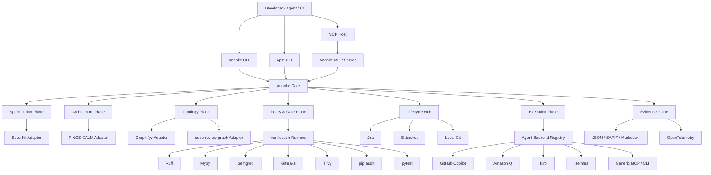
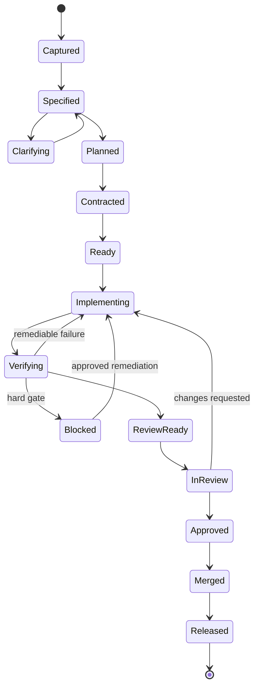
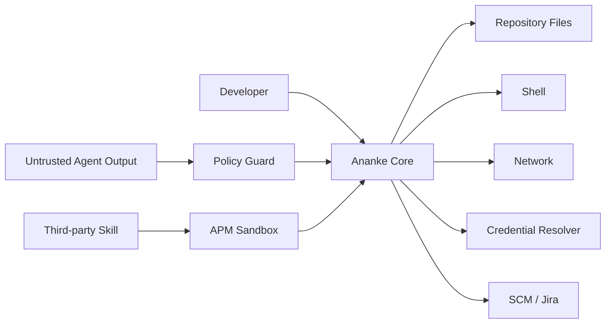

# Ananke Plexus — Master Technical Specification & Implementation Plan

> **Document status:** Superseding architecture specification  
> **Target package:** `ananke-plexus`  
> **Primary CLI:** `ananke`  
> **Agent Package Manager CLI:** `apm`  
> **Distribution:** PyPI + private Python indexes  
> **Runtime:** Python 3.11+  
> **Architecture style:** Local-first, plugin-oriented, hexagonal, policy-driven ADLC orchestration  
> **License recommendation:** Apache-2.0  
> **Primary design principle:** *Tensegrity — maximal agentic autonomy inside explicit, verifiable, non-negotiable engineering constraints.*

---

## 0. Executive Summary

`Ananke Plexus` is a local-first **Agent Development Life Cycle (ADLC) engineering harness** that turns non-deterministic coding agents into governed participants in an auditable software delivery system.

It is not intended to be another coding agent, another prompt collection, another CI wrapper, or another static-analysis tool. Its role is to become the **control plane that composes those systems** into one deterministic development lifecycle.

The system establishes an explicit contract between:

- **Intent** — Jira tickets, product requirements, prompts, existing code, ADRs.
- **Specification** — Spec-Driven Development artifacts and acceptance criteria.
- **Behavior** — executable tests and runtime assertions.
- **Model** — typed schemas and boundary contracts.
- **Architecture** — CALM architecture-as-code and architectural invariants.
- **Topology** — code graphs, ASTs, call relationships, dependency impact.
- **Execution** — governed autonomous or human-assisted implementation loops.
- **Verification** — tests, type checks, policy gates, SAST, SCA, secrets, licenses.
- **Evidence** — reproducible reports, hashes, provenance, SBOMs, attestations.
- **Lifecycle** — branches, commits, pull requests, Jira transitions, review evidence.
- **Distribution** — signed, attested, reproducible Python releases published through PyPI Trusted Publishing.

The core thesis is:

> **Agents receive freedom of action only through a stronger surrounding structure of truth.**

The project therefore treats specification, architecture, tests, graph topology, security, git state, external issue state, and release provenance as one interconnected **Plexus**.

---

# 1. Product Identity

## 1.1 Meaning of Ananke

**Ananke** represents the constraints that are not negotiable at runtime:

- schema conformance,
- architectural boundaries,
- test outcomes,
- credential isolation,
- security policy,
- release provenance,
- user approval requirements,
- immutable evidence,
- safe filesystem boundaries,
- allowed network destinations,
- tool-call argument validation.

Ananke should never encode subjective style as if it were physical law. It governs only rules that the project explicitly declares as binding.

## 1.2 Meaning of Plexus

**Plexus** represents the graph of relationships connecting:

- requirements,
- specs,
- models,
- tests,
- source files,
- symbols,
- dependencies,
- tools,
- agents,
- tasks,
- architecture components,
- execution runs,
- git commits,
- PRs,
- tickets,
- evidence artifacts.

The primary system abstraction is therefore not "a collection of files." It is a **versioned graph of engineering facts**.

## 1.3 Meaning of Tensegrity

Tensegrity is the governing architectural metaphor:

- **Compression members:** hard constraints and invariants.
- **Tension members:** dynamic context, graphs, live implementation state, agent reasoning.
- **Shape:** the implementation being continuously reconciled with its specification.

The project succeeds when agents can move quickly without silently escaping the intended system geometry.

---

# 2. Scope

## 2.1 Primary Goals

Ananke Plexus MUST:

1. Initialize and manage an ADLC-aware repository.
2. Translate requirements into version-controlled structured specifications.
3. Support GitHub Spec Kit workflows without duplicating Spec Kit.
4. Define and validate Ananke BMAD contracts:
   - Behavior
   - Model
   - Architecture
5. Treat FINOS CALM as the canonical external architecture-as-code format.
6. Integrate code-graph providers such as Graphifyy and code-review-graph.
7. Provide incremental impact analysis on code changes.
8. Provide a policy engine for deterministic gates.
9. Run local verification through one consistent execution abstraction.
10. Provide safe git-hook integration.
11. Provide an MCP server exposing governed tools, resources, and prompts.
12. Support multiple coding backends:
    - GitHub Copilot
    - Amazon Q Developer
    - Kiro
    - Hermes
    - generic MCP/CLI backends
13. Provide Jira and Bitbucket lifecycle automation.
14. Permit GitHub/GitLab lifecycle adapters later without redesigning the core.
15. Provide APM, an agent skill/package manager.
16. Maintain lockable, verifiable skill manifests and provenance.
17. Produce machine-readable and human-readable evidence bundles.
18. Provide OpenTelemetry-compatible tracing.
19. Support local-first and air-gapped operating modes.
20. Publish safely to PyPI using modern supply-chain controls.
21. Expose stable Python APIs in addition to CLIs.
22. Remain usable without any LLM or hosted agent provider.

## 2.2 Secondary Goals

The architecture SHOULD support:

- monorepos,
- polyglot repositories,
- multiple architecture domains,
- multi-agent execution,
- parallel worktrees,
- policy packs,
- enterprise custom registries,
- custom graph engines,
- custom issue trackers,
- custom SCM providers,
- private model gateways,
- extension discovery by Python entry points,
- reproducible run replay,
- SARIF output,
- JSONL event streams,
- OpenAPI or AsyncAPI contract linkage,
- SBOM generation,
- code-owner / approval policy integration.

## 2.3 Explicit Non-Goals

The core package SHOULD NOT:

- ship its own foundational LLM,
- become a full IDE,
- replace Git,
- replace Jira,
- replace Bitbucket or GitHub,
- reimplement Semgrep, Trivy, Gitleaks, Ruff, CodeQL, or pip-audit,
- implement a second CALM standard,
- fork Spec Kit behavior into an incompatible DSL,
- execute arbitrary third-party agent skills without permission checks,
- silently auto-commit generated artifacts after a developer commit,
- require network access for local verification,
- persist plaintext secrets into `.ananke/`.

---

# 3. 2026 Ecosystem Alignment Decisions

The original ideation correctly anticipated several ecosystems that have since become concrete. The implementation should **integrate them by contract rather than clone them**.

| Area | Ananke Position |
|---|---|
| GitHub Spec Kit | Treat as an upstream SDD provider. Wrap orchestration; do not fork its workflow semantics. |
| FINOS CALM | Treat as canonical architecture model where CALM is enabled. Store compatible JSON/YAML documents and retain the schema version. |
| MCP | Target official Python SDK v2. Expose stdio by default; Streamable HTTP optionally. |
| Graphifyy | Treat as a graph-provider adapter. Import/query produced graph data and preserve EXTRACTED / INFERRED / AMBIGUOUS provenance. |
| code-review-graph | Treat as a code-impact/review graph provider. Prefer its incremental structural map where available. |
| GitHub Awesome Copilot | Import Agent Skills as source packages through APM; retain upstream provenance and permissions. |
| Amazon Q | Prefer MCP integration where possible. |
| Kiro | Integrate through MCP + hooks/agent adapter rather than hard-coding Kiro internals. |
| Hermes | Use as an optional orchestration/backend adapter, not as an unconditional dependency. |
| BMAD-METHOD ecosystem | Keep separate from **Ananke BMAD**. If supported, expose it as an adapter named `bmad_method`, avoiding semantic collision. |

### Naming collision: BMAD

The source ideation uses **BMAD = Behavior, Model, Architecture Driven**. There is also an external `BMAD-METHOD` ecosystem.

To preserve the original concept without ambiguity:

- Public documentation SHOULD call the internal triad **Ananke BMAD**.
- Python modules SHOULD use `ananke.plexus.contracts.bmad`.
- External BMAD-METHOD integration SHOULD live under `ananke.plexus.integrations.bmad_method`.
- User configuration SHOULD refer to `contract_mode = "ananke-bmad"`.

---

# 4. Architectural Principles

## 4.1 Deterministic Core, Non-Deterministic Edge

No LLM response is itself a trusted fact.

All agent output must pass through deterministic boundaries before it can become:

- a file mutation,
- a git state transition,
- a Jira transition,
- a PR,
- a release,
- a credentialed tool action.

## 4.2 Ports and Adapters

Core code must depend on interfaces, not provider SDKs.

Examples:

```text
IssueTrackerPort  -> JiraAdapter
SCMPort           -> BitbucketAdapter / GitHubAdapter
GraphPort         -> GraphifyyAdapter / CodeReviewGraphAdapter
SpecProviderPort  -> SpecKitAdapter / NativeSpecAdapter
AgentBackendPort  -> CopilotAdapter / AmazonQAdapter / KiroAdapter / HermesAdapter
ScannerPort       -> SemgrepAdapter / TrivyAdapter / GitleaksAdapter / PipAuditAdapter
TelemetryPort     -> OTelAdapter / NoopTelemetryAdapter
```

## 4.3 Capability Discovery

Every adapter declares a `CapabilitySet`.

Ananke never assumes that a backend can:

- edit files,
- run tools,
- call MCP,
- stream output,
- maintain session state,
- approve plans,
- create commits,
- run asynchronously.

The orchestrator asks the registry for capabilities and constructs a compatible execution plan.

## 4.4 Local-First

Local operation must remain first class:

- specs live in the repo,
- graph cache lives locally,
- policies live in the repo,
- evidence can be generated locally,
- no hosted service is necessary,
- no telemetry leaves the machine by default.

## 4.5 Evidence Before Mutation

Every mutating step should have:

1. requested intent,
2. policy decision,
3. preconditions,
4. execution result,
5. verification result,
6. resulting artifact hashes,
7. audit record.

## 4.6 Idempotency

All lifecycle operations SHOULD have stable idempotency keys.

Examples:

- branch creation,
- Jira transition,
- PR creation,
- evidence comment posting,
- APM install,
- architecture rendering.

## 4.7 Fail Closed for Hard Gates

When an explicitly configured hard gate cannot execute, the default result is **blocked**, not "pass."

Soft gates may return:

- `PASS`
- `WARN`
- `SKIPPED`
- `UNAVAILABLE`

Hard gates may return:

- `PASS`
- `BLOCKED`
- `ERROR`

---

# 5. System Context



---

# 6. Core Domain Model

## 6.1 Project Identity

```python
class ProjectIdentity(BaseModel):
    project_id: str
    name: str
    repository_root: Path
    default_branch: str = "main"
    package_ecosystems: list[str] = []
```

## 6.2 Requirement

A requirement is immutable input captured from a source.

```python
class Requirement(BaseModel):
    requirement_id: str
    source: Literal["jira", "prompt", "file", "api"]
    source_ref: str | None = None
    title: str
    body: str
    acceptance_criteria: list[str]
    labels: list[str] = []
    captured_at: datetime
    content_hash: str
```

## 6.3 SpecBundle

```python
class SpecBundle(BaseModel):
    spec_id: str
    requirement_ids: list[str]
    spec_markdown: Path
    plan_markdown: Path | None = None
    tasks_markdown: Path | None = None
    architecture_delta: Path | None = None
    behavior_contracts: list[Path] = []
    model_contracts: list[Path] = []
    state: str
    content_hash: str
```

## 6.4 Ananke BMAD Contract

```python
class BehaviorContract(BaseModel):
    contract_id: str
    scenarios: list["BehaviorScenario"]
    test_targets: list[str]
    evidence_required: list[str]

class ModelContract(BaseModel):
    contract_id: str
    schema_refs: list[str]
    compatibility_policy: str
    boundary_types: list[str]

class ArchitectureContract(BaseModel):
    contract_id: str
    calm_ref: str
    allowed_dependencies: list[str]
    denied_dependencies: list[str]
    invariant_ids: list[str]
```

## 6.5 Gate

```python
class GateResult(BaseModel):
    gate_id: str
    status: Literal["PASS", "WARN", "BLOCKED", "ERROR", "SKIPPED", "UNAVAILABLE"]
    severity: Literal["info", "low", "medium", "high", "critical"]
    summary: str
    findings: list["Finding"] = []
    artifact_refs: list[str] = []
    started_at: datetime
    completed_at: datetime
```

## 6.6 Evidence Bundle

Every meaningful run produces one bundle.

```text
.ananke/evidence/<run-id>/
├── manifest.json
├── run.json
├── spec-lock.json
├── policy-decisions.jsonl
├── gates/
│   ├── tests.json
│   ├── lint.json
│   ├── typecheck.json
│   ├── secrets.json
│   ├── sast.sarif
│   ├── sca.json
│   ├── licenses.json
│   └── architecture.json
├── graph/
│   ├── delta.json
│   └── impact.md
├── architecture/
│   └── diagrams.md
├── git/
│   ├── diff.patch
│   └── metadata.json
└── checksums.sha256
```

The manifest MUST contain hashes for generated evidence files.

---

# 7. ADLC State Model

## 7.1 Feature Lifecycle



## 7.2 Run Step State

Every orchestration step uses:

```text
PENDING
READY
RUNNING
SUCCEEDED
FAILED
BLOCKED
SKIPPED
COMPENSATING
COMPENSATED
CANCELLED
```

## 7.3 Checkpointing

The run engine writes checkpoints after every side effect.

A crash after creating a Jira comment but before recording the local state must be recoverable using the idempotency key.

---

# 8. Repository Architecture — Package Source

```text
ananke-plexus/
├── .github/
│   ├── CODEOWNERS
│   ├── dependabot.yml
│   ├── dependency-review-config.yml
│   ├── ISSUE_TEMPLATE/
│   ├── PULL_REQUEST_TEMPLATE.md
│   └── workflows/
│       ├── ci.yml
│       ├── security.yml
│       ├── scorecard.yml
│       ├── docs.yml
│       ├── release-testpypi.yml
│       └── release-pypi.yml
├── .pre-commit-config.yaml
├── .python-version
├── CHANGELOG.md
├── CITATION.cff
├── CODE_OF_CONDUCT.md
├── CONTRIBUTING.md
├── LICENSE
├── NOTICE
├── README.md
├── SECURITY.md
├── SUPPORT.md
├── pyproject.toml
├── uv.lock
├── docs/
│   ├── architecture/
│   ├── concepts/
│   ├── guides/
│   ├── reference/
│   ├── security/
│   └── adr/
├── schemas/
│   ├── config.schema.json
│   ├── skill.schema.json
│   ├── policy.schema.json
│   └── evidence.schema.json
├── src/
│   └── ananke/
│       ├── __init__.py
│       └── plexus/
│           ├── __init__.py
│           ├── version.py
│           ├── cli/
│           │   ├── app.py
│           │   ├── commands/
│           │   └── rendering.py
│           ├── core/
│           │   ├── errors.py
│           │   ├── ids.py
│           │   ├── paths.py
│           │   ├── result.py
│           │   ├── runtime.py
│           │   └── context.py
│           ├── config/
│           │   ├── models.py
│           │   ├── loader.py
│           │   ├── merge.py
│           │   ├── env.py
│           │   └── secrets.py
│           ├── contracts/
│           │   ├── bmad.py
│           │   ├── behavior.py
│           │   ├── model.py
│           │   └── architecture.py
│           ├── specs/
│           │   ├── models.py
│           │   ├── service.py
│           │   ├── lock.py
│           │   └── providers/
│           ├── architecture/
│           │   ├── models.py
│           │   ├── calm.py
│           │   ├── validate.py
│           │   ├── delta.py
│           │   └── mermaid.py
│           ├── graph/
│           │   ├── models.py
│           │   ├── service.py
│           │   ├── impact.py
│           │   ├── diff.py
│           │   └── providers/
│           ├── policy/
│           │   ├── models.py
│           │   ├── engine.py
│           │   ├── expression.py
│           │   ├── packs.py
│           │   └── decisions.py
│           ├── gates/
│           │   ├── models.py
│           │   ├── runner.py
│           │   ├── registry.py
│           │   └── adapters/
│           ├── evals/
│           │   ├── models.py
│           │   ├── deterministic.py
│           │   ├── semantic.py
│           │   └── datasets.py
│           ├── execution/
│           │   ├── plan.py
│           │   ├── scheduler.py
│           │   ├── state.py
│           │   ├── checkpoint.py
│           │   ├── compensation.py
│           │   └── worktree.py
│           ├── backends/
│           │   ├── base.py
│           │   ├── registry.py
│           │   ├── capabilities.py
│           │   └── adapters/
│           ├── lifecycle/
│           │   ├── issues.py
│           │   ├── scm.py
│           │   ├── git.py
│           │   └── adapters/
│           ├── hooks/
│           │   ├── models.py
│           │   ├── manager.py
│           │   ├── runner.py
│           │   └── stages.py
│           ├── apm/
│           │   ├── cli.py
│           │   ├── manifest.py
│           │   ├── registry.py
│           │   ├── installer.py
│           │   ├── resolver.py
│           │   ├── lockfile.py
│           │   ├── sandbox.py
│           │   ├── provenance.py
│           │   └── importers/
│           ├── mcp/
│           │   ├── server.py
│           │   ├── auth.py
│           │   ├── tools.py
│           │   ├── resources.py
│           │   └── prompts.py
│           ├── evidence/
│           │   ├── models.py
│           │   ├── bundle.py
│           │   ├── hash.py
│           │   ├── sarif.py
│           │   └── markdown.py
│           ├── telemetry/
│           │   ├── api.py
│           │   ├── otel.py
│           │   └── noop.py
│           ├── events/
│           │   ├── bus.py
│           │   ├── models.py
│           │   └── subscribers.py
│           └── plugins/
│               ├── api.py
│               ├── discovery.py
│               └── metadata.py
└── tests/
    ├── unit/
    ├── contract/
    ├── integration/
    ├── e2e/
    ├── security/
    ├── fixtures/
    ├── golden/
    └── compatibility/
```

---

# 9. Generated Workspace Layout

`ananke init` should create only project-owned configuration and generated state.

```text
customer-project/
├── .ananke/
│   ├── config.toml
│   ├── config.local.toml.example
│   ├── policy/
│   │   ├── default.toml
│   │   ├── architecture.toml
│   │   ├── security.toml
│   │   └── licenses.toml
│   ├── architecture/
│   │   ├── system.calm.json
│   │   ├── domains/
│   │   └── diagrams/
│   ├── specs/
│   │   └── <ticket-or-feature>/
│   │       ├── requirement.md
│   │       ├── spec.md
│   │       ├── plan.md
│   │       ├── tasks.md
│   │       ├── bmad.yaml
│   │       ├── architecture-delta.calm.json
│   │       └── spec.lock.json
│   ├── graph/
│   │   ├── metadata.json
│   │   ├── cache/
│   │   └── overlays/
│   ├── skills/
│   │   ├── installed/
│   │   └── active/
│   ├── apm.lock
│   ├── runs/
│   ├── evidence/
│   ├── state/
│   └── tmp/
├── .github/
│   ├── copilot-instructions.md
│   └── skills/
├── docs/
│   └── architecture/
└── ...
```

### Gitignore policy

Recommended defaults:

```gitignore
.ananke/tmp/
.ananke/state/
.ananke/runs/*/scratch/
.ananke/config.local.toml
```

Project teams choose whether graph caches and evidence are committed.

Recommended:
- Commit specs.
- Commit CALM architecture.
- Commit policies.
- Commit APM lock file.
- Commit generated architecture Markdown if documentation is desired.
- Do not commit credentials.
- Do not commit volatile runtime state.
- Evidence retention is policy-controlled.

---

# 10. Configuration System

Use TOML as the primary hand-edited configuration.

YAML may be accepted for compatibility, but internal models normalize everything.

```toml
[project]
name = "payments-service"
default_branch = "main"

[ananke]
mode = "developer"
fail_closed = true
offline = false

[spec]
provider = "speckit"
contract_mode = "ananke-bmad"

[architecture]
provider = "calm"
schema_version = "pinned"
strict = true

[graph]
providers = ["code-review-graph", "graphifyy"]
primary = "code-review-graph"

[backend]
default = "copilot"

[lifecycle]
issue_tracker = "jira"
scm = "bitbucket"

[hooks]
mode = "native"

[telemetry]
enabled = true
exporter = "console"
redact_prompts = true

[security]
allow_network = false
secret_scan = true
sast = true
sca = true
license_scan = true
```

## 10.1 Configuration Precedence

Highest wins:

1. explicit CLI flags,
2. process environment,
3. `.ananke/config.local.toml`,
4. `.ananke/config.toml`,
5. user config,
6. built-in defaults.

Secrets MUST be referenced, not embedded.

Example:

```toml
[jira]
base_url = "https://example.atlassian.net"
token = { env = "ANANKE_JIRA_TOKEN" }
```

---

# 11. Plugin / Adapter Contract

Use Python entry points.

```toml
[project.entry-points."ananke.graph"]
graphifyy = "ananke_graphifyy:plugin"
code_review_graph = "ananke_code_review_graph:plugin"

[project.entry-points."ananke.backend"]
copilot = "ananke_copilot:plugin"
```

## 11.1 Plugin Metadata

```python
class PluginMetadata(BaseModel):
    plugin_id: str
    plugin_type: str
    api_version: str
    plugin_version: str
    capabilities: set[str]
    min_ananke_version: str | None = None
    max_ananke_version: str | None = None
```

## 11.2 API Compatibility

Core plugin API follows semantic versioning independent of package version:

```text
Ananke package: 0.6.2
Plugin API:      1.1
```

Minor plugin API additions MUST be backward compatible.

---

# 12. Specification Plane

## 12.1 Inputs

Supported input sources:

- freeform CLI prompt,
- Markdown file,
- Jira issue,
- Jira epic,
- issue URL,
- imported Spec Kit feature,
- existing PR,
- bug report.

## 12.2 Spec Kit Integration

Ananke should invoke or interoperate with Spec Kit rather than silently generating incompatible files.

Ananke flow:

```text
requirement capture
    -> Spec Kit specify
    -> optional clarify
    -> plan
    -> checklist
    -> tasks
    -> Ananke BMAD compilation
    -> implementation
    -> converge
```

## 12.3 Spec Lock

After approval, Ananke writes `spec.lock.json`.

Contains:

- hashes of requirement,
- hashes of spec / plan / task files,
- CALM architecture hash,
- policy-pack hash,
- active skill versions,
- graph snapshot ID,
- toolchain versions,
- approval identity if configured.

A later run detects drift.

## 12.4 Drift Types

- `REQUIREMENT_DRIFT`
- `SPEC_DRIFT`
- `ARCHITECTURE_DRIFT`
- `MODEL_DRIFT`
- `POLICY_DRIFT`
- `TOOLCHAIN_DRIFT`
- `GRAPH_DRIFT`

Policy determines which drift invalidates approval.

---

# 13. Ananke BMAD Contract Compiler

## 13.1 Behavior

Behavior compiler converts acceptance criteria into:

- executable pytest tests where deterministic,
- Gherkin-style scenarios where useful,
- API contract checks,
- integration test skeletons,
- explicit manual or semantic checks where automation is not appropriate.

### Behavior principle

Never claim that an automatically generated test proves the requirement unless traceability exists.

Every test records:

```text
Requirement -> Acceptance Criterion -> Scenario -> Test ID
```

## 13.2 Model

Model contract defines:

- API request/response schema,
- event payload schema,
- domain value objects,
- database boundary models,
- tool call schemas,
- error schemas,
- compatibility rules.

Pydantic v2 can be used internally, but the architecture should allow OpenAPI / JSON Schema references.

## 13.3 Architecture

Architecture contract is checked against:

- CALM architecture,
- graph provider facts,
- import rules,
- component allow/deny relationships,
- protocol constraints,
- dependency direction,
- deployment restrictions.

---

# 14. CALM Architecture Plane

## 14.1 Canonical Rule

Where CALM mode is enabled, Ananke does not invent a reduced "CALM-like" schema.

It stores canonical or explicitly versioned CALM documents.

## 14.2 Architecture Sources

- baseline system CALM document,
- domain CALM documents,
- feature architecture delta,
- observed graph overlay.

## 14.3 Planned vs Observed Architecture

Ananke distinguishes:

```text
DECLARED  = architecture intended by CALM
OBSERVED  = architecture found in source/deployment graph
DELTA     = observed - declared / declared - observed
```

This is a major Plexus capability.

## 14.4 Architecture Findings

Examples:

- undeclared dependency,
- declared relationship not found,
- protocol mismatch,
- forbidden cross-domain edge,
- interface changed without model version,
- new public endpoint absent from CALM,
- data-store access bypassing required service,
- missing control declaration.

## 14.5 Mermaid

Mermaid is a **renderer**, not the architecture source.

Renderers:

- system flow,
- component topology,
- sequence,
- state,
- dependency,
- impact radius,
- spec-to-code traceability.

Generated diagrams MUST contain a source hash comment so stale diagrams can be detected.

---

# 15. Graph & Topology Plane

## 15.1 Graph Provider Interface

```python
class GraphProvider(Protocol):
    def build(self, request: GraphBuildRequest) -> GraphSnapshot: ...
    def update(self, request: GraphUpdateRequest) -> GraphSnapshot: ...
    def query(self, request: GraphQuery) -> GraphResult: ...
    def impact(self, diff: GitDiff) -> ImpactReport: ...
```

## 15.2 Canonical Graph Model

Normalize providers into:

### Node kinds
- repository
- module
- file
- package
- function
- method
- class
- type
- route
- event
- table
- queue
- service
- architecture component
- requirement
- test
- skill
- tool

### Edge kinds
- imports
- calls
- inherits
- implements
- reads
- writes
- publishes
- subscribes
- tests
- realizes
- depends_on
- owns
- violates
- constrained_by

## 15.3 Evidence Provenance

Each graph edge SHOULD carry:

```text
origin: extracted | inferred | ambiguous | declared
provider
confidence
source_location
snapshot_id
```

## 15.4 Graphifyy Adapter

Use Graphifyy for broad knowledge-graph enrichment and multi-source relationships.

## 15.5 code-review-graph Adapter

Use code-review-graph for structural code review and incremental blast-radius analysis.

## 15.6 Multi-Provider Reconciliation

Do not merge conflicting edges into a false single truth.

Store provider-specific facts and create a reconciled view:

```text
CONSENSUS
SINGLE_SOURCE
CONFLICT
UNKNOWN
```

---

# 16. Policy Engine

The policy engine is the real "Ananke" layer.

## 16.1 Policy Categories

- architecture
- security
- quality
- testing
- model compatibility
- dependency
- license
- git
- lifecycle
- agent permissions
- network
- filesystem
- shell
- release
- evidence

## 16.2 Policy Example

```toml
[[rule]]
id = "arch.no-domain-cycle"
stage = "pre_push"
severity = "high"
gate = "architecture"
assert = "graph.domain_cycles == 0"
on_failure = "block"

[[rule]]
id = "security.no-secret"
stage = "pre_commit"
severity = "critical"
gate = "gitleaks"
assert = "findings.count == 0"
on_failure = "block"

[[rule]]
id = "tests.minimum-coverage"
stage = "ci"
severity = "medium"
gate = "pytest"
assert = "coverage.line >= 85"
on_failure = "block"
```

## 16.3 Policy Packs

```text
.ananke/policy/
├── baseline.toml
├── python-library.toml
├── agentic-security.toml
└── enterprise-strict.toml
```

## 16.4 Policy Decision Record

Every decision contains:

- rule ID,
- resolved input,
- result,
- evidence refs,
- engine version,
- timestamp.

---

# 17. Verification / Gate Plane

## 17.1 Local Fast Gate

Intended for pre-commit:

- formatting check,
- Ruff,
- targeted type checks where practical,
- staged secret scan,
- schema validation,
- spec-lock drift,
- fast architecture rules.

Target: predictable and fast.

## 17.2 Local Full Gate

Intended for `ananke verify` and pre-push:

- full unit tests,
- type checking,
- Semgrep,
- dependency audit,
- Trivy filesystem scan,
- license policy,
- graph impact,
- architecture conformance,
- spec convergence checks.

## 17.3 CI Gate

Adds:

- clean-environment build,
- Python version matrix,
- package install test,
- sdist/wheel validation,
- CodeQL,
- dependency review,
- action workflow security,
- SBOM,
- artifact attestation,
- OpenSSF Scorecard.

## 17.4 Gate Runner Contract

```python
class GateRunner(Protocol):
    gate_id: str
    async def available(self) -> Availability: ...
    async def run(self, ctx: GateContext) -> GateResult: ...
```

## 17.5 Scanner Set

Recommended adapters:

| Purpose | Preferred |
|---|---|
| Lint / style / import hygiene | Ruff |
| Format | Ruff formatter |
| Type safety | mypy and/or Pyright adapter |
| Unit/integration | pytest |
| Coverage | coverage.py / pytest-cov |
| Secrets | Gitleaks |
| SAST | Semgrep |
| GitHub code scanning | CodeQL |
| Python dependencies | pip-audit |
| Cross-ecosystem CVEs | Trivy |
| Dependency PR gate | GitHub dependency review |
| License inventory | `pip-licenses` or equivalent |
| GitHub Actions audit | zizmor + actionlint |
| Supply-chain posture | OpenSSF Scorecard |
| SBOM | CycloneDX or Syft |

Tools not installed must produce an explicit `UNAVAILABLE`; policy decides block vs warn.

---

# 18. Git Hooks — Safe Tensile Hooks

The initial idea of post-commit mutation should be revised.

## 18.1 Rules

1. Hooks MUST preserve existing user hooks.
2. Installation MUST be reversible.
3. Hooks MUST NOT silently overwrite unmanaged hooks.
4. Hooks MUST NOT automatically create a second commit.
5. Pre-commit checks SHOULD avoid unrequested source mutation.
6. Formatting repair is explicit:
   - `ananke fix`
   - or pre-commit framework-managed modification.
7. Post-commit may refresh ignored caches but SHOULD NOT mutate tracked files by default.
8. Generated tracked documentation should be refreshed pre-commit/pre-push or in CI.

## 18.2 Hook Modes

- `native`
- `pre-commit-framework`
- `delegated`
- `disabled`

## 18.3 Hook Wrapper

Native hook should delegate:

```bash
#!/usr/bin/env sh
exec ananke hooks run pre-commit -- "$@"
```

If a hook already exists, install a dispatcher only with explicit consent or configured `--chain`.

## 18.4 Default Stages

### pre-commit
- spec/schema validation
- Ruff check
- Ruff format check
- staged secret scan
- small deterministic policy set

### post-commit
- update ignored graph cache
- update runtime index
- emit local event
- no tracked-file mutation by default

### pre-push
- tests
- full graph impact
- Semgrep
- pip-audit / Trivy
- license policy
- architecture conformance

---

# 19. Autonomous Execution Engine

## 19.1 Plan Model

```python
class ExecutionPlan(BaseModel):
    plan_id: str
    spec_id: str
    steps: list["ExecutionStep"]
    approvals: list["ApprovalRequirement"]
    compensation_strategy: str
```

## 19.2 Step Types

- read_context
- create_worktree
- create_branch
- transition_issue
- generate_contracts
- invoke_backend
- run_gate
- update_graph
- render_architecture
- commit
- push
- create_pr
- post_evidence
- request_approval
- compensate

## 19.3 Human Approval Classes

- `NONE`
- `PLAN`
- `FILE_WRITE`
- `SHELL`
- `NETWORK`
- `GIT_PUSH`
- `PR_CREATE`
- `ISSUE_TRANSITION`
- `RELEASE`

Enterprise policy can increase but not silently decrease configured approval requirements.

## 19.4 Worktree Isolation

Every autonomous run SHOULD use a dedicated Git worktree.

```text
.ananke/runs/<run-id>/worktree/
```

Benefits:

- no collision with user edits,
- clean rollback,
- parallel runs,
- exact commit attribution,
- deterministic diff.

## 19.5 Concurrency

Per repository:

- read-only graph queries can run concurrently,
- mutations are scoped by worktree,
- branch creation uses repository lock,
- shared evidence manifests use atomic writes.

## 19.6 Cancellation

Cancellation must:

1. stop future steps,
2. terminate owned processes,
3. preserve evidence,
4. avoid deleting user work,
5. optionally run compensation.

---

# 20. Backend Abstraction

## 20.1 Capability Model

```python
class BackendCapabilities(BaseModel):
    filesystem_read: bool
    filesystem_write: bool
    shell: bool
    mcp_client: bool
    streaming: bool
    persistent_session: bool
    structured_output: bool
    subagents: bool
```

## 20.2 Adapter Contract

```python
class AgentBackend(Protocol):
    metadata: BackendMetadata
    capabilities: BackendCapabilities

    async def start(self, request: BackendRequest) -> BackendSession: ...
    async def send(self, session: BackendSession, task: BackendTask) -> BackendResult: ...
    async def cancel(self, session: BackendSession) -> None: ...
```

## 20.3 Supported Adapters

### Copilot
- Prefer agent skills + MCP.
- Avoid unsupported internal Language Server assumptions.

### Amazon Q Developer
- Prefer MCP server attachment.
- Use documented CLI integration only.

### Kiro
- Use custom agent + MCP + hook capability where useful.

### Hermes
- Optional direct orchestration/backend mode.
- Treat Hermes state as external to Ananke evidence state.

### Generic CLI
A fallback adapter can invoke a user-specified command with structured input/output.

---

# 21. MCP Server

Target MCP Python SDK v2.

## 21.1 Default Transport

- local: stdio
- remote/enterprise: Streamable HTTP
- SSE only where compatibility requires it

## 21.2 Tools

Recommended initial tool surface:

```text
ananke.project.status
ananke.spec.get
ananke.spec.validate
ananke.spec.create
ananke.bmad.get_contract
ananke.bmad.verify
ananke.arch.get
ananke.arch.validate
ananke.arch.render
ananke.graph.query
ananke.graph.impact
ananke.graph.update
ananke.policy.explain
ananke.verify.run
ananke.evidence.get
ananke.run.status
```

Mutation tools require stronger permissions:

```text
ananke.run.execute
ananke.git.create_branch
ananke.git.commit
ananke.lifecycle.transition_issue
ananke.lifecycle.create_pr
```

## 21.3 MCP Resources

Examples:

```text
ananke://project/status
ananke://spec/<id>
ananke://architecture/system
ananke://graph/symbol/<fqname>
ananke://run/<run-id>/evidence
ananke://policy/<rule-id>
```

## 21.4 MCP Prompts

- architecture-aware implementation
- blast-radius review
- spec clarification
- BMAD contract generation
- PR evidence summary

## 21.5 MCP Security

- default bind to loopback only,
- no unauthenticated LAN binding,
- tool permission map,
- request size limits,
- path canonicalization,
- timeout,
- redaction,
- audit event per tool invocation.

---

# 22. APM — Agent Package Manager

APM is a core differentiator and should be treated like a supply-chain system.

## 22.1 Package Types

- skill
- prompt-pack
- policy-pack
- evaluator
- workflow
- tool-adapter
- bundle

## 22.2 Skill Layout

```text
my-skill/
├── SKILL.md
├── ananke-skill.toml
├── LICENSE
├── README.md
├── scripts/
├── references/
├── assets/
└── tests/
```

## 22.3 Manifest

```toml
[skill]
name = "graph-reviewer"
version = "1.2.0"
description = "Reviews graph impact before PR creation."
license = "MIT"

[compatibility]
ananke = ">=0.5,<1"
skill_api = "1"

[permissions]
filesystem_read = ["src/**", "tests/**", ".ananke/**"]
filesystem_write = [".ananke/evidence/**"]
network = []
shell = ["git diff", "ananke graph *"]

[entrypoints]
instructions = "SKILL.md"

[provenance]
source = "github"
repository = "github/awesome-copilot"
revision = "<sha>"
```

## 22.4 Lockfile

`apm.lock` records:

- resolved version,
- digest,
- source,
- source revision,
- transitive bundle members,
- permission hash,
- license,
- install timestamp.

## 22.5 Install Flow

```text
resolve
 -> download to quarantine
 -> verify digest/provenance
 -> inspect manifest
 -> scan files
 -> calculate permissions
 -> present policy decision
 -> install immutable copy
 -> update lock
 -> optionally activate
```

## 22.6 Awesome Copilot Import

`apm import copilot` should:

1. recognize Agent Skills directory format,
2. preserve `SKILL.md`,
3. import bundled assets,
4. derive Ananke manifest,
5. infer permissions conservatively,
6. scan scripts,
7. record upstream commit SHA,
8. require explicit activation if executable assets exist.

## 22.7 Untrusted Skills

Untrusted skills cannot:

- gain network access implicitly,
- invoke arbitrary shell patterns,
- write outside approved paths,
- read secret configuration,
- mutate git,
- transition lifecycle objects.

---

# 23. Enterprise Lifecycle Hub

## 23.1 Jira Port

Capabilities:

- fetch issue,
- fetch epic,
- read acceptance criteria,
- list links/subtasks,
- transition issue,
- create subtask,
- comment,
- attach evidence links,
- set labels/custom fields where configured.

Jira workflow transitions must be discovered, not hard-coded.

## 23.2 Bitbucket Port

Capabilities:

- create branch,
- push branch,
- inspect repository,
- create PR,
- update PR body,
- comment,
- request reviewers,
- attach build/evidence links.

## 23.3 Git Port

Prefer invoking Git directly for operations requiring exact CLI semantics, but isolate through a `GitService`.

Important:
- never rely only on GitPython abstractions for advanced worktree/signing semantics,
- capture command arguments and result metadata,
- redact remote credentials.

## 23.4 Branch Naming

Template:

```text
{type}/{ticket}-{slug}
```

Examples:

```text
feature/PROJ-402-order-events
bugfix/PROJ-441-idempotency
chore/PROJ-510-dependency-upgrade
```

---

# 24. Security Threat Model

## 24.1 Trust Boundaries



## 24.2 Agentic Risks to Address

At minimum:

- prompt injection from repository content,
- tool misuse,
- excessive agency,
- unsafe shell construction,
- secret disclosure,
- poisoned skill packages,
- dependency confusion,
- malicious MCP server/tool output,
- architecture-policy bypass,
- approval bypass,
- cross-run state leakage,
- evidence tampering,
- unsafe auto-fix behavior.

## 24.3 Command Execution

Never construct shell commands by concatenating untrusted strings.

Default:

```python
subprocess.run(
    ["git", "diff", "--", user_path],
    shell=False,
    check=False,
)
```

## 24.4 Filesystem Guard

All paths are canonicalized and checked against:

- repository root,
- allowed read globs,
- allowed write globs,
- symlink escape,
- reserved paths.

## 24.5 Network Guard

Default agent skill network policy: deny.

Allow list may include:

- Jira host,
- Bitbucket host,
- configured model host,
- registry hosts.

## 24.6 Secrets

Secrets live in:

- environment,
- OS keychain adapter,
- enterprise vault adapter.

Never in:
- `.ananke/config.toml`,
- evidence files,
- prompts by default,
- trace attributes.

## 24.7 Redaction

Central redaction pipeline applies to:

- logs,
- telemetry,
- prompts,
- CLI output,
- evidence.

---

# 25. Evaluation Plane

The earliest ideation included an evaluation spectrum. Preserve it.

## 25.1 Deterministic Evaluation

Blocking:

- schema assertions,
- exact tool-call contracts,
- path policy,
- maximum loop count,
- allowed commands,
- absence of secrets,
- test outcomes,
- graph invariants.

## 25.2 Semantic Evaluation

Optional / usually advisory:

- requirement coverage,
- answer groundedness,
- PR explanation quality,
- architecture rationale quality,
- generated documentation quality.

## 25.3 Evaluation Dataset

```text
.ananke/evals/
├── datasets/
├── rubrics/
├── baselines/
└── results/
```

## 25.4 LLM-as-Judge

LLM judge output MUST NOT be the sole basis for:

- release approval,
- credentialed destructive action,
- security pass/fail,
- legal/license compliance.

---

# 26. Event System

Every subsystem emits domain events.

Examples:

```text
RequirementCaptured
SpecCreated
SpecLocked
ArchitectureValidated
GraphUpdated
ImpactCalculated
PolicyEvaluated
GateCompleted
BackendInvoked
FileMutated
CommitCreated
PushCompleted
PullRequestCreated
IssueTransitioned
EvidenceFinalized
```

Event envelope:

```python
class Event(BaseModel):
    event_id: str
    event_type: str
    run_id: str | None
    timestamp: datetime
    actor: str
    payload: dict
    correlation_id: str
    causation_id: str | None
```

Append to JSONL audit log.

---

# 27. Observability

## 27.1 OpenTelemetry

Spans:

```text
ananke.run
ananke.spec.create
ananke.graph.update
ananke.gate.semgrep
ananke.backend.invoke
ananke.lifecycle.jira.transition
ananke.lifecycle.bitbucket.create_pr
```

## 27.2 Metrics

- run duration,
- gate duration,
- pass/block counts,
- graph build time,
- changed symbols,
- blast radius,
- backend retries,
- token metrics if provider supplies them,
- skill install counts,
- policy violations.

## 27.3 Privacy

Telemetry default:
- local console / file,
- no remote exporter,
- prompts redacted unless explicitly opted in.

---

# 28. CLI — Complete Command Taxonomy

```text
ananke
├── init
├── doctor
├── status
├── config
│   ├── show
│   ├── validate
│   └── explain
├── spec
│   ├── create
│   ├── import
│   ├── clarify
│   ├── plan
│   ├── tasks
│   ├── lock
│   ├── diff
│   ├── validate
│   └── converge
├── bmad
│   ├── compile
│   ├── show
│   ├── trace
│   └── verify
├── arch
│   ├── init
│   ├── validate
│   ├── diff
│   ├── reconcile
│   └── render
├── graph
│   ├── build
│   ├── update
│   ├── status
│   ├── query
│   ├── impact
│   ├── review
│   └── export
├── verify
├── audit
├── check-all
├── fix
├── policy
│   ├── list
│   ├── check
│   ├── explain
│   └── test
├── hooks
│   ├── install
│   ├── uninstall
│   ├── status
│   └── run
├── run
│   ├── start
│   ├── resume
│   ├── cancel
│   ├── status
│   └── replay
├── evidence
│   ├── show
│   ├── verify
│   ├── export
│   └── prune
├── lifecycle
│   ├── issue
│   └── pr
├── backend
│   ├── list
│   ├── doctor
│   └── test
├── plugin
│   ├── list
│   ├── doctor
│   └── info
├── serve-mcp
├── completion
└── version
```

APM:

```text
apm
├── search
├── info
├── install
├── remove
├── update
├── list
├── activate
├── deactivate
├── verify
├── test
├── lock
├── sync
├── audit
├── import
│   └── copilot
├── bundle
│   ├── list
│   ├── install
│   └── export
└── registry
    ├── list
    ├── add
    └── remove
```

## 28.1 Global Flags

```text
--project PATH
--config PATH
--profile NAME
--offline
--json
--quiet
--verbose
--trace
--no-color
--non-interactive
```

Machine-readable commands MUST support `--json`.

---

# 29. Exit Code Contract

Stable exit codes improve CI behavior.

```text
0  success
1  generic failure
2  invalid usage/config
3  policy blocked
4  verification failed
5  dependency/tool unavailable
6  integration failure
7  authentication/authorization
8  spec drift
9  architecture violation
10 cancelled
```

---

# 30. Python Public API

Examples:

```python
from ananke.plexus import Ananke

ananke = Ananke.open(".")
result = await ananke.verify()
```

Public modules SHOULD be intentionally small:

```text
ananke.plexus.api
ananke.plexus.models
ananke.plexus.plugins
```

Internal modules are not compatibility guarantees.

---

# 31. Packaging Strategy

## 31.1 Core Dependencies

Keep runtime dependencies narrow.

Recommended core:

```toml
dependencies = [
  "pydantic>=2.11,<3",
  "typer>=0.16,<1",
  "rich>=14,<15",
  "httpx>=0.28,<1",
  "platformdirs>=4,<5",
  "PyYAML>=6,<7",
  "jinja2>=3.1,<4",
  "networkx>=3.4,<4",
]
```

Exact floors must be tested before release.

## 31.2 Optional Extras

```toml
[project.optional-dependencies]
mcp = ["mcp>=2,<3"]
jira = ["atlassian-python-api>=..."]
telemetry = ["opentelemetry-api>=...", "opentelemetry-sdk>=..."]
security = [...]
docs = [...]
dev = [...]
all = [...]
```

Heavy tools that are external executables SHOULD NOT be forced as Python dependencies.

Example:
- Trivy
- Gitleaks
- Semgrep CLI where independently installed
- CodeQL

## 31.3 Do Not Depend Directly on Every Ecosystem

Prefer adapters that detect:
1. Python import,
2. CLI binary,
3. MCP endpoint.

---

# 32. Recommended `pyproject.toml`

```toml
[build-system]
requires = ["hatchling>=1.26"]
build-backend = "hatchling.build"

[project]
name = "ananke-plexus"
dynamic = ["version"]
description = "A tensegrity ADLC control plane for governed agentic software engineering."
readme = "README.md"
requires-python = ">=3.11"
license = "Apache-2.0"
license-files = ["LICENSE", "NOTICE"]
authors = [
  { name = "Neo Pragnya Architecture Group" }
]
keywords = [
  "agentic",
  "adlc",
  "spec-driven-development",
  "architecture-as-code",
  "mcp",
  "software-supply-chain",
  "code-graph",
  "ai-agents"
]
classifiers = [
  "Development Status :: 3 - Alpha",
  "Intended Audience :: Developers",
  "License :: OSI Approved :: Apache Software License",
  "Programming Language :: Python :: 3.11",
  "Programming Language :: Python :: 3.12",
  "Programming Language :: Python :: 3.13",
  "Topic :: Software Development :: Quality Assurance",
  "Topic :: Software Development :: Testing",
]

dependencies = [
  "pydantic>=2.11,<3",
  "typer>=0.16,<1",
  "rich>=14,<15",
  "httpx>=0.28,<1",
  "platformdirs>=4,<5",
  "PyYAML>=6,<7",
  "jinja2>=3.1,<4",
  "networkx>=3.4,<4",
]

[project.optional-dependencies]
mcp = ["mcp>=2,<3"]
telemetry = [
  "opentelemetry-api>=1.30",
  "opentelemetry-sdk>=1.30",
]
jira = ["atlassian-python-api>=3"]
dev = [
  "pytest>=8",
  "pytest-asyncio>=0.25",
  "pytest-cov>=6",
  "hypothesis>=6",
  "mypy>=1.15",
  "ruff>=0.12",
  "pre-commit>=4",
  "build>=1.2",
  "twine>=6",
]

[project.scripts]
ananke = "ananke.plexus.cli.app:app"
apm = "ananke.plexus.apm.cli:app"

[project.urls]
Homepage = "https://github.com/<owner>/ananke-plexus"
Documentation = "https://github.com/<owner>/ananke-plexus"
Issues = "https://github.com/<owner>/ananke-plexus/issues"

[tool.hatch.version]
path = "src/ananke/plexus/version.py"

[tool.hatch.build.targets.wheel]
packages = ["src/ananke"]

[tool.ruff]
line-length = 100
target-version = "py311"

[tool.ruff.lint]
select = ["E", "F", "I", "B", "S", "UP", "SIM", "RUF"]

[tool.mypy]
python_version = "3.11"
strict = true

[tool.pytest.ini_options]
addopts = "-ra --strict-markers --strict-config"
testpaths = ["tests"]

[tool.coverage.run]
branch = true
source = ["ananke.plexus"]

[tool.coverage.report]
fail_under = 85
show_missing = true
```

Before the first release, dependency floors must be validated against the supported Python matrix rather than copied blindly.

---

# 33. Dependency Policy

## 33.1 Runtime

- constrain major versions,
- avoid hard pins in library metadata,
- maintain `uv.lock` for development,
- test minimum-supported dependency set periodically,
- test latest-compatible set continuously.

## 33.2 Optional Integrations

Integration failure must not prevent importing the core package.

Bad:

```python
import graphifyy  # at module import
```

Good:

```python
try:
    ...
except ImportError:
    return Availability.unavailable(...)
```

---

# 34. Test Architecture

## 34.1 Unit

Target pure logic:

- config merge,
- policy expressions,
- state transitions,
- path guards,
- manifest parsing,
- diff analysis,
- evidence hashing.

## 34.2 Contract

Every plugin adapter gets contract tests.

Example:

```python
@pytest.mark.contract
def test_graph_provider_contract(provider):
    ...
```

## 34.3 Integration

- temporary git repositories,
- local fake Jira server,
- local fake Bitbucket server,
- subprocess scanner fixtures,
- MCP client/server tests.

## 34.4 E2E

Golden journey:

```text
init
 -> import fake Jira issue
 -> create spec
 -> compile BMAD
 -> create worktree
 -> fake backend edit
 -> verify
 -> create fake PR
 -> finalize evidence
```

## 34.5 Property-Based

Use Hypothesis for:

- path normalization,
- config precedence,
- policy expression evaluation,
- manifest parsing,
- state-machine transitions.

## 34.6 Mutation Testing

Optional nightly quality gate for core policy logic.

## 34.7 Golden Files

Golden snapshots for:

- Mermaid rendering,
- Markdown reports,
- SARIF,
- manifests,
- CLI JSON.

---

# 35. CI Architecture

## 35.1 `ci.yml`

Jobs:

1. metadata validation
2. lint
3. format-check
4. typing
5. unit
6. integration
7. package build
8. wheel install smoke test
9. sdist install smoke test
10. Python matrix

## 35.2 `security.yml`

- Gitleaks
- Semgrep
- pip-audit
- Trivy
- dependency review
- CodeQL
- zizmor
- actionlint
- license report

## 35.3 `scorecard.yml`

Run OpenSSF Scorecard periodically and publish permitted results.

## 35.4 Permissions

Each workflow gets minimum GitHub permissions.

Never give `contents: write` to CI jobs that only read code.

Release job is separate from tests.

---

# 36. Release Engineering & PyPI

## 36.1 Release Model

Recommended:

```text
PR merged to main
 -> CI green
 -> release PR / version bump
 -> tag vX.Y.Z
 -> isolated build job
 -> attest artifacts
 -> TestPyPI optional gate
 -> PyPI Trusted Publishing
 -> GitHub Release
```

## 36.2 Trusted Publishing

Use PyPI OIDC Trusted Publishing.

No long-lived PyPI API token in GitHub secrets.

Release environment:
- `pypi`
- protection rules enabled where available.

## 36.3 Build Once, Publish Same Artifacts

Never rebuild between validation and publish.

```text
build job
  -> dist artifacts
  -> validate
  -> checksum
  -> upload artifact

publish job
  -> download exact artifacts
  -> publish
```

## 36.4 PyPI Attestations

Use the official PyPA publish action so publish attestations are produced automatically where supported.

## 36.5 SBOM

Generate SBOM for release artifacts.

Publish:
- CycloneDX/SPDX artifact,
- checksum file,
- release evidence manifest.

## 36.6 Artifact Attestations

GitHub artifact attestations can additionally establish build provenance.

## 36.7 Reproducibility

Track:
- Python version,
- uv version,
- build backend version,
- lockfile,
- source commit,
- build workflow identity.

---

# 37. Example Release Workflow Shape

```yaml
name: release

on:
  push:
    tags:
      - "v*"

permissions:
  contents: read

jobs:
  build:
    runs-on: ubuntu-latest
    steps:
      - uses: actions/checkout@<PINNED_SHA>
      - uses: astral-sh/setup-uv@<PINNED_SHA>
      - run: uv build
      - run: uvx twine check dist/*
      - uses: actions/upload-artifact@<PINNED_SHA>
        with:
          name: python-dist
          path: dist/

  publish:
    needs: build
    runs-on: ubuntu-latest
    environment: pypi
    permissions:
      id-token: write
    steps:
      - uses: actions/download-artifact@<PINNED_SHA>
        with:
          name: python-dist
          path: dist/
      - uses: pypa/gh-action-pypi-publish@<PINNED_SHA>
```

Pin third-party actions by full commit SHA in the real workflow.

---

# 38. Documentation

Recommended MkDocs Material or similar.

Docs:

```text
Concepts
  What is Ananke Plexus?
  Tensegrity
  Deterministic core / non-deterministic edge
  Ananke BMAD
  Planned vs observed architecture
  Evidence model

Guides
  Install
  Init existing repo
  Jira -> PR
  Copilot integration
  Amazon Q integration
  Kiro integration
  Hermes integration
  Air-gapped mode
  Writing a policy
  Building an adapter
  Publishing an APM skill

Reference
  CLI
  Config
  MCP
  Plugin API
  Skill manifest
  Policy language
  Evidence schemas

Security
  Threat model
  Secret handling
  Skill trust
  MCP security
  Supply chain
```

---

# 39. `ananke init` Behavior

## 39.1 Detect

- git repository,
- language ecosystems,
- Python project,
- package manager,
- existing Spec Kit,
- existing MCP config,
- existing hooks,
- CI provider,
- existing CALM,
- graph tools.

## 39.2 Plan

Before writing, show planned modifications.

`--non-interactive` follows explicit policy.

## 39.3 Write

- `.ananke/`
- initial policy pack
- config
- optional architecture baseline
- optional Copilot instructions
- optional hooks

## 39.4 Validate

Run `ananke doctor`.

---

# 40. `ananke doctor`

Diagnostics:

- Python version,
- package installation,
- git availability,
- repo health,
- uv,
- configured scanners,
- graph providers,
- MCP SDK,
- backend CLI,
- Jira auth,
- Bitbucket auth,
- policy parse,
- writable directories,
- hook health.

Output both human and JSON.

---

# 41. PR Evidence Storytelling

PR description generator should include:

1. requirement summary,
2. acceptance criteria traceability,
3. implementation scope,
4. changed architecture,
5. graph blast radius,
6. test evidence,
7. security evidence,
8. known risks,
9. manual verification,
10. spec hash,
11. evidence bundle ID.

Example sections:

```markdown
## Requirement
## Behavioral Contract
## Architecture Delta
## Code-Graph Impact
## Verification Evidence
## Security & Dependency Evidence
## Residual Risk
## Traceability
```

---

# 42. Jira Evidence

Do not paste massive scanner logs into Jira.

Post:

- concise status,
- gate summary,
- evidence artifact link/reference,
- run ID,
- commit SHA,
- PR link.

---

# 43. Failure & Recovery

## 43.1 Failure Classes

- user input
- config
- dependency unavailable
- provider API
- auth
- rate limit
- policy block
- test failure
- architecture violation
- agent failure
- timeout
- cancellation
- internal defect

## 43.2 Retry Policy

Retry only transient failures.

Never automatically retry:

- authentication failures,
- policy blocks,
- destructive shell commands,
- schema violations.

## 43.3 Compensation

Examples:

- branch created but issue transition failed -> retain branch and report partial result.
- issue moved to In Progress but branch creation failed -> optionally restore previous issue state.
- PR created but evidence posting failed -> retry evidence comment idempotently.

---

# 44. Caching

## 44.1 Content-Addressed Cache

Keys include:

- file hash,
- tool version,
- config hash,
- relevant policy hash.

## 44.2 Cacheable

- parsed AST,
- graph extraction,
- CALM validation,
- schema compilation,
- scanner result where safe.

## 44.3 Non-Cacheable by Default

- secret scan on staged changes,
- remote lifecycle state,
- auth checks.

---

# 45. Offline / Air-Gapped Mode

`ananke --offline`

Must:
- disable network adapters,
- refuse registry download,
- use local APM cache,
- use local graph/scanners,
- use local spec provider mode,
- record unavailable remote gates.

Can work with private mirrors via explicit config.

---

# 46. Data Retention

Policy controls:

- run retention,
- evidence retention,
- prompt retention,
- graph history,
- telemetry.

Provide:

```bash
ananke evidence prune --older-than 30d
```

Never remove committed evidence automatically.

---

# 47. Versioning

## 47.1 Package

SemVer.

Pre-1.0:
- minor may introduce breaking plugin API changes only with migration notes.

## 47.2 Schemas

Each schema has explicit version.

## 47.3 Plugin API

Version separately.

## 47.4 Config Migration

Provide:

```bash
ananke config migrate
```

Never silently rewrite unknown config keys.

---

# 48. Compatibility Matrix

Initial target:

| Dimension | Target |
|---|---|
| Python | 3.11, 3.12, 3.13; add 3.14 once full adapter matrix passes |
| OS | Linux, macOS, Windows |
| Git | current maintained versions |
| MCP | Python SDK v2 |
| CALM | pinned supported schema versions |
| Spec Kit | adapter-tested supported versions |
| Graphifyy | adapter-tested |
| code-review-graph | adapter-tested |
| Jira Cloud | first |
| Bitbucket Cloud | first |

Server/Data Center support becomes explicit later.

---

# 49. Security Release Criteria

No release if:

- critical secret finding,
- critical/high known vulnerability without explicit documented exception,
- failing CodeQL high-confidence critical finding,
- release workflow security failure,
- missing provenance,
- artifact hash mismatch,
- package metadata invalid,
- unreviewed dependency license violation.

---

# 50. Repository Governance

Include:

- Apache-2.0 license,
- `SECURITY.md`,
- private vulnerability reporting instructions,
- Code of Conduct,
- contribution guide,
- DCO or CLA decision,
- CODEOWNERS,
- release ownership,
- dependency policy,
- AI contribution disclosure guidance.

---

# 51. Implementation Roadmap

## Phase 0 — Architecture Freeze

**Goal:** make the project buildable without prematurely integrating everything.

Deliver:
- ADRs,
- package namespace,
- plugin API,
- error model,
- config model,
- event envelope,
- evidence model.

Exit:
- architecture review accepted,
- core interfaces frozen for v0.1.

---

## Phase 1 — v0.1 Foundation

Deliver:
- `uv` project,
- Typer CLI,
- config,
- `ananke init`,
- `ananke doctor`,
- policy engine v1,
- gate result model,
- evidence bundle,
- Ruff / pytest / mypy adapters,
- hook manager,
- basic graph abstraction,
- packaging CI.

Acceptance:
- `pip install -e .`
- `ananke --help`
- `ananke init`
- `ananke verify`
- 85%+ core coverage.

---

## Phase 2 — v0.2 SDD + Ananke BMAD

Deliver:
- Requirement model,
- SpecBundle,
- native spec importer,
- Spec Kit adapter,
- BMAD compiler,
- traceability map,
- spec locking,
- drift detection.

Acceptance:
- Jira-free local prompt -> spec -> tests -> traceability.

---

## Phase 3 — v0.3 Architecture + Topology

Deliver:
- CALM adapter,
- CALM validation,
- Mermaid rendering,
- graph provider API,
- Graphifyy adapter,
- code-review-graph adapter,
- planned/observed reconciliation,
- impact report.

Acceptance:
- code change produces architecture + graph delta.

---

## Phase 4 — v0.4 Security Tensegrity

Deliver:
- Gitleaks adapter,
- Semgrep,
- pip-audit,
- Trivy,
- license policy,
- SARIF,
- security policy pack,
- OWASP agentic security mapping.

Acceptance:
- deterministic full local security gate.

---

## Phase 5 — v0.5 MCP + APM

Deliver:
- MCP v2 server,
- resource/tool/prompt surfaces,
- APM manifests,
- lockfile,
- local registry,
- skill sandbox,
- Awesome Copilot importer,
- provenance checks.

Acceptance:
- Copilot/compatible MCP host can query graph and validation safely.
- third-party skill can be imported, audited, activated, removed.

---

## Phase 6 — v0.6 Enterprise Lifecycle

Deliver:
- Jira Cloud adapter,
- Bitbucket Cloud adapter,
- branch naming,
- PR evidence generator,
- lifecycle idempotency.

Acceptance:
- Jira issue -> worktree/branch -> fake backend -> gates -> Bitbucket PR -> Jira comment.

---

## Phase 7 — v0.7 Agent Backends

Deliver:
- generic backend interface,
- Copilot integration,
- Amazon Q MCP integration,
- Kiro integration,
- Hermes adapter,
- capability detection,
- cancellation.

Acceptance:
- same execution plan works with two different backends.

---

## Phase 8 — v0.8 Autonomous Run Engine

Deliver:
- DAG scheduler,
- checkpointing,
- resume,
- compensation,
- approvals,
- concurrent worktrees,
- run replay.

Acceptance:
- interrupted run resumes without duplicate PR or Jira mutation.

---

## Phase 9 — v0.9 Supply-Chain & Public Hardening

Deliver:
- TestPyPI workflow,
- PyPI Trusted Publishing,
- attestations,
- SBOM,
- CodeQL,
- dependency review,
- Scorecard,
- zizmor,
- actionlint,
- docs site,
- contributor policy.

Acceptance:
- release candidate passes clean-room install and provenance verification.

---

## Phase 10 — v1.0 Stable Contract

Requirements:
- stable public API,
- stable plugin API v1,
- stable config schema v1,
- stable evidence schema v1,
- migration guarantees,
- integration compatibility matrix,
- documented support policy,
- reproducible release procedure.

---

# 52. Recommended Issue Backlog

## Epic A — Core
- A1 IDs and result types
- A2 config models
- A3 config precedence
- A4 secret references
- A5 event bus
- A6 evidence manifest
- A7 content hashing
- A8 plugin discovery
- A9 CLI base
- A10 doctor

## Epic B — Policy
- B1 rule schema
- B2 expression evaluator
- B3 stages
- B4 gate mapping
- B5 policy packs
- B6 explain
- B7 policy unit testing

## Epic C — Verification
- C1 runner process abstraction
- C2 Ruff
- C3 mypy
- C4 pytest
- C5 Gitleaks
- C6 Semgrep
- C7 pip-audit
- C8 Trivy
- C9 license
- C10 SARIF

## Epic D — Specs
- D1 requirement capture
- D2 native spec
- D3 Spec Kit adapter
- D4 SpecBundle
- D5 BMAD behavior
- D6 BMAD model
- D7 BMAD architecture
- D8 lock
- D9 drift
- D10 convergence

## Epic E — Architecture
- E1 CALM loader
- E2 CALM validation
- E3 delta
- E4 renderer
- E5 graph overlay
- E6 reconciliation

## Epic F — Graph
- F1 canonical model
- F2 provider interface
- F3 Graphifyy
- F4 code-review-graph
- F5 impact
- F6 graph query
- F7 graph export

## Epic G — Hooks
- G1 detection
- G2 chain manager
- G3 pre-commit
- G4 post-commit
- G5 pre-push
- G6 uninstall
- G7 framework adapter

## Epic H — MCP
- H1 server
- H2 resources
- H3 read-only tools
- H4 mutation tools
- H5 auth
- H6 HTTP transport
- H7 MCP security tests

## Epic I — APM
- I1 manifest
- I2 registry
- I3 resolver
- I4 installer
- I5 permissions
- I6 sandbox
- I7 lock
- I8 audit
- I9 Copilot import
- I10 bundles

## Epic J — Lifecycle
- J1 Git service
- J2 worktrees
- J3 Jira
- J4 Bitbucket
- J5 PR evidence
- J6 idempotency
- J7 compensation

## Epic K — Backends
- K1 API
- K2 generic CLI
- K3 Copilot
- K4 Amazon Q
- K5 Kiro
- K6 Hermes

## Epic L — Run Engine
- L1 plan
- L2 scheduler
- L3 checkpoint
- L4 approvals
- L5 cancellation
- L6 replay
- L7 concurrency
- L8 compensation

## Epic M — Release
- M1 build
- M2 package metadata
- M3 TestPyPI
- M4 Trusted Publishing
- M5 attestations
- M6 SBOM
- M7 release evidence
- M8 docs
- M9 Scorecard

---

# 53. Definition of Done — Feature

A feature is done when:

- requirement linked,
- spec updated,
- BMAD trace present,
- tests pass,
- architecture impact evaluated,
- graph impact evaluated,
- type checks pass,
- relevant security gates pass,
- docs updated,
- migration impact considered,
- evidence bundle produced,
- changelog entry added where user-facing.

---

# 54. Definition of Done — Release

- all CI green,
- supported Python matrix green,
- wheel and sdist built,
- both install cleanly,
- package metadata validated,
- CLI smoke tested,
- `ananke doctor` smoke tested,
- vulnerability gates pass,
- license gate passes,
- CodeQL clean by policy,
- SBOM generated,
- checksums generated,
- release notes generated,
- provenance/attestation enabled,
- TestPyPI verification complete where used,
- PyPI publish performed by Trusted Publisher,
- installed PyPI artifact matches expected version,
- docs tagged to release.

---

# 55. Architectural Decision Records to Write First

1. **ADR-001:** Core vs adapters.
2. **ADR-002:** Spec Kit integration boundary.
3. **ADR-003:** FINOS CALM as canonical architecture representation.
4. **ADR-004:** Ananke BMAD terminology.
5. **ADR-005:** Canonical graph model.
6. **ADR-006:** Local-first evidence storage.
7. **ADR-007:** Policy expression language.
8. **ADR-008:** Git hook non-mutation policy.
9. **ADR-009:** MCP v2 transport and permission model.
10. **ADR-010:** APM skill sandbox and lockfile.
11. **ADR-011:** Worktree isolation.
12. **ADR-012:** Lifecycle idempotency.
13. **ADR-013:** PyPI release provenance.
14. **ADR-014:** Telemetry privacy defaults.
15. **ADR-015:** Plugin API compatibility.

---

# 56. First Vertical Slice

Do not begin by implementing all integrations.

Build this end-to-end slice first:

```text
ananke init
 -> capture local requirement
 -> create native spec
 -> compile BMAD
 -> create failing pytest
 -> run fake backend
 -> modify sample code
 -> Ruff + mypy + pytest
 -> build code graph
 -> calculate impact
 -> create evidence bundle
 -> render terminal report
```

This proves the architecture.

Then replace fake components with adapters.

---

# 57. Golden Demo

Repository contains a deliberately incomplete service.

Command:

```bash
ananke run start DEMO-101
```

Expected UX:

```text
✓ Requirement captured
✓ Spec locked                 sha256:...
✓ Behavior contract compiled  7 scenarios
✓ Model contract compiled     3 schemas
✓ Architecture validated
✓ Isolated worktree created
✓ Backend completed implementation
✓ Ruff passed
✓ Type checking passed
✓ 42 tests passed
✓ Secret scan passed
✓ SAST passed
✓ Dependency scan passed
✓ Graph review: 11 impacted symbols, 0 forbidden edges
✓ CALM reconciliation passed
✓ Evidence bundle finalized
✓ Pull request created
```

This should become the public README demonstration.

---

# 58. Critical Design Corrections From the Initial Draft

## 58.1 Do not run `ruff check --fix` inside an invisible pre-commit hook

Use checks by default. Make fixes explicit.

## 58.2 Do not mutate tracked docs in `post-commit`

Post-commit is safe for ignored cache refresh. Tracked docs should be generated before commit or in CI.

## 58.3 Do not put all integrations in core dependencies

Use extras and plugins.

## 58.4 Do not assume provider internals

Use MCP/CLI/documented APIs.

## 58.5 Do not define CALM as a homemade simplified YAML

Use actual FINOS CALM or clearly label an internal intermediate representation.

## 58.6 Do not treat LLM evaluation as deterministic proof

Keep semantic evaluation distinct from hard engineering gates.

## 58.7 Do not treat skill import as copying prompts

APM must preserve provenance, permissions, hashes, compatibility, licenses, and activation state.

## 58.8 Do not treat "security scan" as one command

Ananke security is layered:
- source,
- dependencies,
- secrets,
- workflows,
- licenses,
- artifacts,
- agent permissions,
- release provenance.

---

# 59. Long-Term Expansion

After v1:

- GitHub and GitLab lifecycle adapters,
- Azure DevOps,
- ServiceNow,
- Backstage,
- OpenAPI/AsyncAPI architecture correlation,
- Terraform/Kubernetes graph overlays,
- runtime telemetry vs declared architecture,
- policy-as-code adapter for OPA/Rego,
- enterprise central policy registry,
- remote Ananke coordinator,
- team-wide evidence indexing,
- signed APM registries,
- OCI-distributed skill bundles,
- organizational architecture knowledge graph,
- compliance mappings,
- deployment verification,
- change risk scoring,
- incident-to-spec reverse loop.

---

# 60. North-Star Outcome

Ananke Plexus should eventually be able to answer, with evidence:

> **Why was this code changed, which requirement authorized it, which architecture rule allowed it, what symbols and systems were affected, which agent or human performed each action, which tests and security gates proved the change acceptable, what exact artifacts were published, and can we cryptographically trace the release back to the approved source?**

If the platform can answer that question reliably while still allowing modern coding agents to operate quickly, then the tensegrity model is working.

---

# Appendix A — Traceability Matrix

| Source concept | Preserved in master design |
|---|---|
| SDD | Specification plane + Spec Kit adapter |
| TDD | Behavior contracts + pytest gate |
| Pydantic schemas | Model contracts |
| CALM | Architecture plane |
| Mermaid | Renderer layer |
| Graphifyy | Graph provider |
| Code graph review | code-review-graph adapter + impact |
| Hermes | Optional backend/orchestration adapter |
| Copilot | Backend + MCP host |
| Amazon Q | Backend + MCP |
| Kiro | Backend + MCP/hooks |
| Jira | IssueTracker port |
| Bitbucket | SCM port |
| Git worktrees | Execution isolation |
| Git hooks | Safe tensile hook engine |
| Trivy | SCA / filesystem security adapter |
| Semgrep | SAST adapter |
| Ruff | lint/format/security rule layer |
| Gitleaks | secret scanning |
| pip-licenses | license inventory |
| OpenTelemetry | telemetry adapter |
| APM | full skill supply chain |
| Awesome Copilot | APM importer |
| MCP server | dedicated v2 subsystem |
| TDD assertions for agents | deterministic eval layer |
| semantic evals | non-blocking eval plane |
| graph exports | graph provider/export API |
| PyPI | package distribution |
| OIDC | Trusted Publishing |
| release workflow | isolated build/publish |
| architecture PR diagrams | PR evidence |
| Jira verification posting | lifecycle evidence |
| autonomous run | checkpointed execution engine |
| self-correction | backend/run loop with bounded retries |
| subagents | backend capability |
| security gates | policy-driven gate plane |
| local-first | default operating model |

---

# Appendix B — Recommended Initial Public Positioning

**One-line description**

> Ananke Plexus is a local-first ADLC control plane that gives AI coding agents architectural context, deterministic guardrails, security gates, and verifiable delivery evidence.

**Short description**

> Build with autonomous agents without surrendering software truth. Ananke Plexus connects specifications, CALM architecture, code graphs, tests, security scanners, MCP tools, agent skills, Git, Jira, and pull requests into one governed development lattice.

---

# Appendix C — Suggested Public Repository Badges

After the workflows exist:

- PyPI version
- Python versions
- CI
- CodeQL
- OpenSSF Scorecard
- coverage
- license
- documentation
- provenance / trusted publishing statement

Avoid badges whose underlying check is not enforced.

---

# Appendix D — Suggested Release Cadence

Pre-1.0:
- feature releases every 2–4 weeks,
- patch releases as needed,
- one integration promoted from experimental to supported only after contract tests exist.

Support labels:
- `experimental`
- `preview`
- `supported`
- `deprecated`

---

# Appendix E — Final Recommendation

Build **Ananke Plexus as a control plane, not a mega-dependency**.

The most valuable intellectual property is not a wrapper around Graphifyy, Spec Kit, CALM, Hermes, Copilot, Q, Kiro, Jira, Bitbucket, Semgrep, or Trivy.

The durable value is the **unified contract connecting all of them**:

```text
Intent
  -> Spec
  -> Behavior / Model / Architecture contracts
  -> Graph-aware implementation
  -> Policy-controlled action
  -> Deterministic verification
  -> Evidence
  -> Lifecycle mutation
  -> Provenance
```

That is the Plexus.

The laws governing that flow are Ananke.

---

# 61. Implementation Status Checklist (Living)

Status date: 2026-09-19 (updated session 5 — Skill & Agent Registry, Epic O)

Purpose:
- track what is already implemented in this repository,
- track what is partially implemented,
- track what is pending so all ideated features remain in scope until complete.

Legend:
- [x] implemented
- [~] partial / scaffolded
- [ ] not implemented yet

## 61.1 Foundation and Packaging

- [x] Python package scaffold (`src/ananke/plexus/...`)
- [x] CLI entrypoints (`ananke`, `apm`)
- [x] `pyproject.toml` with core + optional extras
- [x] editable install support (`pip install -e '.[dev]'`)
- [x] baseline tests, lint, type checks passing
- [x] build + twine metadata checks passing

## 61.2 Current CLI Capability Status

- [x] `ananke version`
- [x] `ananke init`
- [x] `ananke doctor` (+ `--json`)
- [x] `ananke configure auth`
- [x] `ananke configure auth-interactive`
- [x] `ananke configure auth-export`
- [x] `ananke configure auth-validate`
- [x] command-based token provider support (`--*-token-cmd`)
- [x] bearer-token provider support (`--*-bearer-token`)
- [x] bearer-token command provider support (`--*-bearer-token-cmd`)
- [x] remote-live policy controls (`--remote-live-enabled`, `--remote-live-services`)
- [x] `ananke spec create`
- [x] `ananke spec plan`
- [x] `ananke spec tasks`
- [x] `ananke spec lock`
- [x] `ananke spec validate`
- [x] `ananke spec diff`
- [x] `ananke spec converge`
- [x] `ananke spec superpowers`
- [x] `ananke graph build`
- [x] `ananke graph query`
- [x] `ananke graph impact`
- [x] `ananke graph export`
- [x] `ananke run start`
- [x] `ananke run status`
- [x] `ananke run cancel`
- [x] `ananke run replay`
- [x] `ananke serve-mcp` (baseline stdio/http loop)
- [x] `ananke verify`
- [x] `apm list`
- [x] `apm install --source`
- [x] `apm activate`
- [x] `apm deactivate`
- [x] `apm info`
- [x] `apm verify`
- [x] `apm resolve`
- [x] `apm audit`
- [x] `apm sandbox-check`
- [x] `apm import-copilot`
- [x] `ananke lifecycle branch`
- [x] `ananke lifecycle issue-transition`
- [x] `ananke lifecycle pr-create`
- [x] `ananke lifecycle confluence-upsert`
- [x] `ananke lifecycle worktrees`
- [x] `ananke lifecycle telemetry`
- [x] remote lifecycle evidence log (`.ananke/evidence/lifecycle-remote-events.jsonl`)
- [x] remote lifecycle evidence inspection command (`ananke lifecycle evidence`)
- [x] lifecycle evidence filters for time window (`--since-hours`) and output mode (`--format compact|json`)
- [x] lifecycle evidence aggregation mode (`--aggregate`) grouped by service/status
- [x] lifecycle evidence CSV export mode (`--format csv`, optional `--csv-path`)
- [x] lifecycle evidence severity model (`info|warning|critical`) with `--severity` filtering
- [x] lifecycle evidence trend mode (`--trend hour|day`) with compact/json/csv output paths
- [x] `ananke evidence prune --older-than 30d` (with dry-run/apply safety)
- [x] `ananke config migrate` (analysis/apply, unknown-key fail-safe)
- [x] remaining command taxonomy in Section 28
- [x] `ananke registry init|learn|register|unregister|inspect|show|list|search|diff|resolve`
- [x] `ananke registry promote|yank|unyank|deprecate|quarantine|release-quarantine|alias`
- [x] `ananke registry activate|deactivate|translate|lock|verify-lock|publish|link|unlink|evidence`
- [x] `ananke registry verify|doctor|export|import|backup|restore|gc|rebuild-index|snapshot|events`
- [x] `ananke registry report|analytics|duplicates|recommend|watch|schema|policy|serve|benchmark`
- [x] `ananke registry key generate|trust|revoke|list`, `sign`, `signatures`
- [x] `ananke registry remote list|search|pull` (pull-only federation)
- [x] `ananke registry analytics query` (spec §146 questions), `registry search --semantic`, `registry watch --backend`
- [x] `ananke registry docs build|dump`
- [x] `ananke skill list|show|search|register|resolve|versions|activate`
- [x] `ananke agent list|show|search|register|resolve|versions|activate`
- [x] `ananke sync` (`--lock`, `--update`, `--runtime`, `--mode`, `--activate`, `--release`, `--dry-run`)
- [x] `apm search|install REF|activate REF|info REF|lock|upgrade|link|unlink|publish` (registry-backed; legacy local flow preserved)
- [x] `ananke eval …` and `ananke test …` (see Epic N and the testing harness)

## 61.3 Implemented Vertical Slice (Section 56)

- [x] init project workspace
- [x] capture local requirement via CLI arguments
- [x] create native requirement/spec files
- [x] compile BMAD baseline file
- [x] generate plan/tasks from provider workflow
- [x] verification gate abstraction with adapter set
- [x] generate evidence bundle with hashes/checksum file + SARIF
- [x] render terminal status output
- [x] create failing pytest from requirement (`ananke bmad compile` → `contracts/behavior.py`)
- [x] fake backend edit loop (`backends/adapters/fake.py` — `FakeBackend` with deterministic edits)
- [x] code graph build + impact report (blast_radius + impacted_files)

## 61.4 CI, Security, and Release Operations

- [x] CI workflow for lint/type/test/build
- [x] security workflow scaffold (Semgrep, pip-audit, Gitleaks, Trivy)
- [x] TestPyPI release workflow scaffold
- [x] PyPI release workflow scaffold
- [x] local publish scripts for token-based uploads
- [x] `.env.example` and local `.env` placeholders
- [x] centralized adapter credential store (`.ananke/secrets/adapters.env`)
- [x] release guides and command docs
- [~] action pinning by full commit SHA (`core/workflow_audit.py` detects unpinned; apply SHAs after lookup)
- [x] attestations/SBOM/provenance enforcement (workflows + M5/M6 already done)
- [x] dependency-review/CodeQL/Scorecard/zizmor/actionlint full policy integration
- [x] package builds clean: `uv build` produces wheel + sdist; `twine check` passes
- [x] `uv.lock` generated (133 packages, twine removed from runtime deps)
- [x] `twine` replaced by `uv` in Makefile, CI workflows, release workflows, publish scripts
- [x] Trivy made a hard gate (exit-code 1 on CRITICAL/HIGH unfixed) in: `ci.yml`, `security.yml`, `release-pypi.yml`, `release-testpypi.yml`, `Makefile`
- [x] `.env.example` and `.env` migrated from TWINE_* to UV_PUBLISH_TOKEN / UV_PUBLISH_TOKEN_TESTPYPI
- [x] `scripts/publish_local_pypi.sh` and `scripts/publish_local_testpypi.sh` rewritten for uv
- [x] `[dependency-groups]` used instead of deprecated `[tool.uv.dev-dependencies]`
- [x] CHANGELOG.md with full feature history
- [x] README.md with badges, feature table, architecture summary, quick start

## 61.5 Feature Coverage by Epic (Section 52)

### Epic A — Core
- [x] A1 IDs and result types (`core/ids.py` + `GateResult`/`Finding` in `core/result.py`)
- [x] A2 config models
- [x] A3 config precedence (defaults -> config.toml -> config.local.toml -> env overrides)
- [x] A4 secret references (`config/secrets.py` — env/cmd/keychain resolvers, `redact()`, `SecretResolutionError`)
- [x] A5 event bus (`events/bus.py`, `models.py`, `subscribers.py` — in-process + JSONL audit log)
- [x] A6 evidence manifest (baseline)
- [x] A7 content hashing (baseline)
- [x] A8 plugin discovery (`plugins/discovery.py` — all groups, `load_plugin`, `load_plugin_metadata`; `plugins/metadata.py` — `PluginMetadata`)
- [x] A9 CLI base
- [x] A10 doctor (baseline)

### Epic B — Policy
- [x] B1 rule schema
- [x] B2 expression evaluator
- [x] B3 stages
- [x] B4 gate mapping
- [x] B5 policy packs (`policy/packs.py` — baseline, python-library, agentic-security, enterprise-strict; `ananke policy install-pack`, `ananke policy list`, `ananke policy check`)
- [x] B6 explain
- [x] B7 policy unit testing

### Epic C — Verification
- [x] C1 runner process abstraction
- [x] C2 Ruff adapter wiring
- [x] C3 mypy adapter wiring
- [x] C4 pytest adapter wiring
- [x] C5 Gitleaks adapter contract
- [x] C6 Semgrep adapter contract
- [x] C7 pip-audit adapter contract
- [x] C8 Trivy adapter contract
- [x] C9 license gate (`pip-licenses` adapter in `GateRunner.run_local_full`)
- [x] C10 SARIF output (`evidence/sarif.py` — gate outcomes serialized to SARIF 2.1.0 per evidence bundle)

### Epic D — Specs
- [x] D1 requirement capture (local CLI)
- [x] D2 native spec creation
- [x] D3 Spec Kit adapter
- [x] D4 SpecBundle (models + `load_requirement_from_dir` in specs/service.py)
- [x] D5 BMAD behavior compilation (`contracts/behavior.py` — pytest skeleton + Gherkin; `ananke bmad compile/show/trace/verify`)
- [x] D6 BMAD model compilation (`contracts/model.py` — API request/response schema skeleton)
- [x] D7 BMAD architecture compilation (`contracts/architecture.py` — CALM ref + allow/deny skeleton)
- [x] D8 lock (baseline `spec.lock.json`)
- [x] D9 drift detection
- [x] D10 convergence

### Epic E — Architecture
- [x] E1 CALM loader scaffold
- [x] E2 CALM validation
- [x] E3 delta
- [x] E4 renderer
- [x] E5 graph overlay
- [x] E6 reconciliation

### Epic F — Graph
- [x] F1 canonical model (full `NodeKind`/`EdgeKind`/`EdgeOrigin`/`ReconciliationStatus`; `GraphQuery`, `GraphResult`, `ReconciledEdge`, `ImpactReport` with blast_radius)
- [x] F2 provider interface (`GraphProvider` Protocol; `NativeGraphProvider`; registry with auto-detection)
- [x] F3 Graphifyy adapter (`graph/providers/graphifyy.py` — availability detection, normalize to canonical model)
- [x] F4 code-review-graph adapter (`graph/providers/code_review_graph.py` — availability detection, normalize to canonical model)
- [x] F5 impact (blast_radius, impacted_files + impacted_symbols)
- [x] F6 graph query (baseline)
- [x] F7 graph export

### Epic G — Hooks
- [x] G1 detection (`hooks/manager.py` — detects managed vs unmanaged hooks per stage)
- [x] G2 chain manager (`hooks/manager.py` — `--chain` flag preserves existing hooks as backup)
- [x] G3 pre-commit stage orchestration (`hooks/stages.py` + `ananke hooks run pre-commit`)
- [x] G4 post-commit stage orchestration (`hooks/stages.py` + `ananke hooks run post-commit`)
- [x] G5 pre-push stage orchestration (`hooks/stages.py` + `ananke hooks run pre-push`)
- [x] G6 uninstall (`ananke hooks uninstall` with backup restore)
- [x] G7 framework adapter (`install_pre_commit_framework()` — adds hooks to `.pre-commit-config.yaml`; `install_delegated()` — delegates to external command; `--mode` flag on CLI)

### Epic H — MCP
- [~] H1 server (baseline stdio loop)
- [x] H2 resources (full resource registry: static + dynamic; per-spec, per-run/evidence, per-policy, graph snapshot, evidence index, run index)
- [x] H3 read-only tools (full surface)
- [x] H4 mutation tools (enabled via `--allow-mutations`)
- [~] H5 auth (Bearer token baseline for HTTP)
- [~] H6 HTTP transport (minimal /mcp endpoint)
- [~] H7 MCP security tests (baseline unit coverage)

### Epic I — APM
- [x] I1 manifest
- [x] I2 registry
- [x] I3 resolver
- [x] I4 installer
- [x] I5 permissions (full `check_shell/network/write/read` with blocked-pattern enforcement)
- [x] I6 sandbox (`SandboxViolation` exception; `assert_shell/write`; blocked shell+write patterns enforced)
- [x] I7 lock
- [x] I8 audit
- [x] I9 Copilot import
- [x] I10 bundles (`apm bundle list/export/install` via `apm/bundle.py` + CLI)

### Epic J — Lifecycle
- [x] J1 Git service (`lifecycle/git.py` — `create_branch`, `push_branch`, `current_branch`, `current_commit`, `git_diff_stat`)
- [x] J2 worktrees (`lifecycle/worktree.py` — `git worktree add` isolation, `remove_isolated_worktree`, `list_git_worktrees`)
- [~] J3 Jira (local simulation + remote dry-run + remote-live baseline)
- [~] J4 Bitbucket (local simulation + remote dry-run + remote-live baseline)
- [x] J5 PR evidence generator (`lifecycle/pr_evidence.py` — full 8-section storytelling: requirement, behavioral contract, architecture delta, graph impact, verification evidence, security evidence, residual risk, traceability)
- [x] J6 idempotency
- [x] J7 compensation (`lifecycle/compensation.py` — plan/execute/mark-partial)

### Epic K — Backends
- [x] K1 API (`backends/base.py` — `AgentBackend` Protocol, `BackendCapabilities`, `BackendMetadata`, `BackendRequest/Task/Result/Session`)
- [x] K2 generic CLI backend (`backends/adapters/generic_cli.py` — stdin/stdout JSON adapter)
- [x] K3 Copilot adapter (`backends/adapters/copilot.py` — `gh copilot suggest` integration)
- [x] K4 Amazon Q adapter (`backends/adapters/amazon_q.py` — `q chat` CLI integration)
- [x] K5 Kiro adapter (`backends/adapters/kiro.py` — `kiro run` CLI integration)
- [x] K6 Hermes adapter (`backends/adapters/hermes.py` — `hermes run` + persistent session + cancellation)
- [x] K-bonus Fake backend (`backends/adapters/fake.py` — deterministic demo/test backend with fake edit loop)

### Epic L — Run Engine
- [x] L1 plan (`execution/plan.py` — `ExecutionPlan`, `ExecutionStep`, `ApprovalRequirement`, `default_plan()` DAG)
- [x] L2 scheduler (`execution/scheduler.py` — DAG-based `run_plan()`)
- [x] L3 checkpoint (`execution/checkpoint.py` — `save_checkpoint`, `load_checkpoint`, `resume_from_checkpoint`)
- [x] L4 approvals (`execution/approvals.py` — request/grant/deny/list)
- [x] L5 cancellation
- [x] L6 replay
- [x] L7 concurrency (`execution/scheduler.py` — `ThreadPoolExecutor` for independent ready steps)
- [x] L8 compensation (`execution/compensation.py` — `compensate_plan()` delegates to J7 `lifecycle/compensation.py`)

### Epic M — Release
- [x] M1 build pipeline baseline
- [x] M2 package metadata baseline (full classifiers, keywords, license, URLs)
- [~] M3 TestPyPI workflow (scaffold — needs OIDC environment configured in repo)
- [~] M4 Trusted Publishing workflow (scaffold — needs OIDC environment configured in repo)
- [x] M5 attestations enforcement
- [x] M6 SBOM generation
- [x] M7 release evidence docs (`docs/guides/release.md`)
- [x] M8 docs — complete MkDocs Material site with 11 pages, Mermaid diagrams, all 7 images, dark mode
- [x] M8a docs hosting (GitHub Pages workflow)
- [x] M9 Scorecard integration

### Epic O — Skill & Agent Registry (Debug-Specs/ANANKE_PLEXUS_SKILL_AGENT_REGISTRY_SPEC.md)

Implemented in Python (`src/ananke/plexus/registry/`); the Rust core, `redb` and `tantivy` are not implemented (see the O-gap items below).

- [x] O1 canonical models, artifact kinds, URIs, lifecycle/trust/channel enums (`models.py`)
- [x] O2 SemVer 2.0 (lenient normalization, ranges, prerelease) (`semver.py`)
- [x] O3 SQLite authoritative store — WAL, foreign keys, immutability and append-only triggers, schema version + migrations (`store.py`)
- [x] O4 content-addressed store — read-only blobs, verify-on-read, deterministic payload tar (`cas.py`, `payload.py`)
- [x] O5 registration service — immutable versions, conflict rejection (`VERSION_CONTENT_CONFLICT`), version suggestion, dependency-cycle rejection (`registry.py`, `diff.py`)
- [x] O6 provenance, licence, trust, compatibility, security metadata; aliases, deprecate, yank, quarantine (`registry.py`)
- [x] O7 trust promotion workflow + quality gate (`quality.py`); enterprise approval and namespace publishers (`policy.py`)
- [x] O8 lexical search — FTS5 with Python fallback, query DSL, capability/runtime/trust/channel/licence filters (`search.py`)
- [x] O9 resolver — rule pipeline + `ananke.registry.rules` plugin group, backtracking dependency solver, modes, explanations (`resolver.py`)
- [x] O10 lockfile — deterministic TOML, verify-lock, registry snapshot (`lockfile.py`)
- [x] O11 importers — manifest (incl. legacy `ananke-skill.toml`), filesystem, Python (static), Rust (static), MCP (snapshot; stdio/http gated), git, archive, framework AST scan (`importers/`)
- [x] O12 dynamic introspection sandbox + plugin protocol; gated by policy and CLI override (`introspect.py`)
- [x] O13 `learn` workflow — dry-run, diagnostics (never guess), identity matching, duplicate detection, interactive mode (`learn.py`, `duplicates.py`)
- [x] O14 APM integration — install/materialize, activation profile, runtime translation, `ananke sync`, path overrides/dev links, `apm.lock` origin tracking (`activation.py`, `sync.py`, `translate.py`, `apm/cli.py`)
- [x] O15 static documentation generator — multi-page, single-file dump with CSP hashes, search index, SVG diagrams, version selector/history/compare, incremental build (`docsgen/`)
- [x] O16 read-only HTTP server and JSON schemas (`server.py`, `schemas.py`)
- [x] O17 MCP interface — `registry_search`, `registry_get_skill`, `registry_get_agent`, `registry_resolve`, `registry_compare_versions`, `registry_list_capabilities`; resources `ananke://registry/skills|agents` (`mcp_interface.py`)
- [x] O18 events — DB audit log + event bus (`events.py`); watcher — native (`notify` via `watchfiles`) or polling (`watcher.py`)
- [x] O19 operations — portable export/import, backup/restore, verify/doctor, dry-run-first GC, reports, analytics JSONL (+ DuckDB export) (`portable.py`, `verify.py`, `gc.py`, `reports.py`)
- [x] O20 evidence integration — `registry-capabilities.json` in bundles when `ananke.lock` exists (`evidence.py`)
- [x] O21 security — secret scanning (reject/redact/warn), path-traversal/symlink/archive checks, git `ext::`/argument-injection blocks, gated network/dynamic execution, sanitized HTML with CSP, read-only server
- [x] O22 optional extras — `registry`, `registry-fast`, `registry-zstd`, `registry-validate`, `registry-signing`, `registry-watch`, `registry-analytics`; runs with none installed
- [x] O23 tests — ~500 unit tests across semver, core, resolver, importers, learn, docs, activation/sync, portable/ops, interfaces, CLI, extras (seeded randomized property-style tests)
- [x] O24 documentation — `docs/concepts/registry.md`, `docs/guides/registry-guide.md`, `docs/reference/registry.md`; CLI, architecture, MCP/APM, configuration, index, getting-started pages updated
- [x] O25 signatures — Ed25519 over `URI + payload digest`, trusted keys in policy, computed (never self-asserted) verification, revocation, `key`/`sign`/`signatures` CLI, `artifact_signatures` (schema v2), export/import round trip (`signing.py`, `ed25519.py`)
- [x] O26 pull-only federation — `remote list|search|pull`, https-only/no-redirect/size-capped client, bearer-token server auth, digest verification, local re-validation, no inherited trust (`remote.py`, `server.py`, `sources.py`)
- [x] O27 optional similarity search — policy-gated, local deterministic embedder, `ananke.registry.embedders` plugin group with remote-consent gate (`semantic.py`)
- [x] O28 native file watching — `watchfiles` (Rust `notify`) backend with polling fallback (`watcher.py`)
- [x] O29 analytics questions — spec §146 on DuckDB or SQLite with identical SQL (`reports.py`)
- [x] O30 benchmarks with regression tracking (spec §132, §170) — `registry benchmark` (`bench.py`)
- [x] O31 fuzz targets (spec §169) — version/requirement parsers, query DSL, manifests, portable import, archive extraction, path handling, Markdown sanitizer (`tests/unit/test_registry_fuzz.py`); found and fixed unwrapped import errors
- [x] O32 testing-harness quality gate enforces `coverage_threshold`, `mutation_score_threshold`, `max_duration_seconds`; invalid `.ananke/quality.yaml` fails closed
- [x] O-zstd `tar.zst` via the optional `zstandard` extra (bounded output) with gzip fallback; Python 3.14 `compression.zstd` path is present but untested here
- [ ] O-gap Rust core `ananke-registry-core` / PyO3 bindings (spec §61–§67; acceptance #40 "Rust and Python APIs" is met for Python only) — needs a Rust toolchain, maturin wheels and CI matrix
- [ ] O-gap `redb` metadata cache (spec §10) — a SQLite-backed `KVCache` is used instead
- [ ] O-gap `tantivy` search index (spec §13) — FTS5 with a Python fallback is used
- [~] O-gap performance — `docs_incremental` misses the 100 ms goal on large registries (documentation model is rebuilt per run); all other §132 goals are met at 500 artifacts on the reference machine
- [~] O-gap semantic search quality — the built-in embedder is lexical-morphological, not neural; real embeddings need a plugin

## 61.6 Governance Rule: Preserve Full Ideation Scope

To ensure all ideated features are implemented over time:

1. No section in this specification is considered out of scope unless explicitly marked as a non-goal or superseded by ADR.
2. Any implemented shortcut must be tagged as temporary and mapped to a backlog item.
3. Every release must update this checklist and show net reduction of [ ] items.
4. New features must not remove prior commitments without an ADR update.

## 61.7 Immediate Next Milestones to Maintain Full Coverage

**Completed 2026-09-19 session 5:**
- [x] Epic O Skill & Agent Registry (Python implementation, signatures, federation, similarity search, native watcher, analytics, benchmarks, fuzzing; see 61.5 for the remaining Rust items)

**Completed 2026-09-16 session 1:**
- [x] A1, A5, C9, C10, Epic G (G1–G7), H3, H4, I10, J7, K1, K2, L4

**Completed 2026-09-16 session 2:**
- [x] A4 secret references resolver (env/cmd/keychain)
- [x] A8 plugin discovery + `PluginMetadata`
- [x] B5 four builtin policy packs + `ananke policy list/check/install-pack`
- [x] D4-D7 full BMAD compiler (behavior pytest + Gherkin, model contract, architecture contract) + `ananke bmad` CLI
- [x] F1 canonical graph model (all NodeKind/EdgeKind + ReconciliationStatus)
- [x] F3 Graphifyy adapter, F4 code-review-graph adapter
- [x] G7 pre-commit-framework + delegated modes
- [x] H2 full dynamic MCP resource registry
- [x] I5/I6 full APM sandbox with blocked-pattern enforcement
- [x] J1 full git service, J2 real git worktree isolation, J5 PR evidence storytelling
- [x] K3 Copilot, K4 Amazon Q, K5 Kiro, K6 Hermes + FakeBackend
- [x] L1 ExecutionPlan DAG, L2 DAG scheduler, L3 checkpoint/resume, L7 concurrent steps, L8 run compensation
- [x] Vertical slice: create failing pytest from requirement + fake backend edit loop
- [x] CI action SHA pinning audit (`core/workflow_audit.py`)

**Completed session 3:**
- [x] 337 tests, 80% coverage (threshold 78%; cli/app.py and mcp/http.py omitted as transport wrappers)
- [x] Complete MkDocs documentation site: 11 pages, Material theme, all 7 images referenced, mermaid diagrams
- [x] Converted Obsidian blog post into 6 concept pages + getting started guide
- [x] Professional README with badges, feature table, architecture summary, and quick start
- [x] CHANGELOG.md with full version history
- [x] pyproject.toml with full PyPI classifiers and keywords
- [x] wheel + sdist build passes `twine check`
- [x] `.gitignore` updated (site/, .ananke/state/)

**Completed session 4 — release tooling:**
- [x] uv replaces twine everywhere (build, publish, Makefile, CI, release workflows, scripts)
- [x] Trivy hard gate in all security-relevant workflows (exit-code 1 on CRITICAL/HIGH)
- [x] `uv.lock` generated and committed (133 packages)
- [x] env files migrated to UV_PUBLISH_TOKEN / UV_PUBLISH_TOKEN_TESTPYPI
- [x] `[dependency-groups]` replaces deprecated `[tool.uv.dev-dependencies]`
- [x] release-pypi and release-testpypi now follow build-once → trivy → provenance → publish DAG

**Completed session 5 — Enterprise Evaluation Harness:**
- [x] N1 Core eval models (EvalStatus, SpanKind, Usage, AgentSpan, AgentTrace, EvalCase, EvalScore, EvalSuite, EvalDataset)
- [x] N2 Evaluator port + EvaluationContext
- [x] N3 Native outcome evaluators (ExactMatch, NormalizedMatch, RegexMatch, JsonEquality, SchemaConformance, SetEquality, NumericTolerance, TaskCompletion, AcceptanceCriteria)
- [x] N4 Trajectory evaluators (Strict, OrderedSubset, UnorderedSubset, Superset, ForbiddenStep, RequiredStep, LoopDetection, StepEfficiency, GraphTrajectory)
- [x] N5 Tool-use evaluators (ToolSelection, ToolArgument, ToolSchema, ToolAllowlist, ToolDenylist, DuplicateSideEffect, Idempotency, ToolRetry, ToolFailureRecovery)
- [x] N6 Planning evaluators (PlanCoverage, PlanDependency, PlanFeasibility, PlanRisk, PlanAdherence, PlanRevisionQuality)
- [x] N7 RAG/context evaluators (ContextPrecision, ContextRecall, Faithfulness, AnswerRelevance, RetrievalRedundancy, CitationCoverage, CitationCorrectness, ContextFreshness, ContextAuthority, ContextEfficiency)
- [x] N8 Ananke-specific context evaluators (GraphContextPrecision, GraphContextRecall, BlastRadiusCoverage, SpecContextCoverage, ArchitectureContextCoverage, PolicyContextCoverage, ContextBudget)
- [x] N9 Safety/governance evaluators (PermissionBoundary, FilesystemScope, NetworkPolicy, ShellPolicy, SecretAccess, SecretLeakage, ApprovalGate, DependencyApproval, AgentAuthority, HumanEscalation)
- [x] N10 Software engineering evaluators (SpecAdherence, BehaviorCoverage, ModelConformance, ArchitectureConformance, UnexpectedDependency, BlastRadiusDiscipline, ChangedFileScope, TestSelection, RegressionRisk, BreakingContract)
- [x] N11 Efficiency evaluators (TokenBudget, CostBudget, Latency, ToolCallCount, ModelCallCount, ContextSize, RetryCount, WallClock, CacheEfficiency)
- [x] N12 Resilience evaluators (FailureRecognition, RecoveryPath, RepeatedFailure, CheckpointUsage, Rollback, Fallback, Escalation, PartialFailureContainment)
- [x] N13 Multi-agent evaluators (DelegationAccuracy, RoleBoundary, HandoffCompleteness, SharedContextConsistency, CrossAgentContradiction, MessageDuplication, CyclicDelegation, FinalOwnership)
- [x] N14 LLM Judge port + gateway (enterprise provider routing: Azure, Bedrock, local, custom gateway)
- [x] N15 Judge ensemble + calibration (meta-eval: human-judge agreement, Cohen's kappa, positional bias detection)
- [x] N16 OTel trace normalizer (runtime adapter for Pydantic AI, Microsoft Agent, Hermes, generic OTel)
- [x] N17 Dataset loader/validator/versioning (YAML + provenance records)
- [x] N18 Regression engine (compare, statistics, policy: mean/median/pass-rate/bootstrap CI)
- [x] N19 Report generators (console, markdown, JSON, JUnit XML)
- [x] N20 Third-party adapter stubs — lazy, graceful UNAVAILABLE (MLflow, DeepEval, Inspect AI, Ragas, OpenEvals, AgentEvals)
- [x] N21 Dependency allowlist enforcement (license/package policy validation)
- [x] N22 Evaluator registry (discovery, enable/disable, version, network declaration)
- [x] N23 Eval evidence bundle (`evals/evidence/` under run directory: suite, scores, trace hash, policy decision, JUnit)
- [x] N24 Eval gate policy integration (EvalScore[] → Ananke policy → PASS/WARN/REVIEW/BLOCK)
- [x] N25 CLI `ananke eval` tree (run, suite list/show/validate, case show/run, dataset list/validate/import, baseline create/show/approve, compare, regression, trace show/import, judge list/test, adapter list/doctor, report)
- [x] N26 PyPI extras: eval-otel, eval-mlflow, eval-pydantic, eval-deepeval, eval-inspect, eval-ragas, eval-openevals, eval-agentevals, eval-enterprise
- [x] N27 Evaluation docs (concepts/evaluation.md, reference/eval-harness.md)

**Remaining items:**
- J3 Jira full adapter (dry-run baseline in place)
- J4 Bitbucket full adapter (dry-run baseline in place)
- H1 MCP stdio formal MCP SDK protocol alignment
- H5-H7 MCP HTTP auth/transport hardening
- M3/M4 OIDC Trusted Publishing environments must be configured in GitHub repo settings
- action SHA pinning in CI YAML files (`core/workflow_audit.py` detects; apply after lookup)
- A4 enterprise vault adapter

---

## Epic N — Enterprise Agent Evaluation Harness

The evaluation harness is the quality-intelligence plane of Ananke Plexus. It evaluates **what the agent did and how well**, while Ananke policy converts those measurements into governance decisions.

### Design Principles

- **Deterministic before probabilistic**: computed facts must not defer to an LLM judge.
- **Policy separate from score**: evaluators produce facts/scores; Ananke Policy decides PASS/WARN/REVIEW/BLOCK.
- **Run once, score many**: trace-only rescoring without re-executing the agent.
- **Enterprise-safe by default**: core has no restrictive-license or SaaS dependencies.
- **Runtime-independent**: evaluates Pydantic AI, Microsoft Agent, Hermes, custom OTel traces.
- **Local-first**: zero network required for deterministic evaluation.
- **Adapter-driven**: third-party frameworks live behind stable ports and fail gracefully.

### N1 — Core Models

Module: `evals/models/`

Key types:
- `EvalStatus` — `pass | warn | review | fail | error | skipped`
- `SpanKind` — `agent | model | planning | tool | retrieval | subagent | approval | verification | policy | filesystem | shell`
- `Usage` — prompt/completion tokens, cost_usd, duration_ms, tool_calls, retries
- `AgentSpan` — span_id, parent_span_id, kind, name, timestamps, input, output, attributes, events
- `AgentTrace` — trace_id, run_id, runtime, model, spans, final_output, usage, spec/arch/policy hashes, dataset_case_id
- `EvalCase` — id, input, expected, metadata, tags
- `EvalScore` — evaluator_id/version, dimension, metric, value, normalized_score, status, threshold, reason, evidence, deterministic, judge_model
- `EvalSuite` — id, version, cases, evaluators (EvaluatorSpec[]), policy (GatePolicy)
- `EvalDataset` — id, version, cases, provenance
- `Rubric` — rubric_id, version, criteria, scale, prompt_template
- `Baseline` — baseline_id, version, scores, approved_by, approved_at
- `EvalReport` — run_id, suite_id, scores, policy_decision, baseline_comparison, timestamp

### N2 — Evaluator Port

```python
class Evaluator(Protocol):
    id: str
    version: str

    def evaluate(
        self, *, case: EvalCase, trace: AgentTrace, context: EvaluationContext
    ) -> list[EvalScore]: ...
```

`EvaluationContext` holds: project root, policy engine ref, graph service ref, spec loader ref, architecture ref, CALM file, config.

### N3–N13 — Native Evaluator Catalog

Each evaluator family lives in its own subpackage: `evaluators/outcome/`, `evaluators/trajectory/`, etc.

All evaluators:
- declare `deterministic: bool`
- return `list[EvalScore]` with full evidence
- handle missing trace fields gracefully (`status=skipped`)
- carry `id`, `version`, `dimension`, `metric`

### N14–N15 — Judge Subsystem

`judges/base.py` — `Judge` Protocol + `JudgeResult` model
`judges/gateway.py` — enterprise gateway routing (Azure/Bedrock/local/custom), credential resolution, redaction, retries, budget
`judges/ensemble.py` — multi-judge consensus, majority/weighted voting
`judges/calibration.py` — human-judge agreement, Cohen's kappa, positional/length bias detection

Judge input envelopes always separate trusted rubric from untrusted agent output.

### N16 — Trace Normalizer

`traces/normalize.py` — maps runtime-specific events → canonical `AgentTrace`
`traces/otel.py` — OpenTelemetry span extraction
`traces/importers.py` — load from JSON/JSONL file
`traces/exporters.py` — export canonical trace to JSON/OTel proto

Required resource attributes on OTel spans:
- `service.name`, `service.version`, `deployment.environment`
- `ananke.project.id`, `ananke.run.id`, `ananke.runtime`, `ananke.spec.hash`, `ananke.policy.hash`, `ananke.eval.suite`

### N17 — Dataset Subsystem

`datasets/loader.py` — YAML/JSON dataset loading with provenance
`datasets/validator.py` — schema validation, sensitivity classification
`datasets/versioning.py` — content hash, version tracking, case hashes

Dataset classes: smoke, regression, golden, adversarial, rag, tool-use, architecture, recovery, production-mined, benchmark.

### N18 — Regression Engine

`regression/compare.py` — metric delta computation (candidate vs. baseline)
`regression/statistics.py` — mean, median, pass-rate, variance, bootstrap CI, paired comparison
`regression/policy.py` — regression thresholds (max_drop, max_increase_percent, allow_regression)

### N19 — Reports

`reports/console.py` — rich table output
`reports/markdown.py` — PR-ready markdown eval table
`reports/json.py` — structured JSON
`reports/junit.py` — JUnit XML (CI integration)

### N20 — Third-Party Adapters

All adapters implement `EvaluatorAdapter` Protocol with `available() -> bool`. Missing dependencies → `status=UNAVAILABLE`, never a crash.

| Adapter | Extra | Package |
|---|---|---|
| `adapters/mlflow/` | `eval-mlflow` | `mlflow` |
| `adapters/deepeval/` | `eval-deepeval` | `deepeval` |
| `adapters/inspect_ai/` | `eval-inspect` | `inspect-ai` |
| `adapters/ragas/` | `eval-ragas` | `ragas` |
| `adapters/openevals/` | `eval-openevals` | `openevals` |
| `adapters/agentevals/` | `eval-agentevals` | `agentevals` |

### N21 — Dependency Allowlist

`evals/policy/thresholds.py` — license/package allowlist loaded from `.ananke/evals/config.yaml`

Validates: `allowed_licenses`, `denied_licenses`, `allowed_packages`, `require_explicit_approval`, `deny_external_saas`.

### N22 — Evaluator Registry

`evaluators/registry.py` — register/discover/enable/disable evaluators; records id, version, dimension, deterministic, requires, network, license.

### N23 — Eval Evidence Bundle

Layout under `.ananke/evidence/<run-id>/eval/`:
```
manifest.json, suite.json, dataset.json, case.json, trace.json,
scores.json, policy-decision.json, baseline-comparison.json,
judges/, reports/, checksums.txt
```

### N24 — Gate Policy Integration

`evals/policy/decisions.py` — maps `EvalScore[]` through Ananke policy rules → `EvalGateDecision` (PASS/WARN/REVIEW/BLOCK) with evidence.

### N25 — CLI

`ananke eval run --suite <id> [--case <id>] [--trace <path>]`
`ananke eval suite list|show|validate|explain`
`ananke eval dataset list|validate|import`
`ananke eval baseline create|show|approve`
`ananke eval compare --baseline <id>`
`ananke eval regression --suite <id> --baseline <id>`
`ananke eval trace show|import`
`ananke eval judge list|test`
`ananke eval adapter list|doctor [<name>]`
`ananke eval report --run <id> [--format markdown|json|junit|console]`

### N26 — PyPI Extras

```toml
[project.optional-dependencies]
eval-otel = ["opentelemetry-api", "opentelemetry-sdk"]
eval-mlflow = ["mlflow"]
eval-pydantic = ["pydantic-evals"]
eval-deepeval = ["deepeval"]
eval-inspect = ["inspect-ai"]
eval-ragas = ["ragas"]
eval-openevals = ["openevals"]
eval-agentevals = ["agentevals"]
eval-enterprise = ["mlflow", "opentelemetry-api", "opentelemetry-sdk"]
```

### N27 — Documentation

- `docs/concepts/evaluation.md` — evaluation philosophy, ADLC placement, evaluator catalog
- `docs/reference/eval-harness.md` — API reference, configuration, CLI examples


---

## Epic O — Skill & Agent Registry

Source specification: `Debug-Specs/ANANKE_PLEXUS_SKILL_AGENT_REGISTRY_SPEC.md`. The registry makes skills, agents, tools, workflows, evaluators, prompts, policies, bundles and runtime profiles **durable, inspectable, versioned engineering artifacts**. Frameworks expose capabilities, importers learn them, the registry normalizes them, versions preserve history, policy determines trust, the resolver chooses compatible artifacts, APM materializes and activates them, documentation makes them understandable, and evidence records exactly what ran.

### Design Principles

- **Discovery, trust and resolution are separate.** `learn` never grants trust; registration only yields `discovered`, `unknown` or `restricted`; promotion runs the quality gate.
- **Immutable versions.** A version's payload, manifest, version and creation time never change (DB triggers). Trust, channel and lifecycle are separate mutable state with an append-only audit log.
- **Content-addressed.** Blobs are SHA-256 addressed, read-only and verified on read; payload archives are deterministic.
- **Never guess.** Missing metadata is reported as a diagnostic, never fabricated; a name-only identity match is a suggestion, not a merge.
- **Static before dynamic.** Importers inspect metadata and source without executing it. Network and dynamic execution require policy *and* an explicit CLI override (`allow_cli_override` can be disabled).
- **Deterministic and explainable.** Same registry, policy and requirements yield the same resolution, the same `ananke.lock`, and a `✓/✗` explanation.
- **Local-first and offline.** No network or optional accelerator is required.
- **Read-only exposure.** The HTTP server and MCP tools cannot mutate the registry.

### O1 — Artifact Model

Module: `registry/models.py`

- `ArtifactKind` — `skill | agent | tool | workflow | evaluator | prompt | policy | bundle | runtime-profile`
- URI `ananke://<kind>/<namespace>/<name>@<version>`
- `LifecycleStatus` — `active | deprecated | yanked | quarantined | archived`
- `TrustStatus` — `unknown | discovered | verified | approved | restricted | quarantined`
- Channels — `stable | candidate | beta | canary | deprecated | quarantined` plus custom
- Manifest sections — identity, runtime/compatibility, capabilities, inputs/outputs, permissions, dependencies (skills/tools/agents), provenance, licence, security, model requirements, instructions

### O2 — Storage

- SQLite (WAL, foreign keys, busy timeout) is authoritative: `artifacts`, `artifact_versions`, dependencies, aliases, `registry_events`, FTS index, schema version.
- Triggers enforce immutability of `payload_sha256`, `manifest_json`, `version`, `created_at` and append-only `registry_events`.
- Content-addressed blobs at `blobs/sha256/<aa>/<hex>`; deterministic payload tar embedding canonical `ananke.registry.json`.
- Layout under `.ananke/registry/` (project) or the user registry home.

### O3 — Registration and Lifecycle

- Same version + different content ⇒ `VERSION_CONTENT_CONFLICT` with a diff and a suggested SemVer bump; `--version auto` applies it.
- Dependency cycles rejected. Namespace publisher governance from policy.
- `promote` (quality gate → verified → approved), `yank`/`unyank`, `deprecate` (with replacement), `quarantine`/`release-quarantine`, aliases.

### O4 — Import ("Learn")

Two-stage `Candidate` → `finalize` model with diagnostics. Importers: Ananke manifest (incl. legacy `ananke-skill.toml`), filesystem (`SKILL.md`, `skill.yaml`, `manifest.yaml`, `AGENT.md`…), Python package (entry points `ananke.skills`/`ananke.agents`, static), Rust crate (static), MCP (saved `tools/list`; stdio/http gated), git (safe clone, `ext::` blocked), archive (safe extraction), framework AST scan (never imports), dynamic sandbox (isolated subprocess, no network, scrubbed env, limits, JSON-only output) with an importer plugin protocol.

### O5 — Diff and Versioning

Capability, permission, schema, dependency and metadata diffs with a suggested SemVer. **Permission expansion is security-significant even when the API is compatible.**

### O6 — Resolver

Rule pipeline (Lifecycle, Prerelease, Channel, Trust, License, Security, Quality, Compatibility, EnterpriseApproval) plus plugin group `ananke.registry.rules`; backtracking dependency solver; ranking (adjust, trust, channel, semver); modes `highest-compatible | highest-approved | lowest-compatible | stable-only | exact | locked`; lock pins (strict/prefer); path overrides bypass rules and are marked dirty.

### O7 — Lockfile and Sync

Deterministic TOML `ananke.lock` (no timestamps). `ananke sync` reads `[tool.ananke.agent|skills|overrides]`, `.ananke/registry/overrides.toml` and registry-origin `apm.lock` entries; `--release` forbids path/dev entries; `verify-lock` checks presence, digest and quarantine.

### O8 — Activation and APM

Registered ≠ installed ≠ activated. Materialization to `.ananke/skills/installed/<ns>.<name>@<ver>`, activation profile `.ananke/activation.toml`, runtime translation, legacy `apm.lock` kept in sync with `origin = registry | registry-dependency`. The APM sandbox blocks skills from `.ananke/secrets/**` and `config.local.toml`.

### O9 — Documentation Generator

Deterministic, incremental (`.build-cache.json`) multi-page static HTML via jinja2 (autoescape), pre-rendered SVG diagrams, sanitized Markdown, CSP without inline scripts, per-artifact version selector (latest approved / latest stable / all), version history with BREAKING markers, compare pages, capability matrix, search index JSON, and a single-file offline dump with CSP hashes.

### O10 — Interfaces

- HTTP (`ananke registry serve`, read-only, loopback default) and JSON schemas (`ananke registry schema`).
- MCP tools `registry_search`, `registry_get_skill`, `registry_get_agent`, `registry_resolve`, `registry_compare_versions`, `registry_list_capabilities`; resources `ananke://registry/skills`, `ananke://registry/agents`.
- Python API `Registry`, `Resolver`, `learn`, `sync` (`ananke.plexus.registry`); cached `Ananke.registry` property.

### O11 — Operations

Portable export/import (checksums, collision aborts, policy checks, hardened against malformed archives), backup/restore, `verify`/`doctor`, GC (dry-run default; retains locked and evidence-referenced blobs), rebuild-index, reports (licences, deprecated, …), analytics (JSONL; DuckDB or SQLite question engine), duplicate detection, recommendations, native or polling watcher, benchmarks with regression tracking.

### O12 — Security

Secret scanning with `reject | redact | warn` modes; path-traversal, symlink and archive-bomb checks; git argument-injection blocking; never construct shell commands from untrusted strings (`shell=False`, static arg lists); HTML escaping and CSP; secrets never in registry records, evidence, prompts or trace attributes; enterprise preset disables CLI overrides for network/dynamic gates.

### O12a — Signatures

Ed25519 over `ananke-registry-signature-v1 \n <version URI> \n sha256:<payload digest>`. `verified` is **computed** against the policy's `[signing.trusted_keys]` (and revocations) on every read and is never taken from a manifest, archive or database column. `require_signature` gates promotion and resolution. Private keys stay in an operator-controlled `0600` file (never in registry, policy, events or evidence); signing needs `registry-signing`, verification is dependency-free (pure-Python RFC 8032, cross-checked against OpenSSL in tests).

### O12b — Federation

Remote registries are **pull-only**: resolution never touches the network. `remote pull` is policy-gated (`[remote_sources]` or an allowed CLI override), https-only (loopback http for development), refuses redirects, caps sizes, reads its bearer token from an environment variable named in policy, verifies advertised digests, re-runs local import validation, and imports as `discovered`/`candidate` (trust is never inherited). The server can require a bearer token and refuses non-loopback binds without one; quarantined versions are never distributed.

### O12c — Optional Similarity Search (spec §14)

Off by default (`[semantic] enabled`). Deterministic local feature-hashing embedder; entry-point group `ananke.registry.embedders` for real models; remote embedders need `allow_remote`. Vectors are derived cache entries keyed by embedded text — never authoritative, never exported.

### O13 — Evidence

When `ananke.lock` exists, evidence bundles include `registry-capabilities.json`: agent, each skill's URI, exact version and payload digest, registry snapshot and lockfile hash.

### O14 — Optional Extras

```toml
registry-fast = ["blake3>=1.0"]
registry-zstd = ["zstandard>=0.22"]
registry-validate = ["jsonschema>=4.23"]
registry-analytics = ["duckdb>=1.0"]
registry = ["ananke-plexus[registry-fast,registry-zstd,registry-validate]"]
```

The registry runs with none installed (gzip, SHA-256, structural validation, JSONL analytics).

### O15 — Acceptance Criteria Status (spec §171)

| # | Criterion | Status |
|---|---|---|
| 1–7 | init, SQLite, CAS, register skills/agents, multiple immutable versions, conflict rejection | ✅ |
| 8–10 | SemVer resolution, lockfiles, agent skill dependency graphs | ✅ |
| 11–14 | provenance, licences, trust, compatibility tracking | ✅ |
| 15–20 | Ananke manifests, filesystem, static Python, MCP (gated), importer plugins, sandboxed dynamic | ✅ |
| 21–24 | lexical search, filters, diffs, explainable resolution | ✅ |
| 25–28 | multi-page HTML, single-file dump, version histories, dependency graphs | ✅ |
| 29–30 | APM install/lock/activate, MCP query | ✅ |
| 31–36 | export/import, verify, rebuild, safe GC, audit events | ✅ |
| 37 | quality/security checks before promotion | ✅ (including signature verification) |
| 38–39 | offline; runs without DuckDB/Tantivy/redb | ✅ |
| 40 | Rust and Python APIs | 🟡 Python only; Rust core not implemented |

### O16 — Known Gaps (tracked in §61.5)

Rust core (`ananke-registry-core`, PyO3), `redb`, `tantivy`, plus the `docs_incremental` performance goal. Each gap has a working Python implementation and is *not* out of scope (see §61.6). Everything else in the original gap list (signatures, federation, semantic search, native watcher, DuckDB analytics, benchmarks, fuzz targets, zstd) is implemented.

### O17 — Documentation

- `docs/concepts/registry.md` — model, trust, resolver, security
- `docs/guides/registry-guide.md` — hands-on tour
- `docs/reference/registry.md` — CLI, manifest, policy, HTTP/MCP/Python API
- `docs/concepts/testing.md`, `docs/reference/test-harness.md` — testing harness (verification plane), including quality-gate thresholds
