# Ananke Plexus Skill & Agent Registry
## Local-First, Versioned Capability Discovery, Storage, Resolution, and Documentation

> **Discover capabilities once. Normalize them into registry truth. Version them immutably. Resolve them reproducibly. Explain them visibly. Use them safely everywhere.**

---

# 1. Executive Summary

The **Ananke Plexus Skill & Agent Registry** is a local-first registry and package-resolution subsystem for reusable agent capabilities.

It enables Ananke Plexus to:

- discover skills, tools, agents, evaluators, prompts, policies, workflows, and capabilities from external packages
- introspect supported frameworks without coupling Ananke's core to them
- normalize discovered capabilities into one canonical registry model
- register multiple versions of a skill or agent
- preserve immutable historical versions
- select the best compatible version according to policy
- pin versions through lockfiles
- track provenance, hashes, licenses, trust, security, compatibility, and dependencies
- store registry state locally
- use a fast Rust-native storage/indexing layer
- search capabilities by name, description, tags, inputs, outputs, runtime, framework, and semantic metadata
- generate a complete static HTML registry site
- expose the registry through CLI, Python APIs, Rust APIs, and MCP
- integrate directly with Ananke's Agent Package Manager (`apm`)
- allow agents and other Ananke installations to consume the same capability definitions reproducibly

The registry is not merely a catalog.

It becomes the **capability memory and package-resolution layer of Ananke Plexus**.

---

# 2. Why the Registry Exists

Agent ecosystems are becoming increasingly fragmented.

Capabilities can exist as:

- Python package tools
- Rust crates
- MCP tools
- Pydantic AI capabilities
- Microsoft Agent Framework tools and agents
- LangGraph nodes
- CrewAI tools/agents
- prompt packages
- SKILL-style Markdown bundles
- local scripts
- Git repositories
- workflow definitions
- evaluation functions
- Ananke-native packages

Without a registry, every runtime must rediscover and reinterpret those capabilities independently.

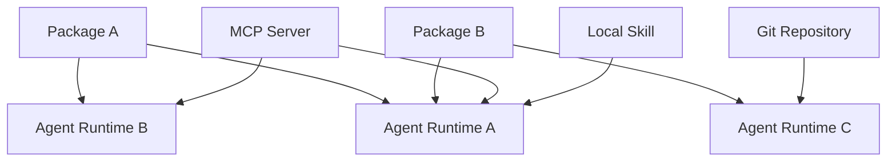

This creates:

- duplicate introspection logic
- inconsistent names
- no unified version semantics
- unclear compatibility
- missing provenance
- hidden license differences
- weak documentation
- difficult reproducibility
- no global understanding of available capabilities

The registry changes this to:

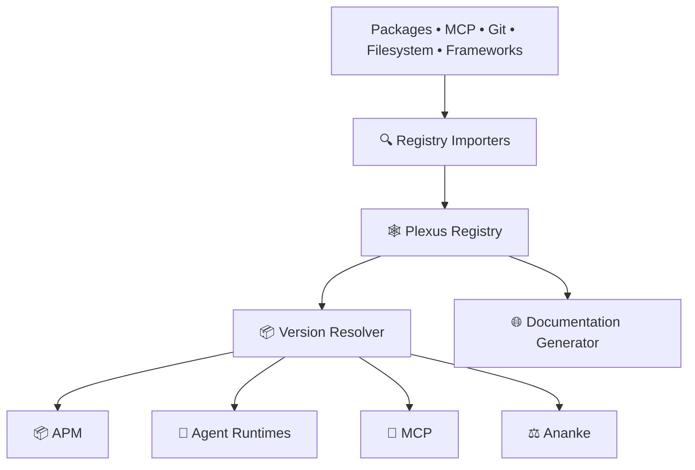

---

# 3. Core Design Decision: One Registry Core, Multiple Artifact Kinds

Ananke should not maintain separate independent databases for skills and agents.

Instead, define a generalized **Registry Artifact** model.

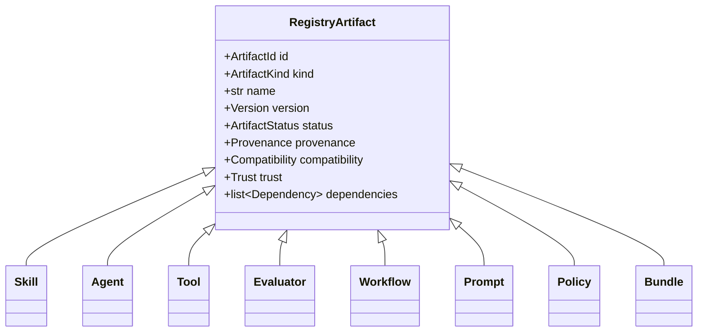

Initial public views:

```text
Skill Registry
Agent Registry
```

Future artifact kinds can use the same infrastructure without a database redesign.

---

# 4. Terminology

| Term | Meaning |
|---|---|
| **Artifact** | Any versioned registry entity |
| **Skill** | Reusable capability that an agent can activate or invoke |
| **Agent** | Configured autonomous actor with instructions, runtime, skills, tools, policies, and model requirements |
| **Tool** | Callable operation with a typed input/output contract |
| **Bundle** | Versioned collection of registry artifacts |
| **Version** | Immutable release identifier for an artifact |
| **Revision** | Registry metadata correction that does not change capability payload |
| **Source** | Origin from which an artifact was discovered |
| **Importer** | Adapter that reads an external source format |
| **Normalizer** | Converts imported data into Ananke canonical models |
| **Resolver** | Selects compatible artifact versions |
| **Lockfile** | Reproducible resolved dependency graph |
| **Channel** | Stable/beta/canary/deprecated or enterprise-defined release lane |
| **Provenance** | Origin, hashes, publisher, commit, package metadata, and discovery method |
| **Trust** | Registry judgment based on policy and validation |
| **Activation** | Making a resolved skill available to a runtime |
| **Materialization** | Installing/extracting an artifact payload into a usable local location |

---

# 5. Architectural Principles

| Principle | Requirement |
|---|---|
| **Local-first** | Full registry operation must work offline. |
| **Rust-accelerated** | Storage, indexing, resolution, hashing, and static-site generation should use a Rust core where practical. |
| **Immutable versions** | Published artifact versions are never silently overwritten. |
| **Content-addressed** | Payloads are identified by cryptographic digest. |
| **Framework-neutral** | Pydantic, Microsoft, MCP, etc. remain import adapters. |
| **Static introspection first** | Untrusted package code must not be executed merely to discover metadata. |
| **Isolated introspection when required** | Dynamic discovery runs only in an explicit sandbox/subprocess. |
| **Reproducible resolution** | Same registry snapshot + constraints -> same lockfile. |
| **Policy-governed** | Version selection includes trust, license, security, lifecycle, and compatibility rules. |
| **Explainable** | Every resolution decision can explain why a version was selected/rejected. |
| **Documentable** | Every registry entity can render to rich HTML automatically. |
| **Portable** | Registry can be exported/imported without depending on the local database format. |
| **Enterprise-safe** | No unapproved network egress or dynamic execution by default. |

---

# 6. High-Level Architecture

```mermaid
flowchart TB

    subgraph Sources["Capability Sources"]
        FS["Filesystem"]
        PY["Python Packages"]
        RS["Rust Crates"]
        MCP["MCP Servers"]
        GIT["Git Repositories"]
        APMF["APM Bundles"]
        FRAME["Framework Adapters"]
    end

    subgraph Import["Discovery & Normalization"]
        DISC["Source Discovery"]
        ADAPT["Importer Adapters"]
        NORM["Canonical Normalizer"]
        VALID["Schema / Policy Validation"]
    end

    subgraph Registry["Plexus Registry Core"]
        META["SQLite Metadata Store"]
        BLOB["Content-Addressed Artifact Store"]
        CACHE["Rust KV Cache"]
        INDEX["Search Index"]
        AUDIT["Registry Event Log"]
    end

    subgraph Services["Registry Services"]
        RESOLVE["Version Resolver"]
        QUERY["Query / Search"]
        DIFF["Version Diff"]
        TRUST["Trust / Policy"]
        DOCS["Static HTML Generator"]
        EXPORT["Export / Import"]
    end

    subgraph Consumers["Consumers"]
        APM["APM"]
        AGENT["Agent Runtime"]
        MCPAPI["MCP"]
        CLI["CLI"]
        PYAPI["Python API"]
        CI["CI / Enterprise Policy"]
    end

    Sources --> Import
    Import --> Registry
    Registry --> Services
    Services --> Consumers
```

---

# 7. Storage Architecture Recommendation

The registry has several different storage workloads:

1. transactional metadata
2. immutable artifact payloads
3. high-frequency key/value caches
4. search
5. analytics/reporting

No single embedded database is optimal for all five.

The recommended architecture is:

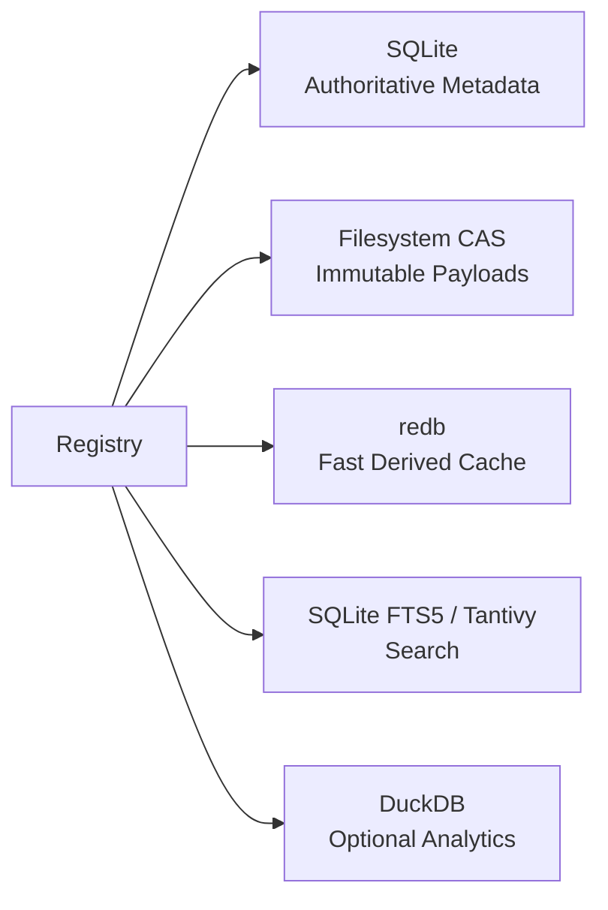

---

# 8. Why SQLite Should Be the Authoritative Registry Database

SQLite is the best default for the registry's transactional metadata because the workload consists primarily of:

- artifacts
- versions
- dependencies
- tags
- aliases
- compatibility
- policies
- activation state
- registry events

These require relational integrity and transactions.

Recommended Rust interface:

```text
rusqlite
```

`rusqlite` is an ergonomic Rust wrapper around SQLite. The registry can optionally compile SQLite as a bundled dependency for portability.

The authoritative database:

```text
~/.ananke/registry/registry.db
```

or project-local:

```text
.ananke/registry/registry.db
```

---

# 9. Why DuckDB Should Not Be the Primary Registry Store

DuckDB is excellent for:

- analytical queries
- aggregations
- historical reports
- version/adoption analytics
- registry inventory analysis
- exporting Parquet

It is not the preferred source of truth for highly transactional package-registry metadata.

Therefore:

```text
SQLite = operational truth
DuckDB = optional analytical projection
```

Example use:

```sql
SELECT framework,
       COUNT(*) AS skills,
       COUNT(DISTINCT publisher) AS publishers
FROM registry_versions
GROUP BY framework;
```

DuckDB can ingest exported registry tables rather than participating in normal write paths.

---

# 10. Rust-Native Disk Cache

For a DiskCache-like local cache, use a Rust key/value layer.

Recommended default candidate:

```text
redb
```

The current redb crate provides:

- embedded storage
- ACID transactions
- MVCC
- crash safety
- copy-on-write B+trees
- pure Rust implementation

It can store derived data such as:

- parsed manifest cache
- source fingerprint -> importer result
- resolver memoization
- rendered HTML fragment cache
- compatibility calculations
- package scan cache

The cache is **rebuildable**.

It must never become the only copy of registry metadata.

---

# 11. Content-Addressed Artifact Store

Payloads should not be stored as huge SQLite BLOB rows by default.

Use a content-addressed filesystem.

```text
~/.ananke/registry/
├── registry.db
├── blobs/
│   ├── b3/
│   │   ├── 01/
│   │   │   └── 01af...
│   │   └── ff/
│   └── sha256/
├── cache.redb
├── index/
├── docs/
└── locks/
```

Blob digest:

```text
BLAKE3 preferred for local fast addressing
SHA-256 additionally recorded for interoperability/provenance
```

A version record references its content digest.

---

# 12. Content Addressing

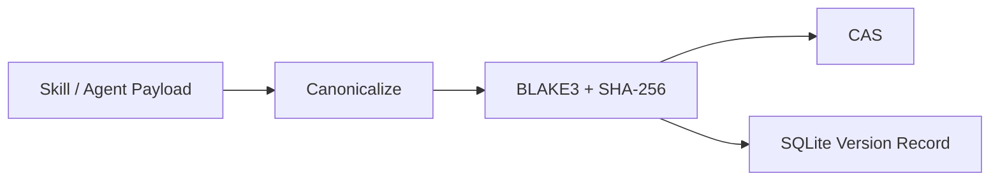

Benefits:

- deduplication
- immutable artifacts
- tamper detection
- easy replication
- reproducible locks
- cheap comparison

---

# 13. Search Strategy

Start with:

```text
SQLite FTS5
```

for:

- name
- summary
- description
- tags
- tool names
- capability names

Optional advanced adapter:

```text
Tantivy
```

Tantivy is a Rust search-engine library analogous to Lucene and is useful when the registry grows large or requires richer search ranking.

Architecture:

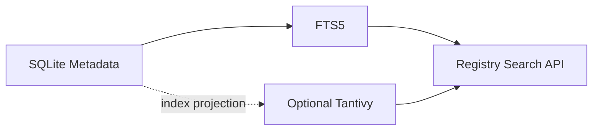

---

# 14. Semantic Search

Semantic search should be optional.

The base registry must not require embeddings.

Optional fields:

```text
embedding_model
embedding_version
embedding_vector
embedding_created_at
```

Enterprise policy controls:

- whether embeddings are allowed
- approved provider
- local vs remote embedding
- data classification

Lexical search remains fully functional without embeddings.

---

# 15. Artifact Kinds

Initial kinds:

```rust
enum ArtifactKind {
    Skill,
    Agent,
    Tool,
    Workflow,
    Evaluator,
    Prompt,
    Policy,
    Bundle,
    RuntimeProfile,
}
```

This allows an agent version to depend on skill versions.

Example:

```text
agent: coding-agent@2.3.0
  ├── skill: graph-query@1.8.1
  ├── skill: code-edit@3.1.0
  ├── evaluator: architecture-review@1.2.0
  └── policy: coding-safe@4.0.0
```

---

# 16. Canonical Artifact Identifier

Use a URI-like stable ID.

```text
ananke://<kind>/<namespace>/<name>@<version>
```

Examples:

```text
ananke://skill/core/code-review@2.1.0
ananke://agent/payments/remediation-agent@1.4.3
ananke://tool/platform/graph-query@3.0.0
```

Namespace allows:

- organization
- team
- publisher
- project

---

# 17. Version Model

Semantic Versioning should be the default.

Rust crate:

```text
semver
```

Version:

```text
MAJOR.MINOR.PATCH[-prerelease][+build]
```

Examples:

```text
1.0.0
1.4.2
2.0.0-beta.1
3.1.0+corp.5
```

SemVer is not blindly trusted; importers can preserve foreign/native version strings and map them to a normalized ordering when possible.

---

# 18. Version Immutability

Once registered:

```text
skill X version 1.3.0
```

its payload digest cannot change.

Attempting to re-register different content under the same identity/version returns:

```text
VERSION_CONTENT_CONFLICT
```

Allowed metadata corrections should create a **registry revision**, not replace payload identity.

---

# 19. Registry Revision

Separate:

```text
artifact version
```

from:

```text
registry metadata revision
```

Example:

```text
Skill payload:
  code-review@1.3.0
  digest = abc123

Registry revision 1:
  description typo

Registry revision 2:
  license metadata corrected
```

Payload remains immutable.

---

# 20. Channels

Artifacts can belong to release channels:

```text
stable
candidate
beta
canary
deprecated
quarantined
```

Enterprises may define custom channels:

```text
approved
restricted
experimental
```

Channel is metadata independent of SemVer.

---

# 21. Lifecycle Status

```rust
enum LifecycleStatus {
    Active,
    Deprecated,
    Yanked,
    Quarantined,
    Archived,
}
```

`Yanked` means:

- version exists for lockfile reproducibility
- new resolution should not select it by default

---

# 22. Canonical Skill Model

```yaml
kind: skill

namespace: core
name: graph-review
version: 2.1.0

summary: >
  Reviews source changes using code-graph blast radius and architecture context.

description: >
  Performs repository impact analysis and returns affected symbols,
  tests, architecture components, and review findings.

capabilities:
  - graph.query
  - graph.blast_radius
  - architecture.read

inputs:
  schema: schemas/input.json

outputs:
  schema: schemas/output.json

runtime:
  supported:
    - pydantic
    - microsoft
    - generic-mcp

permissions:
  filesystem:
    read:
      - "**"
    write: []

  network: []

dependencies:
  - skill: core/repo-context
    version: "^1.4"

compatibility:
  ananke: ">=1.2,<2"
  python: ">=3.11"

metadata:
  tags:
    - graph
    - review
    - architecture
```

---

# 23. Canonical Agent Model

```yaml
kind: agent

namespace: engineering
name: coding-agent
version: 3.2.0

summary: >
  Governed autonomous coding agent for repository changes.

runtime:
  provider: pydantic

model_requirements:
  tool_calling: true
  structured_output: true

skills:
  - ref: core/graph-review
    version: "^2.0"

  - ref: core/test-runner
    version: "^3.0"

policies:
  - safe-coding

evaluation:
  suite: coding-agent-standard

permissions:
  filesystem:
    read:
      - "**"
    write:
      - "src/**"
      - "tests/**"

  shell:
    allow:
      - pytest
      - cargo

  network: []

instructions:
  ref: prompts/coding-agent.md
```

---

# 24. Skill Composition

Skills can compose other skills.

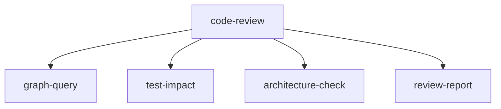

Resolver computes the complete dependency graph.

Cycles are rejected unless an artifact kind explicitly supports them.

---

# 25. Capability Taxonomy

Canonical capability names should use hierarchical IDs:

```text
filesystem.read
filesystem.write
shell.execute
network.http
graph.query
graph.write
architecture.read
architecture.validate
spec.read
spec.write
git.commit
git.push
scm.pull_request.create
issue.read
issue.update
eval.run
test.run
```

This enables:

- permission matching
- search
- capability comparison
- agent/skill compatibility

---

# 26. Skill Input and Output Contracts

Every callable skill should expose typed input/output schemas where practical.

Supported schema representations:

```text
JSON Schema (canonical)
Pydantic schema
OpenAPI component
Rust schemars-derived schema
MCP tool schema
```

Importers convert to JSON Schema.

Original native schema remains available in provenance metadata.

---

# 27. Provenance Model

Each version records:

```yaml
provenance:
  source_type: python-package
  source_name: example-package
  source_version: 4.2.1

  source_url: null

  git:
    repository: https://...
    commit: abc123

  discovered_at: 2026-09-18T18:00:00Z

  importer:
    id: python-entrypoint
    version: 1.3.0

  hashes:
    payload_blake3: ...
    payload_sha256: ...

  publisher:
    name: ...
```

---

# 28. Trust Model

Trust is independent of version.

```rust
enum TrustStatus {
    Unknown,
    Discovered,
    Verified,
    Approved,
    Restricted,
    Quarantined,
}
```

Policy controls which statuses are resolvable.

Example:

```yaml
resolver:
  minimum_trust: approved
```

---

# 29. Trust Signals

Possible signals:

- known publisher
- cryptographic hash
- signed Git tag
- package provenance
- SBOM
- license approval
- vulnerability scan
- human review
- internal owner
- tests passed
- evaluator score
- runtime compatibility verification
- source code availability

Ananke must not collapse these into one opaque score by default.

---

# 30. License Metadata

Each version records:

```text
SPDX expression
license source
confidence
approval state
```

Example:

```yaml
license:
  expression: Apache-2.0
  approval: approved
```

Unknown license can prevent enterprise resolution.

---

# 31. Dependency Model

Dependency kinds:

```text
artifact
python-package
rust-crate
system-binary
mcp-server
model-capability
runtime
```

Example:

```yaml
dependencies:

  - type: artifact
    id: ananke://skill/core/graph-query
    version: "^2"

  - type: system-binary
    name: git
    version: ">=2.40"

  - type: model-capability
    name: tool_calling
```

---

# 32. Compatibility Model

Compatibility dimensions:

- Ananke version
- runtime
- runtime version
- Python version
- Rust toolchain
- operating system
- architecture
- model capability
- MCP protocol
- required tools
- optional tools
- dependency versions

Example:

```yaml
compatibility:
  ananke: ">=1.4,<2"
  runtimes:
    pydantic: ">=1"
    microsoft: ">=1"
  operating_systems:
    - linux
    - macos
  architecture:
    - x86_64
    - arm64
```

---

# 33. Artifact Manifest

Every Ananke-native artifact has:

```text
ananke.toml
```

or:

```text
ananke.yaml
```

Example layout:

```text
skill/
├── ananke.toml
├── README.md
├── prompts/
├── schemas/
├── tools/
├── policies/
├── tests/
└── docs/
```

---

# 34. Import Sources

Ananke registry must support:

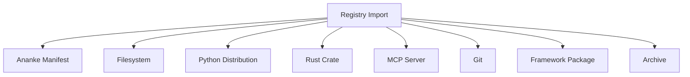

---

# 35. Importer Port

```rust
trait RegistryImporter {
    fn id(&self) -> &'static str;

    fn probe(&self, source: &Source) -> Result<ProbeResult>;

    fn inspect(
        &self,
        source: &Source,
        ctx: &InspectionContext,
    ) -> Result<Vec<ImportedArtifact>>;
}
```

Python-facing wrappers expose equivalent behavior.

---

# 36. Static Introspection First

Discovery must **not import arbitrary Python packages** by default.

Preferred order:

```text
1. explicit Ananke manifest
2. package metadata
3. declared entry points
4. static package resources
5. AST/static parser
6. isolated dynamic introspection
```

This prevents package discovery from becoming arbitrary code execution.

---

# 37. Python Package Importer

Static inputs:

```text
*.dist-info/METADATA
entry_points.txt
pyproject.toml
package_data
known framework manifests
```

The importer can detect:

- package/version
- entry points
- declared skill manifests
- schemas
- README/docs
- dependencies

Dynamic Python introspection is disabled unless explicitly enabled.

---

# 38. Rust Crate Importer

Sources:

```text
Cargo.toml
package metadata
embedded Ananke manifest
generated JSON Schema
docs metadata
```

Rust crates may expose registry metadata through:

```text
ananke.registry.json
```

included in package resources.

---

# 39. MCP Importer

MCP provides a natural capability source.

When allowed, importer can query:

```text
tools/list
resources/list
prompts/list
```

and register discovered definitions.

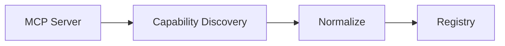

Remote MCP introspection requires explicit network policy approval.

---

# 40. Framework Importers

Framework-specific adapters can discover richer metadata.

Potential adapters:

```text
pydantic-ai
microsoft-agent-framework
langgraph
crewai
generic-python
generic-mcp
```

The registry core must never directly depend on these frameworks.

Where no stable public metadata API exists, importers must require:

- explicit plugin support
- framework-provided metadata
- isolated introspection

---

# 41. "Learn" Command

The user-facing concept should be:

```bash
ananke registry learn <source>
```

Examples:

```bash
ananke registry learn ./skills
ananke registry learn python:pydantic-ai-package
ananke registry learn mcp:local-server
ananke registry learn git:https://example/repo.git
```

`learn` means:

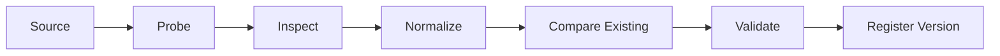

---

# 42. Import Diff

When a source is re-learned:

```text
Existing registered representation
vs
Newly introspected representation
```

Changes are classified:

```text
metadata-only
behavioral contract
input schema
output schema
permissions
dependencies
runtime
prompts
payload
```

Ananke can suggest version impact.

---

# 43. Version Suggestion

Version bump suggestion:

```text
PATCH
  docs/metadata/internal bugfix

MINOR
  backwards-compatible capability addition

MAJOR
  breaking input/output contract
  removed capability
  permission expansion
  runtime incompatibility
```

User or CI policy ultimately controls version publishing.

---

# 44. Permission Expansion Is Significant

Ananke should treat expanded permissions as a potentially breaking/security-significant change.

Example:

```text
1.2.0:
  filesystem.read = src/**

candidate:
  filesystem.read = **
  network.http = true
```

Registry diff must highlight this even if the API remains compatible.

---

# 45. Version Diff Model

```yaml
diff:

  from: 1.2.0
  to: 1.3.0

  changes:
    capabilities:
      added:
        - graph.reverse_dependencies

    permissions:
      expanded: false

    schemas:
      input_breaking: false
      output_breaking: false

    dependencies:
      added:
        - graph-core@^2
```

---

# 46. Resolver Goals

The resolver selects the best version based on:

1. explicit version requirement
2. lockfile
3. lifecycle status
4. channel
5. trust
6. license policy
7. security policy
8. runtime compatibility
9. dependency compatibility
10. environment compatibility
11. preference strategy

This is more sophisticated than:

```text
choose highest semver
```

---

# 47. Resolver Algorithm

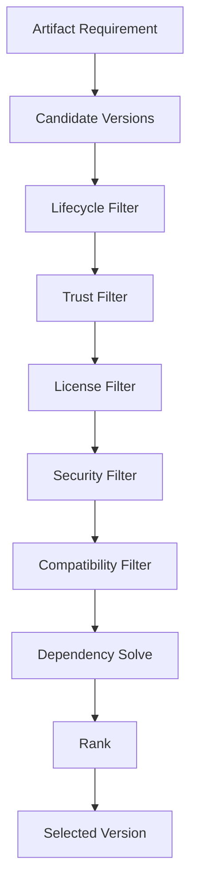

---

# 48. Resolution Modes

```rust
enum ResolutionMode {
    Locked,
    HighestCompatible,
    HighestApproved,
    LowestCompatible,
    StableOnly,
    Exact,
}
```

Recommended default enterprise mode:

```text
HighestApproved
```

not simply `HighestCompatible`.

---

# 49. Version Requirement Examples

```text
=1.2.3
^1.4
~2.3
>=1.5,<2
latest
stable
approved
```

Symbolic aliases such as `latest` resolve through policy, not direct database magic.

---

# 50. Lockfile

File:

```text
ananke.lock
```

or registry-specific:

```text
.ananke/apm.lock
```

Example:

```toml
version = 1

[[artifact]]
id = "ananke://skill/core/graph-review"
version = "2.1.3"
digest = "b3:abc123..."
source = "local-registry"

[[artifact]]
id = "ananke://skill/core/graph-query"
version = "1.8.2"
digest = "b3:def456..."
source = "local-registry"
```

---

# 51. Lockfile Properties

Lockfile must capture:

- exact version
- payload digest
- registry snapshot identifier
- resolved dependencies
- source/provenance
- optional feature flags

Same lockfile should materialize the same capability set.

---

# 52. Registry Snapshot

Each registry mutation sequence can produce a logical snapshot ID.

Example:

```text
registry_snapshot = sha256(
  ordered active artifact version records
)
```

Lockfiles can reference snapshot for debugging/reproducibility.

---

# 53. Agent Resolution

An agent itself is a versioned dependency graph.

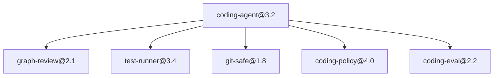

Ananke resolves the complete graph before activation.

---

# 54. "Best Version" Selection

"Best" must never be an undocumented heuristic.

Resolution should explain:

```text
Selected 2.4.1 because:
  ✓ matches ^2
  ✓ stable
  ✓ approved
  ✓ compatible with Ananke 1.7
  ✓ supports runtime pydantic
  ✓ license approved
  ✓ no active security quarantine

Rejected 2.5.0-beta.2:
  ✗ beta channel not allowed

Rejected 2.4.2:
  ✗ trust status = discovered
```

CLI:

```bash
ananke registry resolve graph-review --explain
```

---

# 55. Registry Database Schema

Core SQLite tables:

```text
artifacts
artifact_versions
artifact_revisions
artifact_aliases
artifact_tags
artifact_capabilities
artifact_dependencies
artifact_permissions
artifact_compatibility
artifact_sources
artifact_hashes
artifact_channels
artifact_trust
artifact_licenses
artifact_schemas
artifact_files
agents
agent_skills
registry_events
registry_snapshots
activations
locks
```

---

# 56. `artifacts`

```sql
CREATE TABLE artifacts (
    id              INTEGER PRIMARY KEY,
    kind            TEXT NOT NULL,
    namespace       TEXT NOT NULL,
    name            TEXT NOT NULL,
    created_at      TEXT NOT NULL,
    UNIQUE(kind, namespace, name)
);
```

---

# 57. `artifact_versions`

```sql
CREATE TABLE artifact_versions (
    id                INTEGER PRIMARY KEY,
    artifact_id       INTEGER NOT NULL,
    version           TEXT NOT NULL,
    normalized_version TEXT,
    lifecycle_status  TEXT NOT NULL,
    channel           TEXT NOT NULL,
    summary           TEXT,
    description       TEXT,
    payload_blake3    TEXT NOT NULL,
    payload_sha256    TEXT NOT NULL,
    created_at        TEXT NOT NULL,
    FOREIGN KEY(artifact_id) REFERENCES artifacts(id),
    UNIQUE(artifact_id, version)
);
```

---

# 58. Dependencies

```sql
CREATE TABLE artifact_dependencies (
    id               INTEGER PRIMARY KEY,
    version_id       INTEGER NOT NULL,
    dependency_type  TEXT NOT NULL,
    dependency_id    TEXT NOT NULL,
    version_req      TEXT,
    optional         INTEGER NOT NULL DEFAULT 0,
    FOREIGN KEY(version_id) REFERENCES artifact_versions(id)
);
```

---

# 59. Registry Event Log

Every mutation emits immutable audit event.

```sql
CREATE TABLE registry_events (
    seq             INTEGER PRIMARY KEY AUTOINCREMENT,
    event_id        TEXT UNIQUE NOT NULL,
    event_type      TEXT NOT NULL,
    artifact_uri    TEXT,
    actor           TEXT,
    payload_json    TEXT NOT NULL,
    created_at      TEXT NOT NULL
);
```

Examples:

```text
artifact.discovered
artifact.registered
artifact.yanked
artifact.deprecated
trust.approved
trust.quarantined
alias.updated
activation.changed
lock.created
```

---

# 60. SQLite Modes

Recommended:

```text
WAL mode
foreign_keys=ON
busy_timeout configured
```

Writes should use transactions.

Registry mutation paths should be short-lived.

---

# 61. Rust Storage Crates

Recommended baseline:

```text
rusqlite
serde / serde_json
semver
blake3
sha2
zstd
tar
walkdir
uuid
time
```

Optional:

```text
redb
tantivy
duckdb
notify
```

Exact versions belong in Cargo.lock and release policy, not this specification.

---

# 62. Registry Service Boundary

Rust crate:

```text
ananke-registry-core
```

Responsibilities:

- storage
- manifests
- hashing
- CAS
- versioning
- resolver
- import normalization
- search
- diffing
- HTML model generation

Python package wraps via:

```text
PyO3 / maturin
```

or a local process/RPC boundary if binary isolation is preferred.

---

# 63. Suggested Rust Crate Layout

```text
rust/
└── ananke-registry/
    ├── crates/
    │   ├── registry-core/
    │   ├── registry-store/
    │   ├── registry-model/
    │   ├── registry-resolver/
    │   ├── registry-import/
    │   ├── registry-search/
    │   ├── registry-docs/
    │   └── registry-cli/
    └── Cargo.toml
```

---

# 64. Rust/Python Boundary

Recommended rule:

> Put CPU/IO-heavy deterministic registry operations in Rust; keep high-level Ananke orchestration and framework adapters in Python where appropriate.

Rust:

- storage
- hashing
- indexing
- dependency resolution
- semver
- filesystem scans
- static-site rendering
- diffing

Python:

- framework-specific discovery adapters
- runtime integration
- existing Ananke APIs
- dynamic Python package introspection

---

# 65. Registry Python API

```python
from ananke.plexus import Ananke

ananke = Ananke.open(".")

registry = ananke.registry

skill = registry.skills.get(
    "core/graph-review",
    version="^2",
)

agent = registry.agents.resolve(
    "engineering/coding-agent",
    version="stable",
)
```

---

# 66. Registration API

```python
registry.skills.register(
    source="./skills/graph-review",
)

registry.agents.register(
    source="./agents/coding-agent",
)
```

Explicit manifest:

```python
registry.register_manifest(
    ".ananke/skills/graph-review/ananke.toml"
)
```

---

# 67. Rust API Example

```rust
let registry = Registry::open(path)?;

let resolved = registry.resolve(
    ArtifactRequirement::new(
        ArtifactKind::Skill,
        "core",
        "graph-review",
        "^2",
    ),
    &environment,
    &policy,
)?;
```

---

# 68. CLI

Top-level:

```text
ananke registry
```

Commands:

```text
ananke registry
├── init
├── learn
├── register
├── unregister
├── inspect
├── search
├── list
├── show
├── diff
├── resolve
├── activate
├── deactivate
├── doctor
├── verify
├── export
├── import
├── gc
├── rebuild-index
├── snapshot
├── docs
└── serve
```

Skill shortcuts:

```text
ananke skill ...
apm ...
```

Agent shortcuts:

```text
ananke agent ...
```

---

# 69. `apm` Integration

APM becomes the package-management UX over registry services.

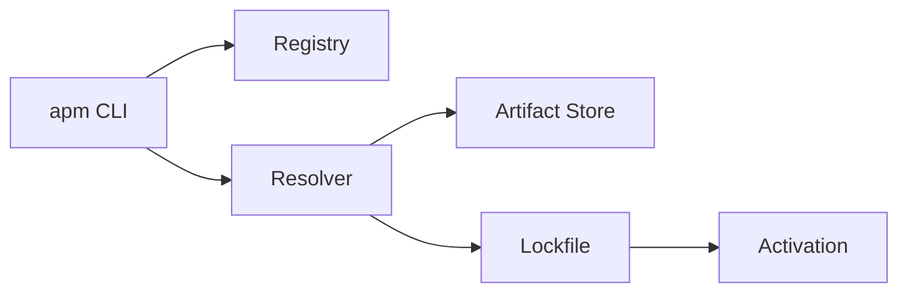

Commands:

```bash
apm search graph
apm info graph-review
apm install core/graph-review@^2
apm activate core/graph-review@2.1.3
apm lock
apm upgrade
```

---

# 70. Search CLI

```bash
ananke registry search "graph review"
```

Filters:

```bash
ananke registry search graph \
  --kind skill \
  --runtime pydantic \
  --trust approved \
  --channel stable \
  --capability graph.query
```

---

# 71. Inspect Command

```bash
ananke registry inspect core/graph-review@2.1.3
```

Displays:

- summary
- description
- capabilities
- tools
- inputs/outputs
- permissions
- dependencies
- compatible runtimes
- version history
- provenance
- trust
- security
- documentation
- source files

---

# 72. Static HTML Documentation

One of the primary registry outputs is a complete static documentation site.

Command:

```bash
ananke registry docs build
```

Output:

```text
.ananke/registry/docs/
├── index.html
├── skills/
│   ├── index.html
│   └── core/
│       └── graph-review/
│           ├── index.html
│           ├── 1.0.0.html
│           ├── 2.0.0.html
│           └── 2.1.3.html
├── agents/
├── capabilities/
├── frameworks/
├── publishers/
├── search-index.json
└── assets/
```

---

# 73. Self-Contained HTML Dump

Additionally:

```bash
ananke registry docs build --single-file
```

produces:

```text
registry.html
```

Requirements:

- CSS embedded
- JavaScript embedded
- search data embedded or compressed
- no external CDN
- works offline
- printable
- dark/light modes

This is ideal for sharing within restricted enterprises.

---

# 74. Registry Home Page

The HTML home page should show:

- number of skills
- number of agents
- artifact versions
- active versions
- deprecated versions
- quarantined versions
- frameworks
- capability categories
- latest changes
- trust breakdown
- license breakdown

---

# 75. Skill Documentation Page

Every skill page contains:

```text
Name + namespace
Latest approved version
Summary
Long description
Capability badges
Runtime support
Inputs
Outputs
Tools
Permissions
Dependencies
Version selector
Version history
Breaking changes
Examples
README
Tests
Provenance
Trust
License
Security findings
Used by agents
Related skills
```

---

# 76. Agent Documentation Page

Agent page:

```text
Identity
Purpose
Runtime
Model requirements
Instructions
Installed skills
Tool graph
Permissions
Policies
Evaluation suite
Supported environments
Versions
Changes
Provenance
Deployment examples
```

---

# 77. Dependency Graph Visualization

HTML docs should generate Mermaid or native SVG dependency diagrams.

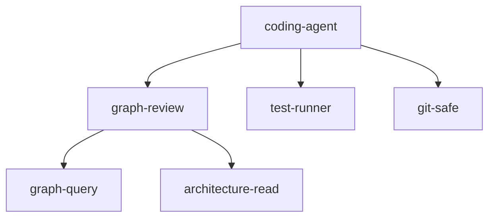

---

# 78. Capability Matrix in HTML

Example:

| Artifact | graph.query | test.run | git.commit | network | filesystem.write |
|---|---:|---:|---:|---:|---:|
| graph-review | ✅ | ❌ | ❌ | ❌ | ❌ |
| coding-agent | ✅ | ✅ | ✅ | ❌ | ✅ |
| release-agent | ✅ | ✅ | ✅ | ✅ | ✅ |

Generated automatically.

---

# 79. Version History View

HTML page displays:

```text
3.0.0  BREAKING
  - removed shell.raw
  - changed result schema

2.4.1
  - bug fix in graph query

2.4.0
  + architecture blast radius
```

Diff data comes from canonical registry version comparisons.

---

# 80. Version Comparison Page

URL:

```text
skills/core/graph-review/compare/2.0.0...2.1.0.html
```

Sections:

- manifest diff
- capability diff
- permission diff
- dependency diff
- schema diff
- prompt diff
- docs diff
- trust changes

---

# 81. HTML Generation Technology

Rust-side options:

```text
Askama
MiniJinja
```

Recommendation:

- use template engine only for rendering
- use embedded static assets
- generate deterministic output
- avoid runtime web framework requirement

For single-file output, inline:

- CSS
- JS
- SVG icons
- compressed registry index

---

# 82. Local Registry Server

Optional:

```bash
ananke registry serve
```

Serves generated docs and JSON APIs locally.

Recommended Rust server:

```text
axum
```

Server is optional.

Static HTML remains the primary documentation artifact.

---

# 83. Registry HTTP API

Optional local endpoints:

```text
GET /api/v1/artifacts
GET /api/v1/artifacts/{kind}/{namespace}/{name}
GET /api/v1/artifacts/{...}/versions
GET /api/v1/search
GET /api/v1/resolve
GET /api/v1/capabilities
```

Write operations disabled by default on HTTP server.

---

# 84. MCP Registry Interface

Expose registry as MCP resources/tools.

Tools:

```text
registry_search
registry_get_skill
registry_get_agent
registry_resolve
registry_compare_versions
registry_list_capabilities
```

Resources:

```text
ananke://registry/skills
ananke://registry/skill/core/graph-review/2.1.3
ananke://registry/agents
```

Agents can discover capabilities through the same source of truth.

---

# 85. Activation

Registry registration and runtime activation are separate.

```text
registered != installed != activated
```

States:

```text
Registered
Materialized
Activated
```

This prevents discovery from automatically making capabilities executable.

---

# 86. Materialization

Materialization extracts/resolves payload into:

```text
~/.ananke/registry/materialized/
  <digest>/
```

Project activation can link/copy:

```text
.ananke/skills/
```

depending on policy.

---

# 87. Activation Profile

Example:

```yaml
activation:
  project: payments

  skills:
    graph-review: "2.1.3"
    test-runner: "3.4.0"

  agent:
    coding-agent: "3.2.0"
```

---

# 88. Runtime Translation

Canonical skills may require translation into runtime-native form.

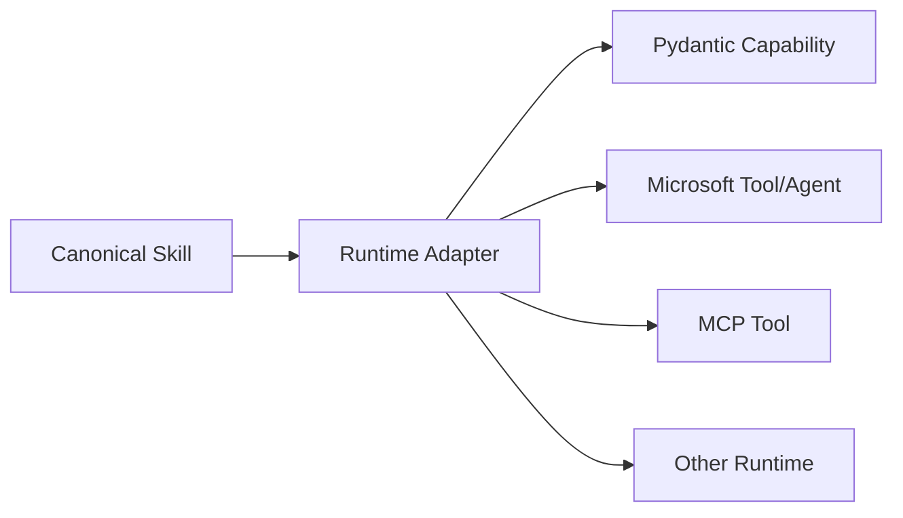

Runtime translation never changes registry identity.

---

# 89. Compatibility Testing

Registered artifacts can include tests.

Before marking version `Approved`:

```text
manifest validation
schema validation
dependency resolution
runtime translation
unit/contract tests
security checks
license checks
```

Policy determines required checks.

---

# 90. Trust Promotion Workflow

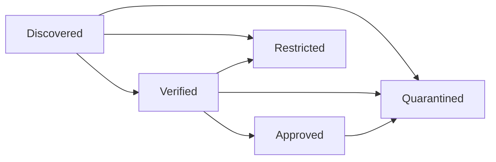

---

# 91. Enterprise Approval

Enterprise registry policy can require:

```yaml
approval:
  licenses:
    allow:
      - Apache-2.0
      - MIT
      - BSD-3-Clause

  minimum_trust: approved

  require:
    - provenance
    - checksum
    - tests
    - vulnerability_scan

  network_capability:
    human_review: true
```

---

# 92. Vulnerability Metadata

Artifact versions may have:

```text
security_status
last_scanned_at
scanner
findings_count
critical_count
```

Quarantine if policy requires.

The registry should not itself implement every scanner.

It consumes Ananke security/evidence results.

---

# 93. Registry Event Integration

Registry emits into Ananke event bus:

```text
registry.source.discovered
registry.artifact.imported
registry.version.registered
registry.version.yanked
registry.version.deprecated
registry.version.quarantined
registry.trust.changed
registry.activation.changed
registry.lock.generated
registry.docs.generated
```

---

# 94. File Watcher

Optional local auto-discovery:

```text
notify
```

Watch directories:

```text
.ananke/skills/
.ananke/agents/
```

When manifest changes:

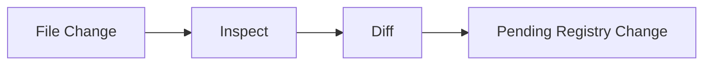

Auto-registration should be policy controlled.

Default:

```text
detect automatically
publish manually
```

---

# 95. Registry Garbage Collection

CAS retains blobs referenced by:

- active versions
- yanked versions
- lockfiles
- snapshots
- evidence

GC only deletes unreachable blobs after grace period.

Command:

```bash
ananke registry gc --dry-run
```

---

# 96. Export Format

Portable export:

```text
ananke-registry.tar.zst
```

Contents:

```text
manifest.json
artifacts.jsonl
versions.jsonl
dependencies.jsonl
events.jsonl
blobs/
checksums.txt
```

This is database-independent.

---

# 97. Import

```bash
ananke registry import registry-export.tar.zst
```

Import validates:

- checksums
- schema version
- collisions
- version immutability
- policy
- signatures if present

---

# 98. Registry Federation

Initial system is local-only, but architecture should support future federation.

Possible future source:

```text
local registry
team registry
enterprise registry
public registry
```

Resolution priority:

```text
project
user
enterprise
public
```

Policy can disable public registries.

---

# 99. Registry Source Configuration

```yaml
registry:

  sources:

    project:
      type: local
      path: .ananke/registry

    enterprise:
      type: remote
      url: https://registry.example.internal
      enabled: true

    public:
      enabled: false
```

Remote registry design is intentionally outside initial implementation but models must preserve source identity.

---

# 100. Namespace Governance

Namespaces can be protected.

Example:

```text
core/*
company/*
team-payments/*
```

Policy:

```yaml
namespaces:

  core:
    publishers:
      - ananke-maintainers

  company:
    publishers:
      - enterprise-registry-admin
```

---

# 101. Aliases

Aliases:

```text
graph-review -> core/graph-review
default-coder -> engineering/coding-agent
```

Aliases never hide versions in lockfiles.

Resolver expands alias before locking.

---

# 102. Deprecation

Deprecated artifact:

```yaml
lifecycle:
  status: deprecated
  message: >
    Use core/graph-review-v2 instead.
  replacement: core/graph-review-v2
```

Docs display warning.

Resolution excludes deprecated versions unless explicitly requested or locked.

---

# 103. Yank

Yank preserves reproducibility.

```bash
ananke registry yank core/graph-review@2.1.0
```

New resolution avoids it.

Existing lockfile can still materialize if policy permits.

---

# 104. Quarantine

Quarantine is stronger.

Triggers:

- critical vulnerability
- malicious behavior
- invalid provenance
- permission escalation
- compromised publisher

Materialization should fail by default.

---

# 105. Registry Validation

```bash
ananke registry verify
```

Checks:

- SQLite integrity
- foreign keys
- blob existence
- blob hashes
- dependency graph
- duplicate IDs
- invalid semver
- dangling aliases
- search index consistency
- lockfile references

---

# 106. Search API

```python
results = registry.search(
    query="graph code review",
    kind="skill",
    capability=["graph.query"],
    runtime="pydantic",
    trust="approved",
)
```

Ranking can combine:

- name exact match
- tags
- capabilities
- description FTS
- optional semantic score

---

# 107. Registry Query DSL

Optional compact query syntax:

```text
kind:skill capability:graph.query runtime:pydantic trust:approved graph review
```

Useful in CLI and HTML search.

---

# 108. Introspection Report

Command:

```bash
ananke registry inspect \
  --source python:some-package \
  --report inspect.html
```

Generates a **pre-registration report** showing:

- discovered candidates
- inferred fields
- missing metadata
- dynamic introspection required?
- permission concerns
- version suggestions
- conflicts with registry

This allows safe human review before registration.

---

# 109. HTML "Registry Dump"

The requested full introspection dump should support:

```bash
ananke registry docs dump \
  --output ananke-registry.html
```

The single HTML contains:

- all skills
- all agents
- all versions
- dependencies
- capability matrix
- search
- filters
- provenance
- licenses
- trust
- compatibility
- version comparisons
- diagrams

No server required.

---

# 110. Documentation JSON Model

Rendering should consume a stable intermediate JSON model.

```text
RegistryDocumentationModel
```

This prevents HTML templates from querying SQLite directly.

Pipeline:

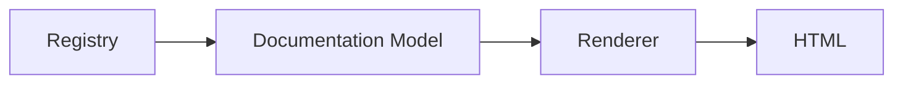

---

# 111. Docs Incremental Build

Use content digest to avoid rerendering unchanged pages.

Cache:

```text
page-key -> source digest -> rendered digest
```

redb is a good fit.

---

# 112. Docs Version Selector

Every artifact page should provide:

```text
Latest Approved
Latest Stable
All Versions
```

The default page:

```text
skill/core/graph-review/index.html
```

renders latest approved according to docs-generation policy.

Historical pages remain immutable.

---

# 113. Docs Search Index

Generated:

```text
search-index.json
```

Fields:

```text
uri
kind
name
version
summary
tags
capabilities
runtime
trust
license
```

Single-file dump embeds it.

---

# 114. Mermaid / SVG Diagrams

Docs generator should create:

- dependency graph
- skill composition graph
- agent skill graph
- version lineage
- capability relationships

To avoid external JS dependence, diagrams can be pre-rendered to SVG where feasible.

---

# 115. Registry Diff CLI

```bash
ananke registry diff \
  core/graph-review@2.0.0 \
  core/graph-review@2.1.0
```

Output:

```text
Capabilities:
  + graph.reverse_dependencies

Permissions:
  unchanged

Inputs:
  backward compatible

Dependencies:
  graph-core ^1 -> ^2

Suggested semver:
  MINOR
```

---

# 116. Auto Version Suggestion

```bash
ananke registry register ./skill \
  --version auto
```

Ananke:

1. finds latest version
2. diffs canonical artifact
3. applies version policy
4. suggests bump
5. requires confirmation unless CI policy auto-accepts

---

# 117. Registration Conflict Rules

Reject:

- same ID/version with different digest
- illegal namespace
- dependency cycle
- malformed schema
- forbidden permissions
- unsupported version syntax where strict mode enabled
- license policy violation
- unsigned artifact where signature required

---

# 118. Identity Matching During Learning

When importing from other frameworks, determine whether candidate represents existing skill using:

1. explicit `ananke_id`
2. source package + native identifier
3. provenance mapping
4. alias table
5. exact normalized name only as low-confidence suggestion

Never silently merge by name alone.

---

# 119. Duplicate Detection

Potential duplicates can be surfaced based on:

- same source
- same digest
- same tool schema
- same capability set
- semantic similarity

Human/policy decides merge/alias.

---

# 120. Registry Ownership

Artifact metadata:

```yaml
owners:
  - team: ai-platform
  - user: alice

maintainers:
  - alice
  - bob
```

Supports enterprise stewardship and deprecation workflows.

---

# 121. Usage Telemetry

Local registry can optionally record:

- activations
- resolutions
- agent usage
- last-used timestamp

Disabled or local-only by default.

No usage leaves machine without explicit telemetry configuration.

---

# 122. Version Selection Signals

The resolver should **not** use popularity as a security-sensitive selection rule by default.

Possible ranking:

```text
policy compatibility
trust
stable channel
semver
local preference
```

Usage counts can inform humans but should not override trust.

---

# 123. Agent Registry Search

Examples:

```bash
ananke agent search \
  --skill graph-review \
  --runtime pydantic \
  --capability git.commit
```

This finds agents that compose requested skills/capabilities.

---

# 124. Skill Recommendations

Ananke may suggest:

```text
"This agent requires graph.query.
Approved skills providing it:
  1. core/graph-query@2.4.0
  2. company/graph-tool@1.8.2"
```

Final resolution remains deterministic through policy.

---

# 125. Resolver Extension Points

Resolver rules can be plugins:

```text
TrustRule
LicenseRule
CompatibilityRule
SecurityRule
ChannelRule
EnterpriseApprovalRule
```

Rules emit:

```text
Accept
Reject(reason)
Penalty
Preference
```

---

# 126. Resolver Explainability Model

```python
class ResolutionDecision(BaseModel):
    selected: ArtifactVersionRef
    candidates: list[CandidateDecision]
```

Each candidate:

```text
version
accepted
reasons
rank
```

This powers CLI and HTML explanations.

---

# 127. Registry Policy

Example:

```yaml
registry_policy:

  resolve:
    minimum_trust: approved
    channel:
      - stable

  licenses:
    allow:
      - Apache-2.0
      - MIT
      - BSD-3-Clause

  permissions:
    network:
      require_review: true

  dynamic_introspection:
    allowed: false

  remote_sources:
    public: false
```

---

# 128. Dynamic Introspection Sandbox

Some frameworks expose metadata only by importing/executing code.

If explicitly allowed:

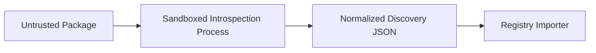

Sandbox:

- no network by default
- read-only package files
- no user home access
- no credentials
- timeout
- CPU/memory limit
- JSON-only output contract

---

# 129. Introspection Plugin Protocol

Dynamic introspection process reads:

```json
{
  "source": "...",
  "framework": "..."
}
```

writes:

```json
{
  "artifacts": [...]
}
```

No Python object crosses process boundary.

---

# 130. Security

Threats:

- malicious package import
- manifest path traversal
- archive traversal
- poisoned docs
- HTML/JS injection
- dependency confusion
- version substitution
- tampered blobs
- malicious MCP servers
- symlink escapes

Controls:

- no dynamic execution by default
- canonicalize paths
- reject archive traversal
- escape all HTML
- sanitize Markdown rendering
- hash all payloads
- namespace policies
- explicit MCP network permission
- lockfile digests
- CAS immutability

---

# 131. HTML Security

Static docs may contain untrusted descriptions.

Renderer must:

- HTML-escape text
- sanitize rendered Markdown
- disable raw HTML by default
- no external scripts
- no inline arbitrary artifact JS
- strong CSP for served mode

---

# 132. Performance Goals

Registry operations should target:

| Operation | Target |
|---|---:|
| exact artifact lookup | < 5 ms typical local |
| version list | < 10 ms typical |
| resolve small dependency graph | < 20 ms |
| FTS search | < 50 ms typical |
| docs incremental single artifact | < 100 ms excluding diagrams |
| registry integrity quick check | seconds for normal local registry |

Targets are goals, not API guarantees.

---

# 133. Concurrency

Expected concurrency:

- multiple readers
- one local writer
- background docs/index refresh

SQLite WAL handles reader concurrency.

redb caches may use concurrent readers.

Registry write operations take advisory process lock where needed.

---

# 134. Migration Strategy

Database schema uses migration version table.

```text
schema_migrations
```

Migrations:

- forward-only
- transactional where possible
- backed up before destructive schema change

Portable export remains fallback for cross-major migration.

---

# 135. Registry Backup

Command:

```bash
ananke registry backup
```

Produces:

```text
registry-backup-<timestamp>.tar.zst
```

Includes:

- SQLite consistent snapshot
- CAS reachable blobs
- lockfiles
- policy
- event log

---

# 136. Registry Doctor

```bash
ananke registry doctor
```

Checks:

```text
✓ SQLite integrity
✓ WAL state
✓ blob hashes
✓ cache rebuildability
✓ FTS consistency
✓ resolver
✓ manifests
✓ lockfiles
✓ importer availability
✓ docs templates
```

---

# 137. APM vs Registry Responsibility

| Capability | APM | Registry |
|---|---:|---:|
| Search | UX | Data/query |
| Install | ✅ | materialization primitive |
| Resolve dependencies | calls registry | ✅ owns |
| Lock | UX | ✅ owns model |
| Activate | UX | registry state |
| Store versions | ❌ | ✅ |
| Provenance | displays | ✅ |
| Docs | links/builds | ✅ |
| Version diff | calls registry | ✅ |
| Trust | displays | ✅ |
| Import from frameworks | command surface | registry importer |

---

# 138. Agent Registry vs Skill Registry

Both are views over shared data.

Skill-specific fields:

- callable capabilities
- input/output schemas
- permissions
- implementation payload

Agent-specific fields:

- runtime
- model requirements
- instructions
- composed skills
- policies
- eval suite
- lifecycle configuration

Shared:

- identity
- versions
- provenance
- trust
- dependencies
- docs
- license
- compatibility

---

# 139. Registry Integration With Evidence

Every agent run can record:

```text
agent URI
skill URIs
exact versions
payload digests
registry snapshot
lockfile hash
```

This means evidence can reconstruct exactly which capability versions ran.

---

# 140. Evaluation Integration

Registry artifact versions can have quality metadata:

```yaml
quality:
  tests:
    status: pass

  evaluation:
    suite: skill-standard
    score: 0.94

  last_verified_at: ...
```

Resolver may require quality status but should not treat a single numeric score as universal truth.

---

# 141. Test Integration

Every registered skill can supply:

```text
tests/
```

Before approval:

```bash
ananke registry verify core/graph-review@2.1.3
```

can invoke the Unified Testing & Quality Harness.

---

# 142. Skill Registry Quality Gate

```mermaid
flowchart LR

    IMPORT["Imported Skill"]
    VALID["Manifest Validation"]
    TEST["Tests"]
    SEC["Security"]
    LICENSE["License"]
    COMPAT["Compatibility"]
    TRUST["Trust Promotion"]

    IMPORT --> VALID --> TEST --> SEC --> LICENSE --> COMPAT --> TRUST
```

---

# 143. HTML Quality Badges

Artifact docs should show badges:

```text
APPROVED
STABLE
TESTED
SIGNED
NO NETWORK
RUNTIME: PYDANTIC
LICENSE: APACHE-2.0
```

Badges are factual metadata, not arbitrary popularity scores.

---

# 144. Registry Reports

CLI reports:

```text
registry inventory
registry licenses
registry trust
registry stale
registry deprecated
registry unused
registry security
registry compatibility
```

Optional DuckDB projection is valuable here.

---

# 145. DuckDB Analytics Export

Command:

```bash
ananke registry analytics build
```

Builds:

```text
registry.duckdb
```

from authoritative SQLite/event data.

This database is disposable/rebuildable.

---

# 146. Example Analytics

Questions:

- How many approved skills exist per runtime?
- Which agents depend on deprecated versions?
- Which skills request network permissions?
- Which artifacts have not been verified recently?
- Which versions remain locked by projects?
- What licenses exist in active bundles?

---

# 147. Change Detection

Source fingerprint:

```text
package version
manifest digest
file tree digest
git commit
MCP server identity/version
```

If unchanged:

```text
skip expensive re-introspection
```

Cache result in redb.

---

# 148. Registry Learn Workflow

```mermaid
sequenceDiagram

    participant U as User
    participant C as CLI
    participant I as Importer
    participant R as Registry
    participant P as Policy
    participant D as Docs

    U->>C: registry learn source
    C->>I: probe + inspect
    I-->>C: normalized candidates
    C->>R: find identity/version
    R-->>C: existing state
    C->>P: validate candidate
    P-->>C: allow/review/deny
    C->>R: register immutable version
    R-->>D: registry event
    D->>D: incremental rebuild
    C-->>U: summary + diff + URI
```

---

# 149. Full Agent Resolve Workflow

```mermaid
sequenceDiagram

    participant A as Ananke Runtime
    participant R as Registry
    participant V as Resolver
    participant P as Policy
    participant C as CAS

    A->>R: resolve coding-agent@^3
    R->>V: candidates + environment
    V->>P: evaluate versions
    P-->>V: allowed candidates
    V->>V: solve dependencies
    V-->>R: resolved graph
    R->>C: verify materialized digests
    C-->>R: ready
    R-->>A: exact agent + skill versions
```

---

# 150. Cross-Project Consumption

Projects should be able to reference:

```toml
[tool.ananke.agent]
name = "engineering/coding-agent"
version = "^3"
```

Then:

```bash
ananke sync
```

resolves and writes lockfile.

---

# 151. Project-Local Overrides

A project may override a registered skill during development.

```yaml
overrides:
  core/graph-review:
    path: ../graph-review-dev
```

Lockfile marks:

```text
source = path
dirty = true
```

Release profiles can prohibit dirty/path overrides.

---

# 152. Development Mode

Commands:

```bash
apm link ./my-skill
apm unlink core/my-skill
```

Linked skills remain distinct from immutable published registry versions.

---

# 153. Publishing

Local publication:

```bash
apm publish ./my-skill
```

Steps:

```text
validate
test
hash
resolve dependencies
check version conflict
policy
register
docs rebuild
```

---

# 154. Promotion

Version does not change during promotion.

```bash
ananke registry promote \
  core/graph-review@2.1.3 \
  --channel stable \
  --trust approved
```

Promotion modifies registry metadata/revision.

---

# 155. Importing Existing Skill Directories

Importer should recognize common generic structures:

```text
README.md
SKILL.md
manifest.yaml
skill.yaml
tool schemas
prompt files
```

No assumption that every repository uses Ananke format.

The importer builds a candidate and asks for missing required metadata.

---

# 156. Skill Learning Wizard

Interactive CLI:

```text
Found 6 callable tools
Found README
Found 2 prompt templates
No license metadata found
No explicit permissions found

Suggested:
  artifact kind: skill
  name: github-review
  version: 0.1.0

Questions:
  [1] Namespace?
  [2] License?
  [3] Required filesystem permissions?
  [4] Register?
```

Noninteractive mode requires explicit manifest fields.

---

# 157. Agent Introspection

Agent importer tries to discover:

- identity
- system instructions
- runtime
- model configuration
- tools
- skills
- handoffs/subagents
- memory
- policies
- output schema
- eval config

Sensitive values such as API keys must never be stored.

---

# 158. Secret Detection

Before registration:

- scan manifests
- prompts
- config
- payload text

Reject or redact secrets according to policy.

Never persist runtime credentials in registry.

---

# 159. Registry Schema Version

Manifest:

```text
ananke.registry.schema = 1
```

Canonical model version is independent from package version.

Import/export includes schema version.

---

# 160. Backward Compatibility

Readers should support at least:

```text
current schema
previous major schema
```

where practical.

Migration tooling handles older exports.

---

# 161. JSON Schema

Publish JSON Schemas for:

- skill manifest
- agent manifest
- bundle manifest
- registry export
- lockfile

This supports IDE validation.

---

# 162. IDE Experience

Provide schemas such that:

```yaml
kind: skill
```

gets:

- autocomplete
- enum validation
- capability names
- permission structure
- version fields

---

# 163. Registry SDK

Public packages:

```text
ananke.plexus.registry
```

Submodules:

```text
models
client
importers
resolver
docs
policy
```

Python SDK delegates heavy operations to Rust core.

---

# 164. Internal Boundaries

```mermaid
flowchart TB

    MODEL["Canonical Models"]

    STORE["Storage"]
    IMPORT["Import"]
    RESOLVE["Resolver"]
    SEARCH["Search"]
    DOCS["Docs"]
    POLICY["Policy"]

    MODEL --> STORE
    MODEL --> IMPORT
    MODEL --> RESOLVE
    MODEL --> SEARCH
    MODEL --> DOCS
    MODEL --> POLICY
```

No subsystem should bypass canonical models to manipulate database rows directly.

---

# 165. Testing Strategy

The registry itself should use the Unified Quality Harness.

Required:

- unit tests
- property tests
- migration tests
- concurrency tests
- fuzz manifest parser
- fuzz archive importer
- resolver property tests
- snapshot HTML output
- mutation testing on resolver/policy
- compatibility fixtures
- corruption recovery tests

---

# 166. Resolver Properties

Critical properties:

```text
same inputs -> same resolution
locked version never silently changes
quarantined version never selected by default
exact pin selects only exact version
dependency constraints all satisfied
payload digest matches lock
```

Use:

- Hypothesis for Python API
- proptest in Rust
- Kani for small resolver/security invariants where useful

---

# 167. Storage Properties

- transaction atomicity
- no version overwrite
- CAS digest correctness
- crash recovery
- index rebuild equivalence
- export/import round trip

Round-trip:

```text
import(export(registry)) == registry semantic state
```

---

# 168. HTML Snapshot Testing

Generated docs are excellent candidates for snapshot tests.

Normalize:

- timestamps
- build IDs
- absolute paths

Compare:

- navigation
- artifact pages
- version selector
- diff pages

---

# 169. Fuzz Targets

Rust fuzz targets:

```text
manifest TOML/YAML parser
portable registry import parser
archive extraction
version requirement parser
query DSL
HTML sanitizer inputs
```

---

# 170. Performance Benchmarks

Benchmark:

- exact lookup
- version resolution
- 100-dependency resolve
- 10k artifact search
- docs incremental build
- full docs build
- CAS insert
- export/import

Performance regression is tracked.

---

# 171. Acceptance Criteria

The initial registry subsystem is complete when it can:

1. initialize a local registry
2. store metadata in SQLite
3. store payloads in content-addressed filesystem
4. register skills
5. register agents
6. preserve multiple immutable versions
7. reject same-version/different-content conflicts
8. resolve SemVer requirements
9. generate lockfiles
10. resolve agent skill dependency graphs
11. track provenance
12. track licenses
13. track trust
14. track compatibility
15. import explicit Ananke manifests
16. import generic filesystem skill directories
17. inspect Python package metadata without executing package code
18. import MCP tools when explicitly allowed
19. provide importer plugin interface
20. support dynamic introspection through sandbox only
21. perform lexical search
22. filter by capability/runtime/trust/version
23. produce detailed artifact/version diffs
24. explain version resolution
25. generate multi-page static HTML
26. generate single-file offline HTML dump
27. generate version histories
28. render dependency graphs
29. integrate with APM install/lock/activate
30. expose registry query via MCP
31. export registry portably
32. import portable registry archive
33. verify registry integrity
34. rebuild caches/indexes
35. garbage collect unreachable blobs safely
36. emit registry audit events
37. integrate quality/security checks before trust promotion
38. work fully offline
39. run without DuckDB/Tantivy/redb optional accelerators
40. provide Rust and Python APIs

---

# 172. Definition of Done for an Importer

Every importer must provide:

- stable ID/version
- supported source types
- static/dynamic classification
- probe method
- inspect method
- provenance output
- canonical artifact conversion
- missing-field diagnostics
- permission declaration
- network declaration
- tests
- fixture package/source
- malformed input tests
- security tests

---

# 173. Definition of Done for a Registry Artifact

A version is registrable only if:

- canonical identity valid
- version valid
- payload hash computed
- schemas valid
- dependency declarations parse
- no forbidden path traversal
- no embedded secrets according to policy
- license status known or explicitly allowed unknown
- provenance present
- permissions parse
- manifest schema valid

Approval may impose stronger requirements.

---

# 174. Implementation Phases

## Phase A — Registry Kernel

- canonical models
- SQLite schema
- CAS
- semver
- CRUD
- event log
- CLI basics

## Phase B — Resolver

- dependencies
- lockfile
- trust/channel/status filters
- compatibility
- explainability

## Phase C — Import

- Ananke manifests
- filesystem importer
- Python metadata importer
- MCP importer
- plugin protocol

## Phase D — Documentation

- docs model
- static multi-page HTML
- single-file dump
- search
- dependency/version diagrams

## Phase E — APM / Runtime

- install/materialize
- activate
- runtime translation
- agent dependency resolution

## Phase F — Enterprise Hardening

- policy
- license/trust/security
- sandboxed dynamic introspection
- export/import
- signatures/provenance integration
- analytics

Phases describe subsystem decomposition; public documentation should present the resulting capabilities rather than promising future implementation status once released.

---

# 175. North-Star UX

Discover from external source:

```bash
ananke registry learn ./external-skills
```

Inspect:

```bash
ananke registry show core/graph-review
```

See versions:

```bash
ananke registry list core/graph-review --versions
```

Compare:

```bash
ananke registry diff \
  core/graph-review@2.0.0 \
  core/graph-review@2.1.0
```

Resolve:

```bash
ananke registry resolve \
  core/graph-review@^2 \
  --runtime pydantic \
  --explain
```

Install:

```bash
apm install core/graph-review@^2
```

Generate registry website:

```bash
ananke registry docs build
```

Generate one-file introspection dump:

```bash
ananke registry docs dump \
  --output registry.html
```

---

# 176. North-Star Architecture

```mermaid
flowchart TB

    SOURCES["🌐 Capability Sources"]

    LEARN["🔍 Learn / Import"]

    NORM["🧬 Canonical Registry Artifact"]

    STORE["🗃️ Local Registry<br/>SQLite + CAS + Rust Cache"]

    VERSION["📦 Immutable Versions"]

    RESOLVE["🧠 Policy-Aware Resolver"]

    LOCK["🔒 Lockfile"]

    DOCS["🌐 HTML Registry"]

    APM["📦 APM"]
    AGENT["🤖 Agent Runtime"]
    MCP["🔌 MCP"]
    EVID["🧾 Evidence"]

    SOURCES --> LEARN
    LEARN --> NORM
    NORM --> STORE

    STORE --> VERSION
    VERSION --> RESOLVE

    RESOLVE --> LOCK
    RESOLVE --> APM
    RESOLVE --> AGENT
    RESOLVE --> MCP

    STORE --> DOCS

    LOCK --> EVID
    AGENT --> EVID
```

---

# 177. Final Architectural Position

The Ananke Plexus Registry should not merely answer:

> "What skills are installed?"

It should answer:

> **What capabilities do we know about?  
> Where did they come from?  
> What exactly does each version do?  
> What changed between versions?  
> What permissions does it require?  
> What runtimes can use it?  
> Which version is allowed here?  
> Why did the resolver select that version?  
> Which agents depend on it?  
> Can we reproduce the same capability graph tomorrow?  
> Can a human understand all of this from one offline HTML page?**

That makes the registry a critical part of the Plexus itself.

**Skills and agents become durable, inspectable, versioned engineering artifacts rather than ephemeral framework objects.**

The durable ownership boundary is:

> **Frameworks expose capabilities.  
> Importers learn them.  
> The Registry normalizes them.  
> Versions preserve history.  
> Policy determines trust.  
> The Resolver chooses compatible artifacts.  
> APM materializes and activates them.  
> Documentation makes them understandable.  
> Evidence records exactly what ran.**

And that directly supports the broader Ananke philosophy:

> **Freedom at the edge. Necessity at the core.**
