# Ananke Plexus Unified Testing & Quality Harness
## Technical Specification for Multi-Paradigm Testing, Verification, and Quality Evidence

> **Examples prove points.  
> Properties challenge spaces.  
> Contracts protect interfaces.  
> Mutation challenges the tests.  
> Fuzzing explores the unknown.  
> Formal methods challenge the state space.  
> Evaluation judges autonomous behavior.  
> Evidence binds it all together.**

---

# 1. Executive Summary

The **Ananke Plexus Unified Testing & Quality Harness** is the testing and verification plane of Ananke Plexus.

Its purpose is to bring together modern quality practices that are typically fragmented across separate tools and teams:

- Specification-Driven Development (SDD)
- Acceptance Test-Driven Development (ATDD)
- Behavior-Driven Development (BDD)
- Test-Driven Development (TDD)
- Property-Based Testing
- Contract Testing
- Mutation Testing
- Fuzz Testing
- Model-Based / Stateful Testing
- Formal Verification
- Snapshot / Golden Testing
- Hypothesis-Driven Development (HDD)
- Performance-Driven Testing
- Security-Driven Testing
- Agent Evaluation / Evaluation-Driven Development (EDD)

The harness does **not** make pytest, cargo-nextest, Hypothesis, proptest, Cucumber, mutmut, cargo-mutants, Kani, or any other third-party package part of Ananke's core domain model.

Instead, Ananke owns:

- canonical test definitions
- quality profiles
- test/evaluator selection
- execution orchestration
- graph-aware impact analysis
- normalized test results
- evidence
- policy gates
- traceability to specifications
- cross-language reporting

Tool-specific frameworks are connected through adapters.

This architecture allows Ananke to remain:

- enterprise-safe
- runtime-independent
- language-neutral at the control-plane level
- locally executable
- auditable
- incrementally extensible
- compatible with approved enterprise toolchains

---

# 2. Relationship to the Ananke Plexus Architecture

The quality harness sits between the **engineering truth layer** and the **delivery/evidence layer**.

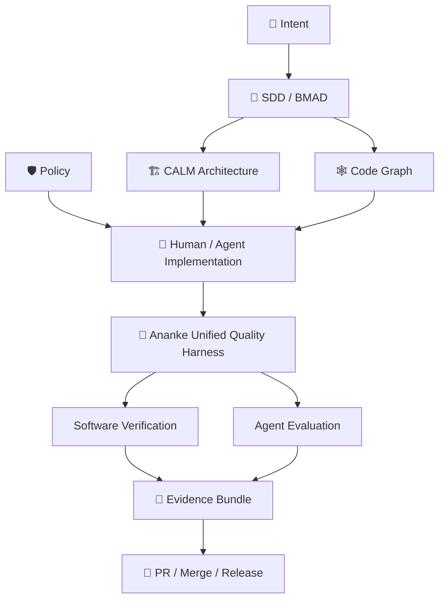

The system therefore separates two questions:

> **Is the software correct?**

and:

> **Did the autonomous agent behave correctly while producing it?**

Both are required for trustworthy autonomous software engineering.

---

# 3. Architectural Principles

| Principle | Requirement |
|---|---|
| **Ananke owns the contract** | Test frameworks must not leak into core domain models. |
| **Deterministic before probabilistic** | Machine-checkable facts are verified with deterministic tools before semantic judges. |
| **Graph-aware** | Test selection should leverage the code graph and Git diff. |
| **Profile-driven** | Fast local checks differ from nightly/release-grade assurance. |
| **Polyglot** | Python and Rust are first-class targets; other languages can be added through adapters. |
| **Enterprise-safe** | Optional tools must be allowlistable and lazy-loaded. |
| **Local-first** | Core testing works without external SaaS. |
| **Traceable** | Every test maps back to a requirement, property, contract, threat, or quality goal where possible. |
| **Evidence-producing** | All test runs create normalized evidence. |
| **Composable** | Teams can combine paradigms without adopting all of them. |
| **Reproducible** | Tool versions, seeds, profiles, and artifacts are recorded. |
| **Failure-minimizing** | Shrunk counterexamples and minimized fuzz cases should become durable regression artifacts. |
| **Policy-governed** | Scores/results are facts; release decisions belong to the Ananke Policy Engine. |

---

# 4. Terminology

To avoid ambiguity, the following terminology is used throughout the implementation.

| Term | Meaning |
|---|---|
| **Test Definition** | Framework-neutral declaration of a test/check. |
| **Test Suite** | Collection of test definitions. |
| **Test Profile** | Named execution policy such as `fast`, `standard`, or `release`. |
| **Test Adapter** | Tool-specific implementation (pytest, nextest, Hypothesis, etc.). |
| **Quality Gate** | Policy decision based on normalized results. |
| **Evidence** | Auditable record of test execution and result. |
| **Property** | General invariant expected to hold across generated input space. |
| **Scenario** | Concrete example of expected behavior, typically BDD/ATDD. |
| **Contract** | Interface or interaction agreement between components. |
| **Mutation** | Intentional code change used to test the strength of the test suite. |
| **Fuzz Case** | Generated input designed to expose crashes, hangs, or violations. |
| **Proof Harness** | Formal/model-checking declaration of invariants. |
| **Snapshot** | Approved representation of an output/artifact. |
| **Quality Dimension** | Category such as behavior, security, performance, or agent quality. |

---

# 5. Quality Methodology Model

Ananke treats the methodologies as complementary layers.

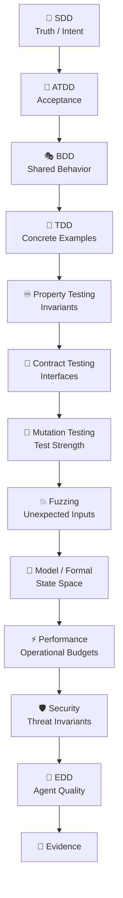

The diagram should not be interpreted as a mandatory serial pipeline. Each method answers a different class of quality question and can be invoked independently through profiles.

---

# 6. Capability Matrix

| Capability | Native Ananke | Python Adapter | Rust Adapter | Typical Profile |
|---|---:|---|---|---|
| Spec traceability | ✅ | N/A | N/A | all |
| ATDD/BDD | orchestration | pytest-bdd | cucumber | standard |
| Unit/TDD | orchestration | pytest | cargo test / nextest | fast/standard |
| Property testing | property contract | Hypothesis | proptest / quickcheck / Bolero | standard/strict |
| Stateful/model testing | state model | Hypothesis stateful | proptest/state models | strict |
| API schema testing | schema contract | Schemathesis | custom/contract adapters | standard |
| Contract testing | contract model | Pact | Pact Rust | standard |
| Mutation testing | normalized score | mutmut | cargo-mutants | nightly |
| Fuzzing | corpus/evidence model | optional | cargo-fuzz / Bolero | security/nightly |
| Snapshot testing | snapshot metadata | Syrupy | Insta | standard |
| Concurrency testing | invariant model | stress/custom | Loom | verification |
| Formal verification | proof contract | optional | Kani | verification |
| Compile-fail API tests | result model | typing/tooling | trybuild | standard |
| Coverage | normalized coverage | coverage.py/pytest-cov | cargo-llvm-cov | standard |
| Performance | budget model | pytest-benchmark | Criterion/Divan | nightly/release |
| Security | threat + invariant | security tools | fuzz/Kani/security | strict |
| Agent evaluation | Ananke Evals | adapters | trace-based | strict/release |

---

# 7. Enterprise Dependency Classification

The testing harness must distinguish architectural capability from package adoption.

## 7.1 Classes

| Class | Meaning |
|---|---|
| **CORE** | Appropriate for base package subject to standard enterprise review. |
| **RECOMMENDED OPTIONAL** | Useful and generally enterprise-friendly, but not required. |
| **SPECIALIZED OPTIONAL** | Higher-cost or narrower use; enable only where needed. |
| **EXTERNAL TOOL** | Invoked as a command or connected system; not imported as a Python dependency. |
| **DISABLED BY POLICY** | Enterprise-specific prohibition. |

---

# 8. Recommended Tool Disposition

> Exact package versions and licenses must be verified in release CI against the organization’s OSS allowlist.

| Tool | Language | Capability | Recommended Status |
|---|---|---|---|
| pytest | Python | unit/TDD runner | **RECOMMENDED OPTIONAL / dev default** |
| pytest-bdd | Python | BDD | **RECOMMENDED OPTIONAL** |
| Hypothesis | Python | property/stateful testing | **RECOMMENDED OPTIONAL** |
| pytest-cov / coverage.py | Python | coverage | **RECOMMENDED OPTIONAL** |
| pytest-xdist | Python | parallel tests | **RECOMMENDED OPTIONAL** |
| Schemathesis | Python | OpenAPI/GraphQL property testing | **RECOMMENDED OPTIONAL** |
| Syrupy | Python | snapshot testing | **RECOMMENDED OPTIONAL** |
| mutmut | Python | mutation testing | **SPECIALIZED OPTIONAL** |
| Nox | Python | environment/test automation | **RECOMMENDED OPTIONAL** |
| Invoke | Python | project tasks | **COMPATIBILITY ADAPTER** |
| Pact Python | Python | contract testing | **SPECIALIZED OPTIONAL** |
| cargo test | Rust | built-in unit tests | **EXTERNAL TOOL** |
| cargo-nextest | Rust | test execution | **PREFERRED RUST RUNNER** |
| rstest | Rust | fixtures/parameterization | **RECOMMENDED OPTIONAL** |
| cucumber | Rust | BDD | **RECOMMENDED OPTIONAL** |
| proptest | Rust | property testing | **PREFERRED RUST PBT** |
| quickcheck | Rust | lightweight property testing | **OPTIONAL** |
| Bolero | Rust | property/fuzz bridge | **SPECIALIZED OPTIONAL** |
| cargo-fuzz | Rust | fuzz testing | **SPECIALIZED OPTIONAL** |
| cargo-mutants | Rust | mutation testing | **SPECIALIZED OPTIONAL** |
| Loom | Rust | concurrency testing | **SPECIALIZED OPTIONAL** |
| Kani | Rust | formal verification | **SPECIALIZED OPTIONAL** |
| Insta | Rust | snapshot testing | **RECOMMENDED OPTIONAL** |
| trybuild | Rust | compile-fail API testing | **RECOMMENDED OPTIONAL** |
| cargo-llvm-cov | Rust | coverage | **RECOMMENDED OPTIONAL** |
| Criterion / Divan | Rust | benchmarking | **SPECIALIZED OPTIONAL** |
| Pact Rust | Rust | contract testing | **SPECIALIZED OPTIONAL** |

---

# 9. Canonical Domain Model

The quality harness requires framework-neutral typed models.

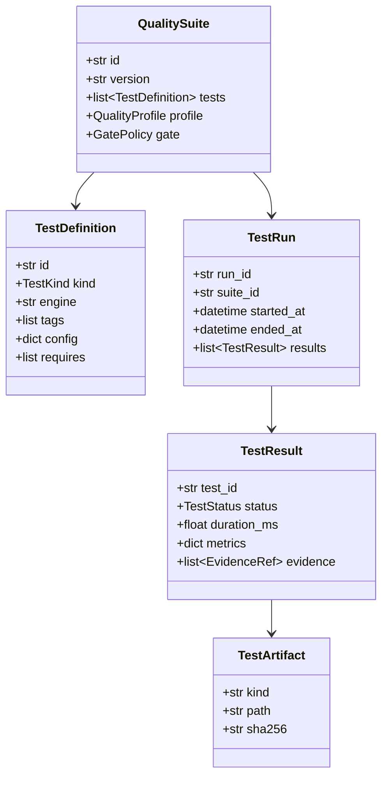

---

# 10. Core Pydantic Models

```python
from __future__ import annotations

from datetime import datetime
from enum import StrEnum
from pathlib import Path
from typing import Any

from pydantic import BaseModel, Field


class TestKind(StrEnum):
    UNIT = "unit"
    INTEGRATION = "integration"
    ACCEPTANCE = "acceptance"
    BDD = "bdd"
    PROPERTY = "property"
    STATEFUL = "stateful"
    CONTRACT = "contract"
    MUTATION = "mutation"
    FUZZ = "fuzz"
    SNAPSHOT = "snapshot"
    FORMAL = "formal"
    CONCURRENCY = "concurrency"
    PERFORMANCE = "performance"
    SECURITY = "security"
    API_SCHEMA = "api_schema"
    COVERAGE = "coverage"
    COMPILE_FAIL = "compile_fail"
    AGENT_EVAL = "agent_eval"


class TestStatus(StrEnum):
    PASS = "pass"
    FAIL = "fail"
    ERROR = "error"
    SKIPPED = "skipped"
    WARN = "warn"
    UNAVAILABLE = "unavailable"


class EvidenceRef(BaseModel):
    kind: str
    uri: str
    sha256: str | None = None


class TestDefinition(BaseModel):
    id: str
    kind: TestKind
    engine: str

    description: str | None = None
    tags: list[str] = Field(default_factory=list)

    source: str | None = None
    command: list[str] | None = None

    timeout_seconds: int | None = None
    required: bool = True

    config: dict[str, Any] = Field(default_factory=dict)
    requires: list[str] = Field(default_factory=list)


class TestResult(BaseModel):
    test_id: str
    kind: TestKind
    engine: str
    status: TestStatus

    started_at: datetime
    ended_at: datetime | None = None
    duration_ms: float | None = None

    metrics: dict[str, float | int | str | bool] = Field(default_factory=dict)
    evidence: list[EvidenceRef] = Field(default_factory=list)

    stdout_path: str | None = None
    stderr_path: str | None = None

    seed: int | None = None
    tool_version: str | None = None
```

---

# 11. Test Adapter Port

```python
from typing import Protocol


class TestAdapter(Protocol):
    id: str

    async def available(self) -> bool:
        ...

    async def version(self) -> str | None:
        ...

    async def discover(
        self,
        context: TestContext,
    ) -> list[TestDefinition]:
        ...

    async def run(
        self,
        tests: list[TestDefinition],
        context: TestContext,
    ) -> list[TestResult]:
        ...
```

Adapters must:

- lazy-load optional packages
- avoid shell interpolation
- normalize paths
- capture version information
- expose capability metadata
- return `UNAVAILABLE` rather than crashing when optional tooling is absent
- respect timeout/cancellation
- emit structured events

---

# 12. Adapter Capability Metadata

```python
class AdapterCapabilities(BaseModel):
    kinds: set[TestKind]
    supports_selection: bool
    supports_parallelism: bool
    supports_seed: bool
    supports_timeout: bool
    supports_junit: bool
    supports_json: bool
    supports_coverage: bool
    network_required: bool
    languages: list[str]
```

The quality orchestrator uses these capabilities to determine valid execution plans.

---

# 13. SDD Integration

Testing begins from specification truth.

A specification may declare quality obligations.

```yaml
quality:
  acceptance:
    - payment webhook is idempotent
    - unauthorized requests are rejected

  properties:
    - ledger balance never becomes negative
    - duplicate event processing is idempotent

  contracts:
    - payment webhook schema remains backward compatible

  security:
    - no secret may appear in output

  performance:
    payment_webhook_p95_ms: 150
```

Ananke should compile these declarations into test obligations.

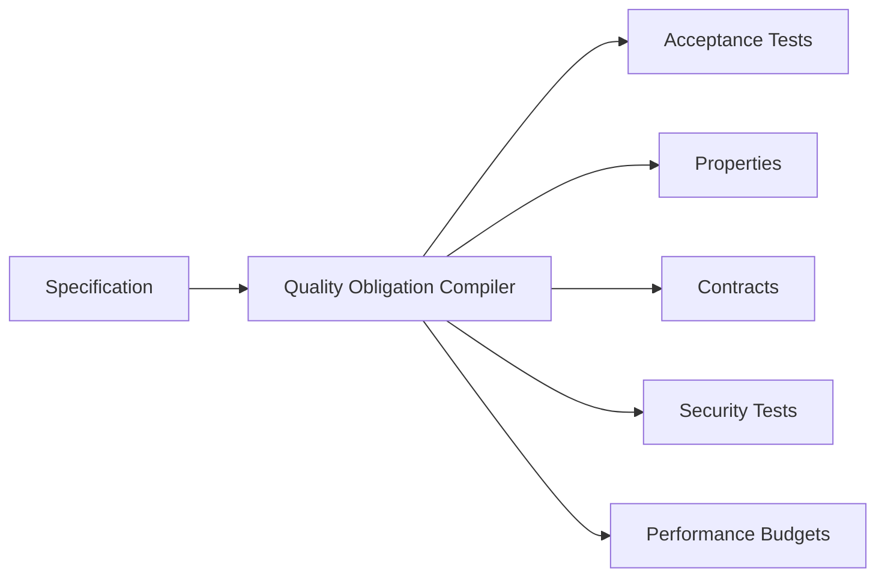

---

# 14. Requirement-to-Test Traceability

Every discovered or generated test can optionally carry:

```yaml
traceability:
  requirement_ids:
    - PAY-101-R1
    - PAY-101-R3

  acceptance_criteria:
    - AC-2

  architecture_components:
    - payments.webhook
    - payments.ledger

  policies:
    - policy.no-secret-output
```

This enables:

```text
Requirement
  -> Scenario
  -> Test
  -> Result
  -> Evidence
```

---

# 15. ATDD Integration

ATDD artifacts are represented as acceptance contracts.

```yaml
acceptance:
  id: AC-DEPENDENCY-APPROVAL

  given:
    - dependency risk is high

  when:
    - agent proposes modifying the lockfile

  then:
    - agent requests human approval
    - no file mutation occurs before approval
```

ATDD execution can use:

- pytest-bdd
- cucumber
- native deterministic assertions
- agent evaluation traces where the behavior spans tool calls

---

# 16. BDD Integration

BDD features can live under:

```text
tests/bdd/
├── features/
│   ├── policy.feature
│   └── payments.feature
└── steps/
```

Ananke must support:

- feature discovery
- scenario tagging
- traceability tags
- profile-based selection
- normalized scenario results

Example:

```gherkin
@policy @security @REQ-POL-14
Feature: Agent write policy

  Scenario: Agent attempts to write a protected workflow
    Given the agent write scope is "src/**"
    When it attempts to modify ".github/workflows/release.yml"
    Then the action must be denied
```

---

# 17. TDD / Unit Test Integration

The harness does not dictate TDD workflow, but enables agent loops around failing tests.

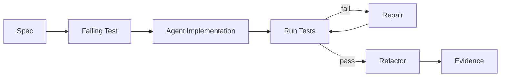

The test runner must support:

- targeted execution
- full-suite execution
- failed-test reruns
- maximum repair loops
- timeout
- cancellation

---

# 18. Property Contract

Property tests should have a framework-neutral declaration.

```yaml
property:
  id: policy-deny-dominates

  description: >
    A deny decision always overrides an allow decision.

  domain:
    input: policy_decisions

  invariant:
    type: expression
    expression: "deny_present -> final_decision == 'deny'"

  engines:
    python: hypothesis
    rust: proptest
```

Properties may be:

- expression-based
- function-backed
- generated from specification
- hand-authored

---

# 19. Property Pattern Library

Ananke should provide reusable property templates.

| Pattern | Example |
|---|---|
| Round-trip | `decode(encode(x)) == x` |
| Idempotence | `f(f(x)) == f(x)` |
| Commutativity | `f(a,b) == f(b,a)` |
| Associativity | `f(f(a,b),c) == f(a,f(b,c))` |
| Monotonicity | `a <= b -> f(a) <= f(b)` |
| Conservation | total remains constant |
| Bounds | value remains inside range |
| Uniqueness | IDs remain unique |
| Determinism | identical inputs produce identical decision |
| Authorization monotonicity | privilege cannot increase without explicit grant |
| No forbidden state | illegal state never reachable |

These templates can be used in documentation, code generation, and agent prompts.

---

# 20. Hypothesis Adapter

The Python Hypothesis adapter must support:

- normal strategies
- custom strategies
- shrinking
- stateful testing
- example database
- deterministic seed configuration
- maximum examples
- deadline
- health-check configuration

Example config:

```yaml
engine: hypothesis

config:
  max_examples: 500
  deadline_ms: 500
  derandomize: false
  report_multiple_bugs: true
```

Failures must record:

- seed
- shrunk example
- falsifying inputs
- test path
- traceback
- Hypothesis settings

---

# 21. Proptest Adapter

The Rust proptest adapter must support:

- Cargo test integration
- configured case count
- seed/environment capture
- failure persistence
- minimized failing case
- package/test filters

Example:

```yaml
engine: proptest

config:
  cases: 1024
  package: ananke-policy-core
```

---

# 22. QuickCheck Adapter

QuickCheck is treated as a lightweight compatibility engine.

It is useful for:

- simple invariants
- libraries already using QuickCheck
- minimal setup

Ananke should not require projects to migrate to proptest.

---

# 23. Bolero Adapter

Bolero bridges:

- property testing
- fuzz-style execution
- stateful exploration

The adapter should expose Bolero as:

```text
TestKind.PROPERTY
TestKind.FUZZ
TestKind.STATEFUL
```

depending on the test definition.

---

# 24. Property Failure Promotion

A shrunk property failure should automatically be promotable into a regression test.

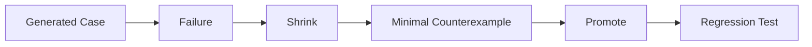

CLI:

```bash
ananke test promote \
  --run RUN-123 \
  --failure property.policy-deny-dominates
```

---

# 25. Contract Testing

Canonical contract model:

```python
class ContractDefinition(BaseModel):
    id: str
    consumer: str
    provider: str
    protocol: str

    request_schema: dict | None = None
    response_schema: dict | None = None

    version: str
    compatibility: str = "backward"
```

Supported contract types:

- REST/OpenAPI
- MCP tools
- event schemas
- plugin interfaces
- agent tool schemas
- internal Python/Rust API boundaries where practical
- Pact consumer/provider contracts

---

# 26. Pact Adapter

Pact integration must support:

- consumer contract generation
- provider verification
- broker configuration through enterprise secret/config providers
- local broker-less workflows
- normalized verification results

Pact must remain optional.

---

# 27. OpenAPI / Schemathesis Integration

Schemathesis is used for schema-driven API property testing.

Use cases:

- Ananke HTTP API
- webhook endpoints
- integration adapters
- OpenAPI-described tools

Normalized metrics:

- generated cases
- failed cases
- schema violations
- 5xx responses
- unique failures
- response-time stats

---

# 28. Snapshot Testing

Canonical snapshot model:

```python
class SnapshotDefinition(BaseModel):
    id: str
    source: str
    format: str
    normalizers: list[str]
    approval_required: bool = True
```

Snapshot candidates include:

- CLI output
- JSON/YAML config rendering
- CALM diagrams
- Mermaid diagrams
- PR descriptions
- evidence reports
- generated plans
- agent prompts/templates
- schema documents

---

# 29. Snapshot Normalization

Dynamic fields must be removable before comparison.

Built-in normalizers:

- timestamps
- UUIDs
- absolute paths
- random IDs
- environment-specific hostnames
- build numbers
- unordered JSON object keys

Example:

```yaml
snapshot:
  id: evidence-report

  normalizers:
    - timestamps
    - absolute_paths
    - json_key_order
```

---

# 30. Mutation Testing

Mutation tests assess test-suite sensitivity.

Canonical metrics:

```text
total_mutants
valid_mutants
killed_mutants
survived_mutants
timed_out_mutants
unviable_mutants
mutation_score
```

\[
MutationScore =
\frac{KilledMutants}
{ValidMutants}
\]

---

# 31. Mutation Policy

Example:

```yaml
mutation:
  minimum_score: 0.80

  critical_packages:
    ananke.policy:
      minimum_score: 0.95

  max_survivors:
    default: 20
```

Mutation tests should generally run:

- nightly
- on security-sensitive changes
- on release
- manually during quality refinement

They should not normally block pre-commit.

---

# 32. Python Mutation Adapter

The mutmut adapter must support:

- package/path selection
- incremental runs
- survivor extraction
- timeout
- result normalization

Surviving mutants should be reportable as quality debt.

---

# 33. Rust Mutation Adapter

The cargo-mutants adapter must support:

- crate/package selection
- nextest integration where configured
- timeout
- survivor list
- normalized mutation score

---

# 34. Mutation-to-Test Refinement

Ananke can create a refinement task when a mutant survives.

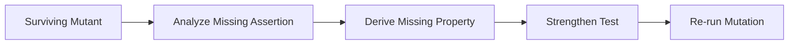

Agent-assisted refinement is allowed, but the final validation remains deterministic.

---

# 35. Fuzz Testing

Canonical fuzz model:

```python
class FuzzTarget(BaseModel):
    id: str
    language: str
    engine: str
    target: str

    corpus_paths: list[str]
    timeout_seconds: int
    max_input_size: int | None = None
```

Normalized outcomes:

- crash
- panic
- timeout/hang
- sanitizer failure
- policy violation
- resource exhaustion
- interesting case
- no finding

---

# 36. Fuzzing Targets for Ananke

Priority targets:

- config parsers
- YAML/JSON parsing
- policy parsing
- path normalization
- glob matching
- URL parsing
- MCP payloads
- tool-call argument parsing
- event serialization
- agent trace import
- evidence bundle parsing
- plugin manifests
- dependency metadata

---

# 37. cargo-fuzz Adapter

Requirements:

- explicit target allowlist
- corpus directory management
- reproducible failure artifact
- minimization
- maximum runtime
- CI-friendly smoke mode
- long-running scheduled mode

Profiles:

```yaml
fast:
  fuzz_seconds: 0

strict:
  fuzz_seconds: 30

security:
  fuzz_seconds: 300

release:
  fuzz_seconds: 900
```

Values are configurable.

---

# 38. Fuzz Corpus Promotion

New production or property failures can be turned into fuzz seeds.

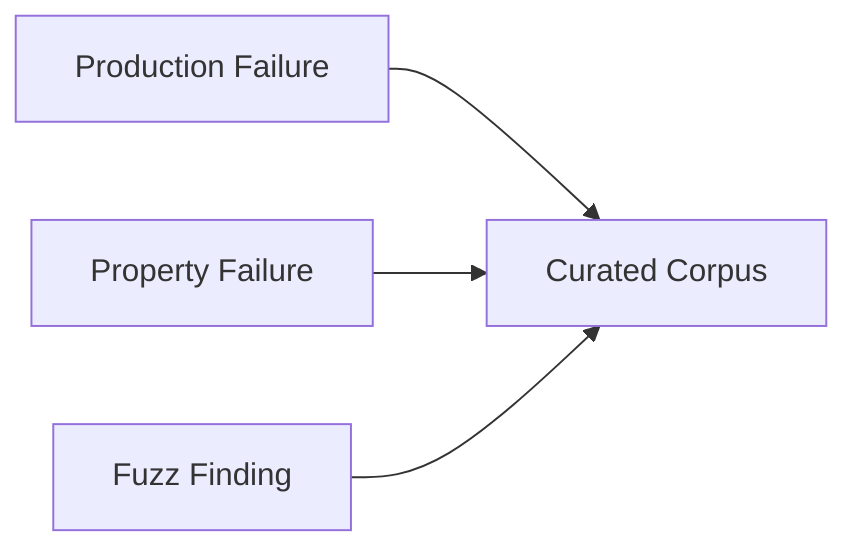

Corpus files may require redaction before being version-controlled.

---

# 39. Stateful / Model-Based Testing

The quality harness must support state-machine definitions.

Example run lifecycle:

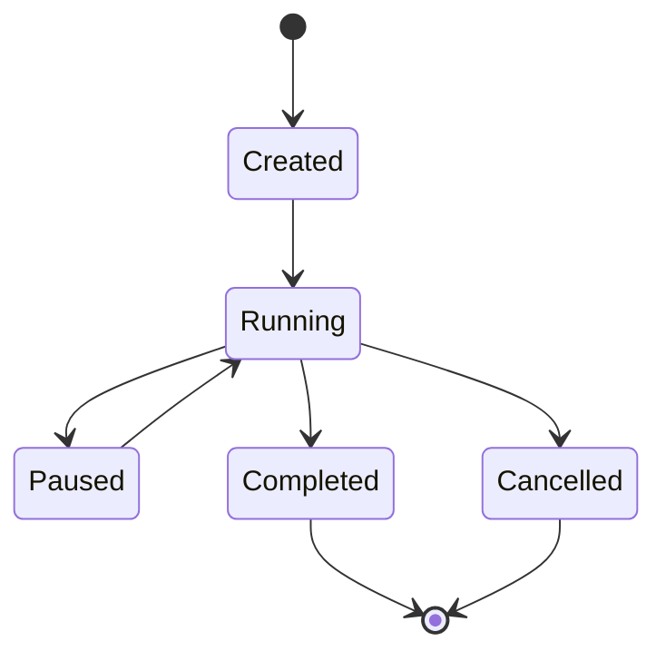

Invariants:

- `Completed` cannot transition to `Running`
- `Cancelled` cannot transition to `Running`
- only one terminal state is allowed
- approval cannot occur after cancellation
- checkpoint cannot regress state version

---

# 40. Canonical State Model

```python
class StateModel(BaseModel):
    id: str
    states: set[str]
    initial_state: str
    terminal_states: set[str]
    transitions: list["Transition"]
    invariants: list["StateInvariant"]
```

Adapters may compile this into:

- Hypothesis stateful machines
- Rust proptest sequences
- custom simulation
- formal verification harnesses

---

# 41. Concurrency Testing with Loom

Loom is recommended for concurrency-critical Rust components.

Target areas:

- locks
- shared run state
- checkpoint coordination
- outbox/event processing
- graph-cache updates
- concurrent evaluator registry access

Loom execution is a **verification-profile** capability, not a general default.

---

# 42. Formal Verification with Kani

Kani is reserved for small high-assurance Rust components.

Candidate domains:

- permission lattice
- deny-overrides-allow logic
- state transition legality
- idempotency primitive
- checksum/integrity logic
- policy decision determinism

Formal harness metadata:

```yaml
formal:
  id: permission-lattice

  engine: kani

  invariants:
    - deny_overrides_allow
    - no_privilege_escalation

  package: ananke-policy-core
```

---

# 43. Compile-Fail Testing

For Rust public APIs, compile-fail tests validate that invalid usage is impossible.

Adapter:

```text
trybuild
```

Use cases:

- typed policy builders
- proc macros
- capability APIs
- invalid trait combinations

---

# 44. Coverage

Coverage is treated as **reach**, not quality.

Supported normalized dimensions:

- line coverage
- branch coverage
- function coverage
- region coverage where available

Policy example:

```yaml
coverage:
  line:
    minimum: 0.85

  branch:
    minimum: 0.75

  no_drop_percent: 2
```

Coverage must never replace mutation/property/security testing.

---

# 45. Python Coverage Adapter

Supported tools:

- coverage.py
- pytest-cov

Normalized output stored in:

```text
.ananke/evidence/<run-id>/coverage/python.json
```

---

# 46. Rust Coverage Adapter

Preferred tool:

```text
cargo-llvm-cov
```

Normalized output:

```text
.ananke/evidence/<run-id>/coverage/rust.json
```

---

# 47. Performance-Driven Testing

Performance budgets are quality contracts.

Canonical budget:

```python
class PerformanceBudget(BaseModel):
    metric: str
    percentile: str | None = None
    maximum: float | None = None
    minimum: float | None = None
    unit: str
```

Examples:

```yaml
performance:
  policy_eval:
    p95_ms: 10

  graph_query:
    p95_ms: 100

  test_fast:
    max_seconds: 10

  agent_run:
    max_cost_usd: 2.00
```

---

# 48. Performance Metrics

The harness should support:

- p50 latency
- p95 latency
- p99 latency
- throughput
- memory peak
- CPU utilization
- tool-call count
- model-call count
- context tokens
- completion tokens
- estimated cost
- graph-query latency
- evaluator latency
- test execution duration

---

# 49. Performance Benchmark Adapters

Python:

- pytest-benchmark
- custom `time.perf_counter` wrappers

Rust:

- Criterion
- Divan

Enterprise orchestration:

- MLflow export
- OpenTelemetry metrics/traces

---

# 50. Performance Regression

```yaml
performance_regression:
  graph_query_p95:
    max_increase_percent: 10

  policy_eval_p95:
    max_increase_percent: 5

  test_suite_runtime:
    max_increase_percent: 20
```

Regression decisions belong to the Policy Engine.

---

# 51. Security-Driven Testing

Security tests derive from the threat model.

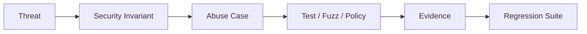

---

# 52. Threat-to-Test Mapping

| Threat | Test Strategy |
|---|---|
| Prompt injection | agent eval + deterministic permission checks |
| Secret leakage | output scan + filesystem policy |
| Path traversal | property/fuzz tests |
| Command injection | shell policy + fuzz |
| Dependency hallucination | package registry validation |
| Network exfiltration | sandbox/network deny tests |
| Privilege escalation | permission property tests / formal verification |
| Malicious tool output | adversarial tool-result tests |
| Replay/duplicate side effects | idempotency properties |
| Resource exhaustion | performance/fuzz limits |

---

# 53. Security Tool Adapters

The quality harness may coordinate:

- Gitleaks
- Semgrep
- Trivy
- dependency audit tools
- license scanners
- custom Ananke policy evaluators
- cargo-fuzz
- Kani

Security findings normalize into the same evidence model.

---

# 54. Hypothesis-Driven Development (HDD)

HDD is implemented as experiment management, not correctness testing.

Canonical experiment:

```python
class EngineeringHypothesis(BaseModel):
    id: str
    statement: str
    baseline: str
    candidate: str
    metrics: list[str]
    acceptance: dict[str, float | int | str]
```

Example:

```yaml
hypothesis:
  id: graph-context-efficiency

  statement: >
    Code-graph context reduces token usage without reducing task completion.

  baseline: whole-repo-context
  candidate: graph-context

  metrics:
    - tokens
    - latency
    - task_completion
```

---

# 55. HDD Execution

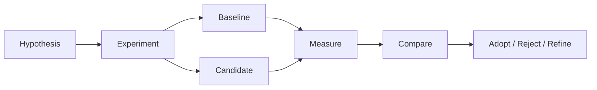

MLflow is the preferred enterprise experiment store when enabled.

---

# 56. Agent Evaluation Integration

The quality harness integrates with `ananke.plexus.evals`.

Testing and evaluation remain separate domains with shared evidence.

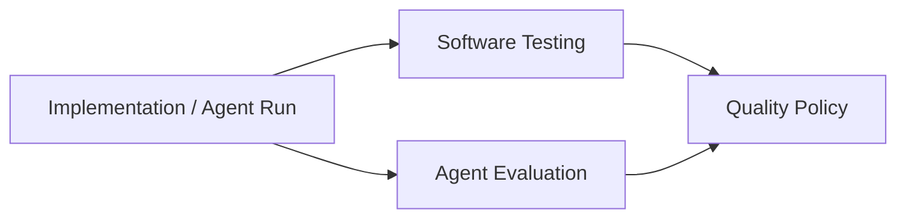

Examples:

- pytest says behavior is correct
- mutation score says tests are strong
- architecture evaluator says structure is valid
- agent trajectory evaluator says agent did not violate permissions

All may be required.

---

# 57. Test Profiles

Ananke provides named profiles.

## 57.1 `fast`

Designed for pre-commit and local repair loops.

Includes:

- lint/type (via broader verify plane)
- targeted unit tests
- schema validation
- fast property tests
- selected snapshots

Goal:

```text
seconds, not minutes
```

---

# 58. `standard`

Designed for pull requests.

Includes:

- full unit suite
- integration tests
- BDD/ATDD
- property tests
- contract tests
- snapshots
- coverage
- API/schema testing

---

# 59. `strict`

Designed for sensitive/high-risk changes.

Includes `standard` plus:

- mutation testing
- deeper property/stateful tests
- fuzz smoke
- security suites
- contract verification
- concurrency checks where applicable

---

# 60. `verification`

Designed for critical core components.

Includes `strict` plus:

- longer fuzz runs
- Loom
- Kani
- exhaustive/expanded state models
- proof harnesses
- deeper agent security evals

---

# 61. `release`

Release-grade assurance.

Includes:

- full compatibility matrix
- package/install tests
- performance regression
- provenance
- SBOM/signing integration
- full evaluation regression
- required evidence completeness

---

# 62. Profile Configuration

```yaml
quality:
  profiles:

    fast:
      kinds:
        - unit
        - property
        - snapshot

      max_seconds: 30

    standard:
      extends: fast

      kinds:
        - integration
        - bdd
        - acceptance
        - contract
        - coverage
        - api_schema

    strict:
      extends: standard

      kinds:
        - mutation
        - fuzz
        - security
        - stateful

    verification:
      extends: strict

      kinds:
        - concurrency
        - formal

    release:
      extends: verification

      kinds:
        - performance
        - agent_eval
```

---

# 63. Graph-Aware Test Selection

This is a core differentiator.

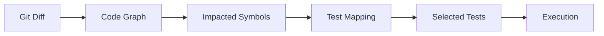

Selection inputs:

- changed files
- changed symbols
- callers/callees
- related tests
- architecture components
- requirement links
- contract links
- historical failures

---

# 64. Test Mapping Edges

The code graph should support relationships such as:

```text
TESTS
TESTED_BY
SATISFIES_REQUIREMENT
COVERS_PROPERTY
VALIDATES_CONTRACT
EXERCISES_COMPONENT
FUZZES
PROVES_INVARIANT
BENCHMARKS
```

This allows Ananke to answer:

> Which tests prove this change?

and:

> Which requirements currently have no executable coverage?

---

# 65. Selection Modes

| Mode | Behavior |
|---|---|
| `changed` | tests directly associated with changed files/symbols |
| `impact` | include graph blast radius |
| `requirement` | run tests linked to active spec |
| `component` | tests for architecture component |
| `full` | complete suite |
| `risk` | selection weighted by risk |
| `historical` | include tests historically correlated with failures |

---

# 66. Risk-Aware Selection

Risk score can include:

- change size
- component criticality
- security sensitivity
- historical defect rate
- graph centrality
- contract exposure
- public API impact
- dependency changes

Example:

```yaml
selection:
  mode: risk

  high_risk:
    run_profile: strict

  critical:
    run_profile: verification
```

---

# 67. Test Result Normalization

Every adapter must normalize into a standard result.

Example:

```json
{
  "test_id": "payments::idempotency",
  "kind": "property",
  "engine": "hypothesis",
  "status": "fail",
  "duration_ms": 84.3,
  "metrics": {
    "examples_run": 72
  },
  "evidence": [
    {
      "kind": "counterexample",
      "uri": ".ananke/evidence/RUN-101/counterexamples/idempotency.json"
    }
  ],
  "seed": 3819281,
  "tool_version": "..."
}
```

---

# 68. Unified Quality Run

A quality run contains:

```text
QualityRun
├── profile
├── selection rationale
├── discovered tests
├── execution plan
├── adapter versions
├── test results
├── coverage
├── mutation score
├── fuzz findings
├── proof results
├── performance metrics
├── agent eval results
├── policy decision
└── evidence bundle
```

---

# 69. Evidence Layout

```text
.ananke/evidence/<run-id>/quality/
├── manifest.json
├── profile.json
├── selection.json
├── environment.json
├── results.json
├── coverage/
│   ├── python.json
│   └── rust.json
├── mutation/
│   ├── python.json
│   └── rust.json
├── properties/
│   └── counterexamples/
├── fuzz/
│   ├── corpus/
│   └── findings/
├── formal/
│   └── proofs.json
├── performance/
│   └── metrics.json
├── security/
│   └── findings.json
├── agent-evals/
│   └── results.json
├── reports/
│   ├── summary.md
│   ├── junit.xml
│   └── report.json
└── checksums.txt
```

---

# 70. Evidence Manifest

Required fields:

- Ananke version
- Git commit
- branch
- profile
- selection mode
- specification hash
- architecture hash
- policy hash
- adapters
- adapter versions
- Python version
- Rust version/toolchain
- OS/platform
- start/end time
- result counts
- quality gate decision

---

# 71. Quality Policy

Testing tools report results.

Policy decides what those results mean.

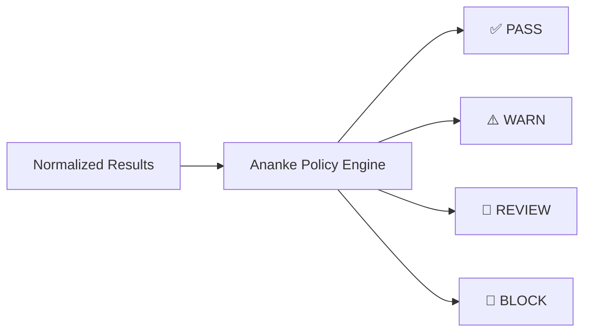

---

# 72. Policy Example

```yaml
quality_gate:

  hard:
    failed_unit_tests: 0
    failed_contract_tests: 0
    security_critical: 0
    architecture_conformance: 1.0

  minimum:
    line_coverage: 0.85
    mutation_score: 0.80

  regression:
    max_coverage_drop: 0.02
    max_performance_regression_percent: 10

  review:
    surviving_mutants_over: 10
    new_snapshot_changes: true
```

---

# 73. CLI Surface

```text
ananke test
├── run
├── discover
├── list
├── show
├── profile
│   ├── list
│   ├── show
│   └── validate
├── select
│   ├── changed
│   ├── impact
│   ├── requirement
│   └── full
├── property
│   ├── run
│   └── promote
├── mutation
│   ├── run
│   └── survivors
├── fuzz
│   ├── run
│   ├── corpus
│   └── minimize
├── formal
│   ├── run
│   └── show
├── benchmark
├── contract
├── snapshot
├── coverage
├── adapter
│   ├── list
│   ├── doctor
│   └── capabilities
└── report
```

---

# 74. CLI Examples

Fast profile:

```bash
ananke test run --profile fast
```

Graph-aware PR testing:

```bash
ananke test run \
  --profile standard \
  --select impact
```

Property-only:

```bash
ananke test run \
  --kind property
```

Mutation:

```bash
ananke test mutation run \
  --package ananke-policy-core
```

Fuzz smoke:

```bash
ananke test fuzz run \
  --target policy_parser \
  --seconds 30
```

Formal:

```bash
ananke test formal run \
  --proof permission-lattice
```

---

# 75. `ananke verify` Integration

The existing `verify` command remains the umbrella.

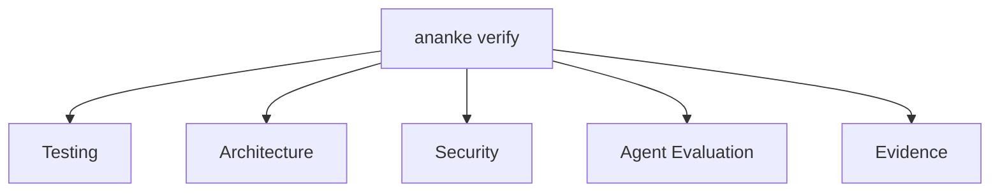

Example:

```bash
ananke verify \
  --profile strict
```

---

# 76. Workspace Layout

```text
.ananke/
├── quality/
│   ├── config.yaml
│   ├── profiles/
│   │   ├── fast.yaml
│   │   ├── standard.yaml
│   │   ├── strict.yaml
│   │   ├── verification.yaml
│   │   └── release.yaml
│   ├── properties/
│   ├── contracts/
│   ├── state-models/
│   ├── proof-harnesses/
│   ├── performance/
│   └── threats/
├── specs/
├── architecture/
├── policies/
├── traces/
└── evidence/
```

---

# 77. Source Repository Layout

Recommended:

```text
tests/
├── unit/
├── integration/
├── acceptance/
├── bdd/
│   ├── features/
│   └── steps/
├── property/
├── contracts/
├── snapshots/
├── security/
└── regression/

rust/
├── crates/
├── fuzz/
├── proofs/
└── tests/
```

This is configurable; Ananke must not require one exact repository layout.

---

# 78. Python Package Layout

```text
src/ananke/plexus/testing/
├── __init__.py
├── api.py
├── runner.py
├── context.py
├── registry.py
├── discovery.py
├── selection.py
├── evidence.py
│
├── models/
│   ├── test.py
│   ├── result.py
│   ├── suite.py
│   ├── profile.py
│   ├── property.py
│   ├── contract.py
│   ├── state.py
│   ├── fuzz.py
│   ├── performance.py
│   └── security.py
│
├── compilers/
│   ├── spec.py
│   ├── acceptance.py
│   ├── property.py
│   └── threat.py
│
├── graph/
│   ├── mapping.py
│   ├── impact.py
│   └── risk.py
│
├── policy/
│   ├── gates.py
│   └── thresholds.py
│
├── adapters/
│   ├── pytest.py
│   ├── pytest_bdd.py
│   ├── hypothesis.py
│   ├── schemathesis.py
│   ├── syrupy.py
│   ├── mutmut.py
│   ├── nox.py
│   ├── invoke.py
│   ├── nextest.py
│   ├── rstest.py
│   ├── cucumber_rs.py
│   ├── proptest.py
│   ├── quickcheck.py
│   ├── bolero.py
│   ├── cargo_fuzz.py
│   ├── cargo_mutants.py
│   ├── loom.py
│   ├── kani.py
│   ├── insta.py
│   ├── trybuild.py
│   ├── cargo_llvm_cov.py
│   ├── criterion.py
│   └── pact.py
│
└── reports/
    ├── console.py
    ├── markdown.py
    ├── json.py
    ├── junit.py
    └── sarif.py
```

---

# 79. Optional Extras

Example packaging:

```toml
[project.optional-dependencies]

test-python = [
    "pytest",
    "pytest-cov",
    "pytest-xdist",
]

test-bdd = [
    "pytest-bdd",
]

test-property = [
    "hypothesis",
]

test-api = [
    "schemathesis",
]

test-snapshot = [
    "syrupy",
]

test-mutation = [
    "mutmut",
]

test-automation = [
    "nox",
    "invoke",
]

test-contract = [
    "pact-python",
]
```

Rust tools should generally be detected/invoked as external Cargo tools rather than bundled as Python dependencies.

---

# 80. Adapter Discovery

Command:

```bash
ananke test adapter doctor
```

Example output:

```text
Python
  ✓ pytest
  ✓ pytest-bdd
  ✓ Hypothesis
  ✓ Schemathesis
  - mutmut not installed

Rust
  ✓ cargo
  ✓ cargo-nextest
  ✓ proptest crate detected
  ✓ cargo-mutants
  - cargo-fuzz not installed
  - kani not installed

Contracts
  ✓ Pact Python

Policy
  ✓ external network disabled
  ✓ allowed license profile loaded
```

---

# 81. Nox Integration

Nox is treated as an orchestration adapter for Python environment matrices.

Example session:

```python
@nox.session(python=["3.11", "3.12", "3.13"])
def tests(session):
    session.install(".[test-python]")
    session.run("ananke", "test", "run", "--profile", "standard")
```

Ananke itself must not require Nox.

---

# 82. Invoke Compatibility

If a repository already has:

```text
tasks.py
```

Ananke can expose named tasks through an adapter.

Example:

```yaml
external_tasks:
  engine: invoke

  tasks:
    test: test
    lint: lint
    integration: integration
```

Invoke remains compatibility plumbing, not the primary test contract.

---

# 83. CI Pipeline

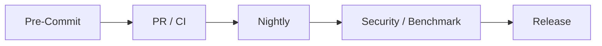

---

# 84. Pre-Commit Stage

Recommended:

- lint/type
- targeted unit
- schema
- fast property tests
- small snapshot checks

Target:

```text
< 10 seconds where practical
```

---

# 85. PR / CI Stage

Recommended:

- unit
- integration
- BDD
- acceptance
- property
- contract
- snapshots
- coverage
- API schema tests

---

# 86. Nightly Stage

Recommended:

- mutation
- deeper property/stateful
- performance regression
- larger compatibility matrix

---

# 87. Security / Benchmark Stage

Recommended:

- fuzz
- sandbox
- security scenarios
- concurrency tests
- formal verification
- agent eval adversarial suites

---

# 88. Release Stage

Recommended:

- full test matrix
- packaging/install tests
- full quality gate
- provenance
- SBOM
- artifact checksums
- final evidence bundle
- release agent evaluation

---

# 89. CI Job Names

```text
quality-fast
quality-python
quality-rust
quality-bdd
quality-property
quality-contract
quality-coverage
quality-mutation
quality-fuzz
quality-formal
quality-security
quality-performance
quality-agent-evals
quality-report
```

---

# 90. Reporting

Required formats:

- console
- Markdown
- JSON
- JUnit XML
- SARIF where appropriate
- HTML optional

Example summary:

```markdown
## Ananke Quality Report

| Dimension | Result |
|---|---:|
| Unit tests | PASS |
| BDD scenarios | 48 / 48 |
| Property tests | PASS |
| Coverage | 88.2% |
| Mutation score | 84.1% |
| Fuzz findings | 0 critical |
| Formal proofs | 4 / 4 |
| Performance | PASS |
| Security | PASS |
| Agent eval | PASS |
```

---

# 91. Test Failure Classification

Failures should be normalized into:

- assertion failure
- timeout
- crash
- infrastructure error
- unavailable dependency
- flaky/retry success
- policy violation
- security violation
- performance regression
- mutation survivor
- fuzz finding
- proof counterexample
- snapshot change
- contract mismatch

This enables consistent policy.

---

# 92. Flakiness Detection

Ananke should track historical test stability.

Metrics:

- failure frequency
- retry success rate
- duration variance
- environment correlation

Tests can be classified:

```text
stable
suspected_flaky
quarantined
```

Quarantining requires explicit policy.

---

# 93. Retry Policy

Retries must not hide defects.

Example:

```yaml
retry:
  infrastructure_error: 2
  suspected_flaky: 1
  assertion_failure: 0
  security_failure: 0
```

---

# 94. Seeds and Reproducibility

Generated tests must record seeds.

Applicable:

- Hypothesis
- proptest
- QuickCheck
- fuzzers where meaningful
- randomized test ordering

Evidence must preserve:

```text
seed
tool version
test config
counterexample
corpus hash
```

---

# 95. Counterexample Registry

All minimized failures may be indexed.

```text
.ananke/quality/counterexamples/
├── property/
├── fuzz/
├── stateful/
└── formal/
```

Each record includes:

- originating test
- engine
- minimal input/trace
- first-seen commit
- resolved commit
- regression-test link

---

# 96. AI-Assisted Test Generation

Agents may generate:

- unit tests
- BDD examples
- properties
- fuzz targets
- contracts
- snapshots
- proof harness drafts

But generated tests must themselves be evaluated.

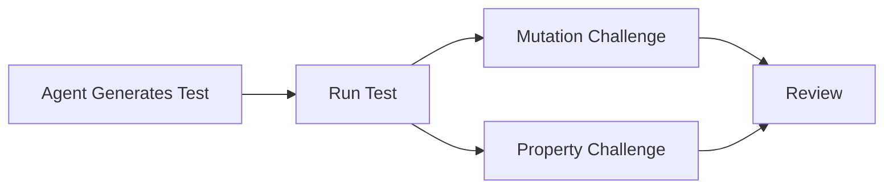

This is particularly important because generated tests can be superficial.

---

# 97. Test Quality Metrics

Beyond pass/fail:

- assertion density
- branch coverage
- mutation score
- property breadth
- transition coverage
- requirement coverage
- contract coverage
- failure detection rate
- historical bug catch rate
- runtime cost

No single metric becomes the universal quality score.

---

# 98. Unified Quality Dashboard Model

Ananke should expose dimensions separately:

```text
Behavior
Properties
Contracts
Coverage
Mutation
Fuzz
State
Formal
Performance
Security
Agent Quality
```

A team may choose to render them in MLflow or another approved platform.

---

# 99. Quality Evidence Graph

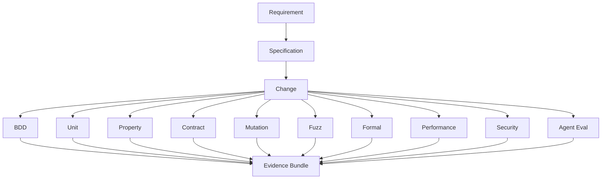

---

# 100. Acceptance Criteria for the Harness

The subsystem is implementation-complete when it can:

1. run without SaaS dependencies
2. execute a `fast` profile locally
3. discover Python pytest tests
4. discover Rust nextest tests
5. run graph-selected tests
6. normalize test results
7. persist evidence
8. execute BDD scenarios
9. execute Python property tests
10. execute Rust property tests
11. capture shrunk counterexamples
12. run contract tests
13. run snapshots
14. produce Python/Rust coverage
15. execute mutation adapters
16. execute fuzz smoke tests
17. import fuzz failures into regression artifacts
18. run stateful/model-based tests
19. invoke Loom
20. invoke Kani
21. run performance budgets
22. run security suites
23. integrate agent evaluations
24. apply quality policies
25. emit Markdown/JSON/JUnit reports
26. run in CI
27. operate when optional adapters are absent
28. enforce dependency allowlists
29. record tool versions/seeds
30. create a complete quality evidence bundle

---

# 101. Definition of Done for a Test Adapter

Every adapter must include:

- stable adapter ID
- supported test kinds
- tool discovery
- version detection
- command construction without shell interpolation
- timeout support
- cancellation
- result parser
- normalized status mapping
- artifact capture
- evidence output
- unit tests
- fixture-based parser tests
- failure-mode tests
- documentation
- license metadata
- network capability metadata

---

# 102. Adapter Failure Semantics

| Condition | Result |
|---|---|
| Tool missing, optional | `UNAVAILABLE` |
| Tool missing, required | `FAIL` via policy |
| Test assertion fails | `FAIL` |
| Test process crashes | `ERROR` |
| Timeout | `ERROR` or policy-specific |
| Invalid output parser | `ERROR` |
| User cancellation | run cancelled |
| Dependency blocked by policy | `UNAVAILABLE/BLOCKED` |

---

# 103. Security Requirements for Test Execution

Testing itself can execute hostile inputs and generated code.

Requirements:

- subprocesses use argument arrays
- `shell=False` by default
- test working directories are explicit
- fuzz/security tests can require sandboxing
- tool paths are resolved explicitly
- no implicit PATH mutation
- environment variables are allowlisted
- credentials are never copied into fuzz environments unless required
- generated artifacts are quarantined until validated
- raw fuzz findings are treated as untrusted
- test logs pass through secret redaction

---

# 104. Sandbox Integration

For high-risk test types:

```text
fuzz
security
untrusted generated code
agent tool execution
```

Ananke may use a sandbox port.

```python
class Sandbox(Protocol):
    async def execute(
        self,
        command: list[str],
        *,
        cwd: str,
        env: dict[str, str],
        timeout: int,
    ) -> SandboxResult:
        ...
```

Sandbox providers remain adapter-driven.

---

# 105. Enterprise Policy Example

```yaml
quality_enterprise:

  allowed_test_engines:
    - pytest
    - pytest-bdd
    - hypothesis
    - schemathesis
    - nextest
    - proptest
    - cucumber-rs
    - cargo-mutants
    - cargo-fuzz
    - kani

  denied_engines:
    - unknown-external-runner

  require_sandbox_for:
    - fuzz
    - security
    - untrusted_code

  network:
    default: deny

  mutation:
    required_for:
      - ananke.policy
      - ananke.security

  formal:
    required_for:
      - permission-lattice

  evidence:
    retain_days: 90
```

---

# 106. MLflow Integration

When MLflow is enabled:

- quality runs become experiment runs
- metrics become MLflow metrics
- evidence files become artifacts
- test profile becomes tags
- Git commit/spec hash become tags
- performance baselines become comparable runs
- agent eval results share the same run lineage

MLflow remains optional.

---

# 107. OpenTelemetry Integration

The harness emits spans such as:

```text
ananke.test.run
ananke.test.adapter
ananke.test.case
ananke.test.property
ananke.test.mutation
ananke.test.fuzz
ananke.test.formal
ananke.test.performance
```

Suggested attributes:

```text
ananke.test.kind
ananke.test.engine
ananke.test.id
ananke.test.status
ananke.test.profile
ananke.test.selection_mode
ananke.test.seed
```

---

# 108. Quality Event Model

The testing subsystem emits events:

```text
quality.run.started
quality.selection.completed
quality.adapter.started
quality.test.started
quality.test.completed
quality.counterexample.discovered
quality.mutation.survived
quality.fuzz.finding
quality.formal.counterexample
quality.performance.regression
quality.gate.decided
quality.run.completed
```

These events integrate with the broader Ananke event bus.

---

# 109. Test Selection Evidence

Every targeted run must explain **why** a test was selected.

Example:

```json
{
  "test": "tests/payments/test_webhook.py::test_idempotency",
  "reason": {
    "changed_symbol": "payments.webhook.handle",
    "graph_edge": "TESTED_BY",
    "distance": 1
  }
}
```

This makes graph-aware selection auditable.

---

# 110. Quality Debt

Ananke may track non-blocking debt:

- surviving mutants
- low coverage
- flaky tests
- missing contracts
- untested requirements
- stale snapshots
- missing property tests
- skipped formal proofs

Debt can appear in reports without necessarily blocking a change.

---

# 111. Quality Maturity Levels

Suggested model:

| Level | Characteristics |
|---|---|
| **L0 — Basic** | unit tests only |
| **L1 — Structured** | unit + integration + coverage |
| **L2 — Behavioral** | BDD/ATDD + contracts |
| **L3 — Generative** | property + schema testing |
| **L4 — Adversarial** | mutation + fuzz + security |
| **L5 — Assured** | stateful + concurrency + formal |
| **L6 — Autonomous** | agent eval + evidence + production feedback |

This is informational, not a universal score.

---

# 112. Quality Feedback Loop

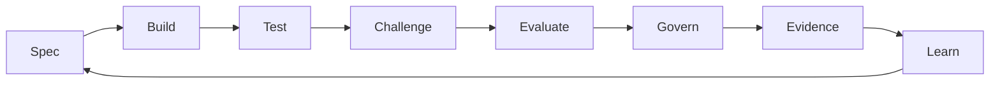

Where:

- **Test** = deterministic expected behavior
- **Challenge** = mutation, fuzz, state, formal
- **Evaluate** = agent/semantic quality
- **Govern** = policy thresholds
- **Learn** = turn failures into stronger specs/tests

---

# 113. Production Failure Promotion

A production incident can become:

- regression test
- property
- contract
- fuzz corpus input
- state-model transition
- security abuse case
- agent eval dataset case

CLI concept:

```bash
ananke test learn \
  --incident INC-204 \
  --promote property
```

The user must review generated artifacts before committing.

---

# 114. North-Star Developer Experience

Local:

```bash
ananke test run --profile fast
```

PR:

```bash
ananke verify --profile standard
```

Sensitive subsystem:

```bash
ananke verify --profile verification
```

Release:

```bash
ananke verify --profile release
```

The developer does not need to remember every underlying tool.

---

# 115. North-Star Architecture

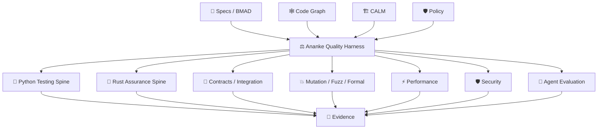

---

# 116. Final Architectural Position

The objective is not to turn Ananke Plexus into a monolithic test runner.

The objective is to give Ananke a **quality control plane** capable of coordinating multiple assurance philosophies while preserving one consistent model of:

- truth
- selection
- execution
- result
- policy
- evidence

The durable ownership boundary is:

> **Specifications define truth.  
> Ananke compiles truth into quality obligations.  
> Testing frameworks execute those obligations.  
> Graph intelligence selects what matters.  
> Challenge techniques stress the tests and system.  
> Evaluation measures autonomous behavior.  
> Policy decides whether results are acceptable.  
> Evidence records what was proven.**

This aligns directly with the broader Ananke Plexus principle:

> **Freedom at the edge. Necessity at the core.**
