## A Tensegrity Control Plane for Governed Autonomous Software Engineering

> **Freedom at the edge. Necessity at the core.**

---

> [!abstract]  
> **Ananke Plexus** is a local-first **Agent Development Life Cycle (ADLC) control plane** and **tensegrity engineering harness** for autonomous software development.
> 
> It weaves together:
> 
> - 📜 **Spec-Driven Development**
>     
> - 🧱 **Architecture Contracts**
>     
> - 🕸️ **Code-Graph Intelligence**
>     
> - 🤖 **Agent Orchestration**
>     
> - 🛡️ **Policy & Security Gates**
>     
> - 🧪 **Deterministic Verification**
>     
> - 🧾 **Auditable Evidence**
>     
> - 🔁 **Git & Enterprise Lifecycle Automation**
>     
> - 🔌 **MCP-based Agent Connectivity**
>     
> - 📦 **Reusable Agent Skills through APM**
>     
> 
> into one governed engineering lifecycle.

The underlying idea is that generative intelligence is expansive, probabilistic, and creative, while production software engineering depends on structure, boundaries, repeatability, traceability, and verifiable truth. Ananke Plexus reconciles those two forces by surrounding autonomous software agents with a **living tensile system of specifications, architecture, graph context, policy, tests, and evidence** rather than attempting to constrain them through a single rigid framework.

---
# 🌌 1. Why Ananke Plexus Exists

Modern coding agents can already do far more than autocomplete.

They can:

- understand requirements,
    
- explore a repository,
    
- generate architecture,
    
- modify dozens of files,
    
- write tests,
    
- install packages,
    
- run commands,
    
- refactor dependencies,
    
- create commits,
    
- open pull requests,
    
- interpret failures,
    
- retry implementation,
    
- coordinate with other agents.
    

That creates an entirely different engineering problem.

The central question is no longer:

> **Can an AI write code?**

It is increasingly:

> **How do we safely allow autonomous systems to participate in software engineering without losing architectural integrity, security, traceability, or control?**

Ananke Plexus is designed around that question.

---

## 🚨 The Core Problems

|Problem|What happens without structure|What Ananke Plexus provides|
|---|---|---|
|🌀 **Agent drift**|The implementation gradually diverges from the original requirement|Specs, acceptance criteria, policies, and evidence preserve intent|
|🧠 **Context overload**|Agents read huge repositories as undifferentiated text|Code graphs provide targeted structural context|
|🏗️ **Architecture drift**|Agents imitate existing accidental dependencies|CALM expresses intended architecture and graphs reveal actual architecture|
|🔓 **Excessive autonomy**|Agents gain broad filesystem, shell, Git, or network access|Capability boundaries and policy gates|
|🧪 **Late testing**|Problems are discovered only in CI or review|Progressive local verification|
|🛡️ **Security as afterthought**|Secrets, dependencies, or unsafe changes reach PRs|Security checks integrated into the lifecycle|
|🧾 **Poor traceability**|Nobody knows why a change exists or what proved it|Evidence bundles connect intent → change → verification|
|🕰️ **Long-running context decay**|Agent reasoning loses alignment over time|Durable artifacts, graph context, checkpoints, and run state|
|🔁 **Fragile automation**|Failed agent runs leave partial external side effects|Recovery, retry, cancellation, idempotency, and state machines|
|🏢 **Enterprise distrust**|Teams restrict autonomy because they cannot prove safety|Auditable execution with deterministic gates|

---

# 🧭 2. The Big Picture

Ananke Plexus does not attempt to replace your agents, IDE, issue tracker, code graph, CI system, security tools, or model provider.

It sits **above and between them**.

It becomes the engineering control plane.

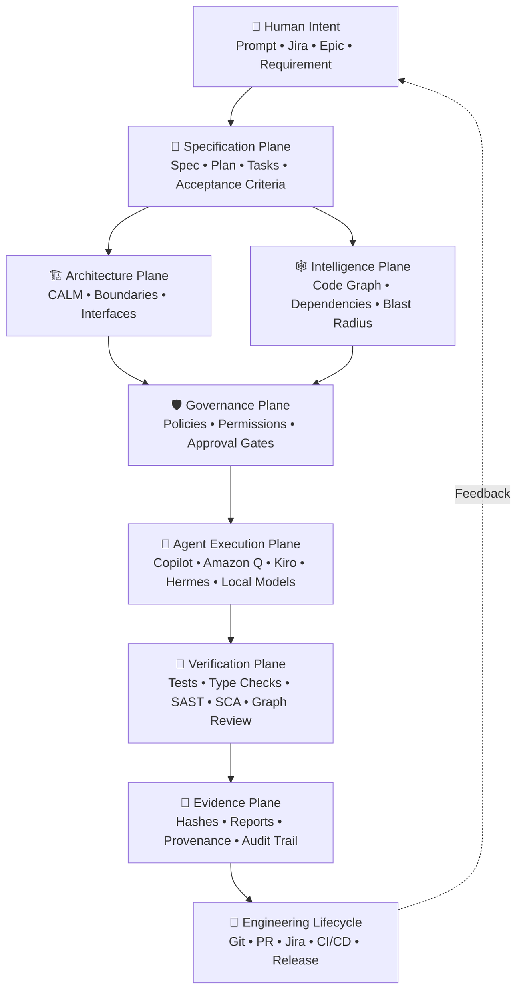

The system is intentionally designed around a simple principle:

> **The model proposes. The environment decides what becomes reality.**

---

# 🧬 3. Why the Name Matters

The architecture is encoded in the name itself.

---

## ⚖️ Ananke — Necessity

In Greek cosmology, **Ananke** represents necessity, inevitability, and the fundamental laws that even divine forces cannot escape.

Within the framework, **Ananke represents software truths that cannot be negotiated away by an agent**.

Examples include:

- ✅ a type contract must validate,
    
- ✅ a test assertion must pass,
    
- ✅ an architecture boundary must hold,
    
- ✅ credentials must not leak,
    
- ✅ prohibited dependencies cannot be introduced,
    
- ✅ sensitive operations may require approval,
    
- ✅ release artifacts must have provenance.
    

Ananke is therefore not primarily a restriction mechanism.

It is the system's **gravitational center of truth**.

---

## 🕸️ Plexus — The Interwoven Engineering Network

Software is not a directory tree.

It is a network of relationships.

A single function may be connected to:

- API routes,
    
- services,
    
- tests,
    
- domain models,
    
- database tables,
    
- architecture components,
    
- requirements,
    
- policies,
    
- PRs,
    
- releases.
    

That interconnected structure is the **Plexus**.

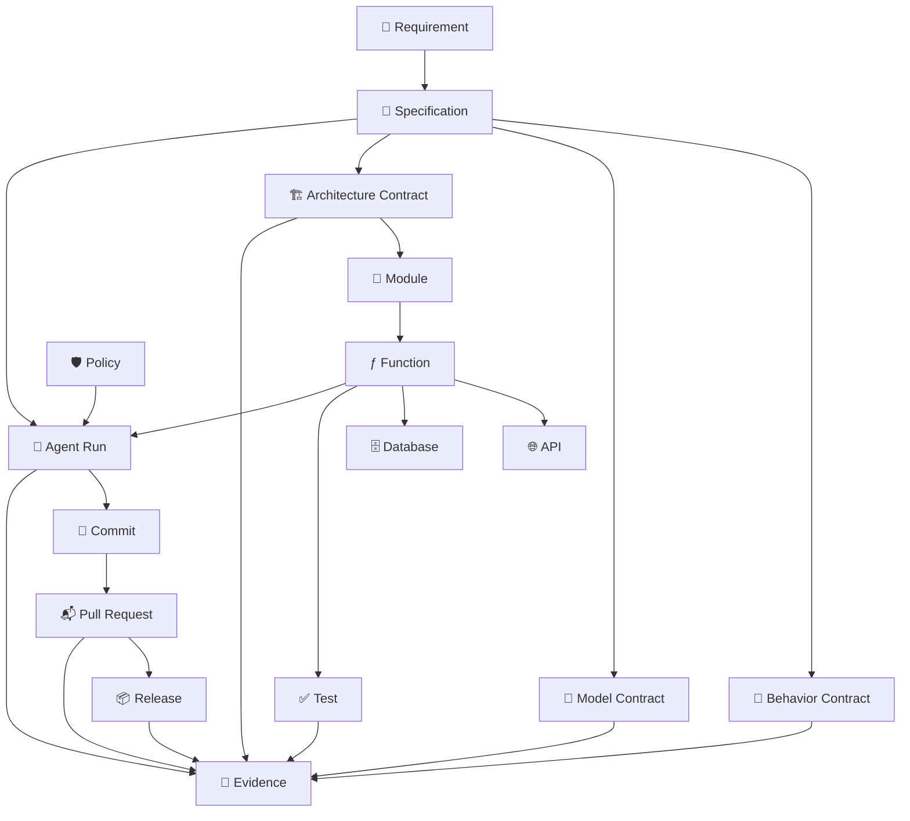

---

# 🏗️ 4. Tensegrity: The Architectural Philosophy

Traditional governance often behaves like a wall:

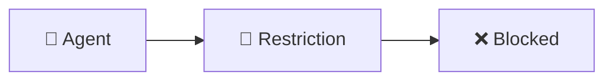

Ananke Plexus instead uses a **tensegrity model**.

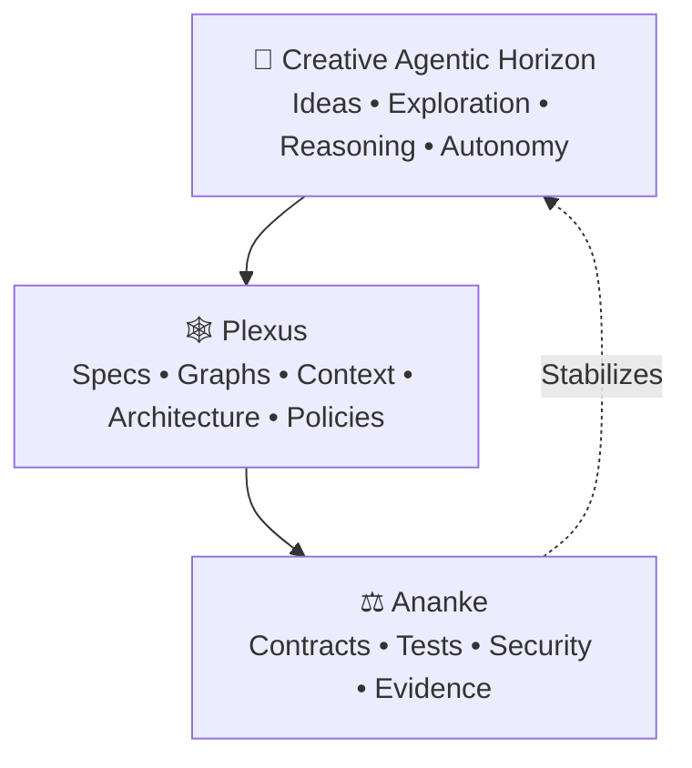

The agent remains creative at the edge.

The middle provides context and structural awareness.

The core protects invariants.

That relationship allows the system to support **more autonomy precisely because stronger constraints exist where they matter**.

---

> [!figure] Core concept  
> ![[ananke_plexus_governed_software_architecture.png]]


---

# 🤖 5. SDLC, SDD, and ADLC

Understanding Ananke requires separating three related concepts.

---

## 🏭 SDLC — Software Development Lifecycle

Traditional SDLC describes how software moves from idea to production.

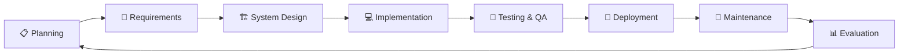

The principal execution actor is traditionally the **human engineering team**.

---

# 📜 6. SDD — Spec-Driven Development

Spec-Driven Development changes what becomes authoritative.

Instead of:

> Prompt → Code

the lifecycle becomes:

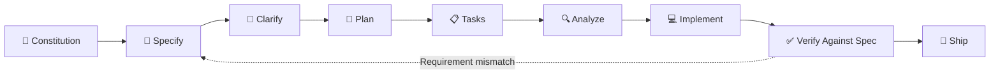

The specification becomes the durable source of truth.

---

# 🧠 7. ADLC — Agent Development Lifecycle

Agentic systems introduce new lifecycle concerns.

```mermaid
flowchart LR

    GOAL["🎯 Goal Definition"]
    PRD["📜 Product Spec / PRD"]
    SKILLS["🛠️ Skills & Tools"]
    ORCH["🤖 Agent Orchestration"]
    CODE["💻 Autonomous Coding"]
    TEST["🧪 Autonomous Testing"]
    HUMAN["👤 Human Evaluation"]
    DEPLOY["🚀 Deployment"]
    MONITOR["📊 Monitoring"]
    LOOP["🔁 Goal Loop"]

    GOAL --> PRD
    PRD --> SKILLS
    SKILLS --> ORCH
    ORCH --> CODE
    CODE --> TEST
    TEST --> HUMAN
    HUMAN --> DEPLOY
    DEPLOY --> MONITOR
    MONITOR --> LOOP
    LOOP --> GOAL
```

ADLC introduces explicit concerns around:

- 🤖 agent identity,
    
- 🧠 context construction,
    
- 🛠️ tool availability,
    
- 🔐 permissions,
    
- 🔄 recovery,
    
- 🧾 execution traces,
    
- 👤 human steering,
    
- 📊 agent evaluation.
    

---

## 🔍 SDLC vs SDD vs ADLC

|Dimension|SDLC|SDD|ADLC|
|---|---|---|---|
|Primary driver|Human process|Specification|Agent + human execution|
|Main source of truth|Documents / code|Specification|Specifications + policies + execution artifacts|
|Planning|Often upfront|Spec-derived|Iterative and agent-assisted|
|Implementation|Human-led|Human or agent|Agent-autonomous or hybrid|
|Testing|Stage or pipeline|Spec-derived|Continuous|
|Context management|Human cognition|Spec artifacts|Explicit context assembly|
|Tool permissions|Usually implicit|Usually external|First-class|
|Retry / recovery|Human-driven|Not central|Core concern|
|Traceability|Tickets + Git|Spec → Code|Intent → Agent → Code → Evidence|
|Governance|Organizational process|Contract-oriented|Machine-enforced|
|Adaptability|Project-dependent|Spec regeneration|Continuous feedback loop|

---

> [!figure] Why ADLC matters  
> ![[why_adlc_matters_governed_autonomous_development.png]]

---

# 🧩 8. Ananke Plexus Architecture

The system follows a **core + ports + adapters** architecture.

The stable center contains Ananke's semantics.

External tooling remains replaceable.

```mermaid
flowchart TB

    subgraph Entry["👤 User & System Entrypoints"]
        CLI["⌨️ ananke CLI"]
        APMCLI["📦 apm CLI"]
        HOOKS["🪝 Git Hooks"]
        MCPCLIENT["🔌 IDE / MCP Clients"]
        CI["⚙️ CI/CD"]
    end

    subgraph Core["⚖️ Ananke Plexus Core"]
        CONFIG["⚙️ Config Manager"]
        POLICY["🛡️ Policy Engine"]
        EXEC["🤖 Execution Director"]
        STORE["🗃️ Artifact Store"]
        TELEMETRY["📊 Telemetry & Audit"]
        PERM["🔐 Permission Boundary"]
        STATE["🔁 Run State Machine"]
    end

    subgraph Domain["🧠 Domain Subsystems"]
        SPECKIT["📜 Spec / SDD"]
        CALM["🏗️ CALM Architecture"]
        GRAPH["🕸️ Graph Intelligence"]
        APM["📦 APM"]
        VERIFY["🧪 Verification"]
        SECURITY["🛡️ Security"]
        EVIDENCE["🧾 Evidence"]
    end

    subgraph Adapters["🔌 Integration Adapters"]
        JIRA["Jira"]
        SCM["GitHub / Bitbucket"]
        GRAPHIFY["Graphifyy"]
        CRG["Code Review Graph"]
        COPILOT["GitHub Copilot"]
        Q["Amazon Q"]
        KIRO["Kiro"]
        HERMES["Hermes"]
        LOCAL["Local Models"]
        SEMGREP["Semgrep"]
        TRIVY["Trivy"]
        GITLEAKS["Gitleaks"]
    end

    Entry --> Core
    Core --> Domain
    Domain --> Adapters

    Adapters -. Results / Context .-> Domain
    Domain -. Evidence / State .-> Core
    Core -. Feedback .-> Entry
```

---

> [!figure] System architecture  
> ![[ananke_plexus_architecture_overview.png]]

---

# 🧱 9. The Core Runtime

The Ananke core is deliberately model-agnostic.

It is responsible for durable engineering semantics rather than LLM reasoning.

---

## ⚙️ Configuration Manager

Configuration determines:

- active integrations,
    
- selected model backend,
    
- enabled policies,
    
- graph provider,
    
- verification profile,
    
- lifecycle connector behavior,
    
- evidence retention,
    
- telemetry.
    

Configuration can be resolved from:

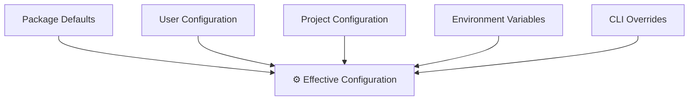

---

# 🛡️ 10. The Policy Engine

Prompts are not policies.

An instruction such as:

> "Please don't modify infrastructure."

is advisory.

A policy such as:

```yaml
policy:
  id: protect-infrastructure
  resources:
    - "infra/**"
    - ".github/workflows/**"

  permissions:
    read: allow
    write: deny

  enforcement: hard
```

is enforceable.

---

## Policy Categories

|Category|Example|
|---|---|
|📁 Filesystem|restrict read/write paths|
|🌐 Network|approved destinations only|
|🛠️ Tool usage|allow / deny commands|
|🔀 Git|prohibit force-push|
|🏗️ Architecture|prevent invalid dependencies|
|📦 Dependencies|require package approval|
|⚖️ Licensing|deny incompatible licenses|
|🧾 Evidence|require evidence before merge|
|👤 Approval|require human confirmation|
|💰 Resource budgets|token / time / tool limits|

---

## Gate Severity

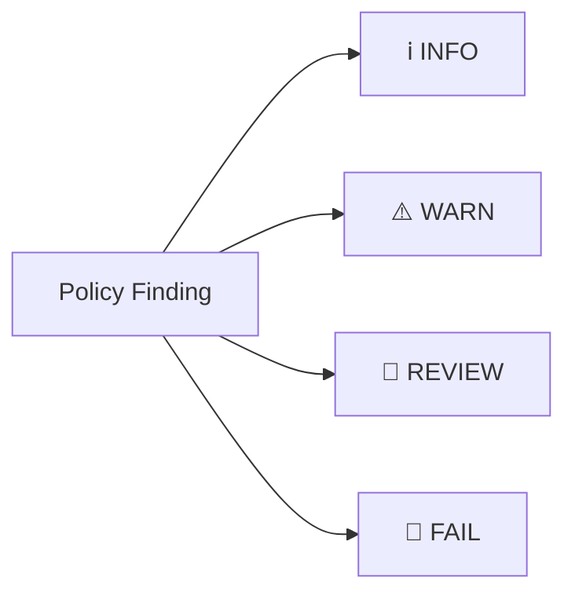

The objective is not to block everything.

It is to **match control intensity to risk**.

---

# 📜 11. From Intent to Governed Specification

Everything starts from intent.

Ananke can accept:

- Jira stories,
    
- epics,
    
- issue text,
    
- natural-language requirements,
    
- existing specifications.
    

Intent is progressively transformed into durable artifacts.

```mermaid
flowchart LR

    INTENT["🎯 Intent"]
    CONSTITUTION["📖 Constitution"]
    SPEC["📜 Specification"]
    CLARIFY["💬 Clarification"]
    PLAN["🧭 Plan"]
    TASKS["📋 Tasks"]
    ANALYZE["🔍 Risk Analysis"]
    IMPLEMENT["💻 Implementation"]
    VERIFY["✅ Verification"]
    PR["📬 PR + Evidence"]

    INTENT --> CONSTITUTION
    CONSTITUTION --> SPEC
    SPEC --> CLARIFY
    CLARIFY --> PLAN
    PLAN --> TASKS
    TASKS --> ANALYZE
    ANALYZE --> IMPLEMENT
    IMPLEMENT --> VERIFY
    VERIFY --> PR
```

---

> [!figure] Intent to implementation  
> ![[from_intent_to_implementation.png]]

---

# 📚 12. Specification Artifacts

|Artifact|Purpose|
|---|---|
|`intent.md`|Captures originating intent|
|`constitution.md`|Defines project-wide principles|
|`spec.md`|Defines expected behavior and scope|
|`plan.md`|Defines technical approach|
|`data-model.md`|Defines model / schema design|
|`research.md`|Captures relevant research|
|`tasks.md`|Converts plans into executable tasks|
|`risk.md`|Records identified risk|
|`*.calm.yaml`|Defines architecture|
|Evidence records|Record verification and execution|

The core relationship is:

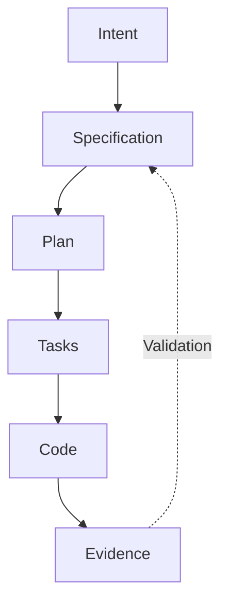

---

# 🧬 13. Ananke BMAD

Within Ananke Plexus, **BMAD** means:

> **Behavior — Model — Architecture Driven Development**

These represent three distinct forms of truth.

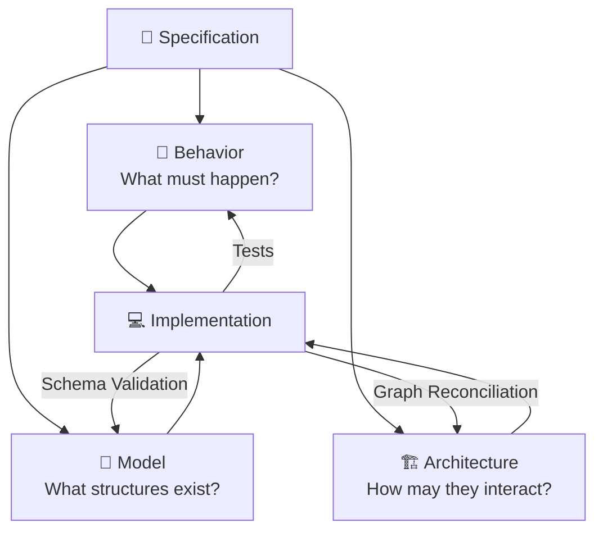

---

## 🧪 Behavior

Behavior is expressed through:

- tests,
    
- acceptance criteria,
    
- expected outcomes,
    
- invariants,
    
- integration scenarios.
    

```gherkin
Feature: Payment webhook idempotency

  Scenario: Duplicate payment notification
    Given a previously processed payment event
    When the same webhook is received again
    Then exactly one ledger entry exists
    And the endpoint returns a successful response
```

---

## 🧱 Model

Models define structural expectations.

```python
from pydantic import BaseModel
from datetime import datetime
from decimal import Decimal
from uuid import UUID


class PaymentCompletedPayload(BaseModel):
    transaction_id: UUID
    customer_id: UUID
    amount: Decimal
    currency: str
    occurred_at: datetime
```

Models may represent:

- API payloads,
    
- domain entities,
    
- events,
    
- tool interfaces,
    
- configuration objects,
    
- agent messages.
    

---

## 🏗️ Architecture

Architecture defines valid relationships.

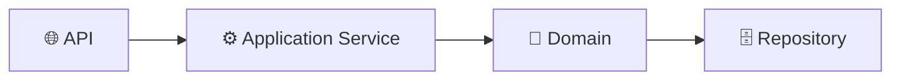

Ananke can detect when implementation introduces forbidden shortcuts.

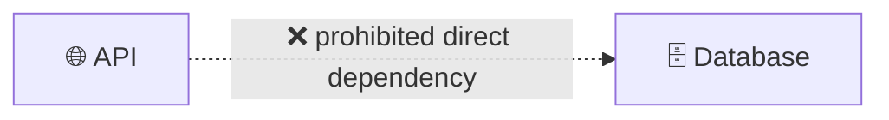

---

# 🏛️ 14. CALM: Declared Architecture as Machine-Readable Truth

Code represents the architecture that exists.

CALM represents the architecture that is intended.

That distinction is fundamental.

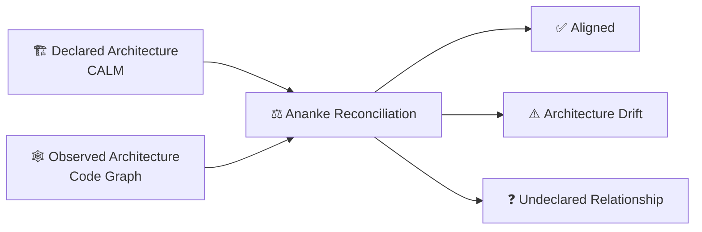

CALM models can describe:

- components,
    
- interfaces,
    
- boundaries,
    
- protocols,
    
- flows,
    
- controls,
    
- relationships.
    

---

# 🕸️ 15. Code Graph Intelligence

Repository files are storage units.

They are not necessarily the most useful reasoning units.

Ananke treats code as a graph of semantic relationships.

---

## Node Types

Possible graph nodes include:

- 📁 packages,
    
- 📄 modules,
    
- 🧱 classes,
    
- ƒ functions,
    
- 🔧 methods,
    
- 🧬 types,
    
- 🌐 API endpoints,
    
- 🗃️ database entities,
    
- 🧪 tests,
    
- 🏗️ architecture components,
    
- 📜 requirements.
    

---

## Edge Types

Typical relationships include:

- `IMPORTS`,
    
- `CALLS`,
    
- `EXTENDS`,
    
- `IMPLEMENTS`,
    
- `USES_TYPE`,
    
- `TESTED_BY`,
    
- `READS`,
    
- `WRITES`,
    
- `EXPOSES`,
    
- `BELONGS_TO`,
    
- `SATISFIES_REQUIREMENT`.
    

---

# 💡 16. Why Graph Context Changes Agent Behavior

Without graph intelligence:

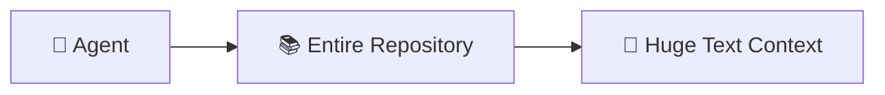

With graph intelligence:

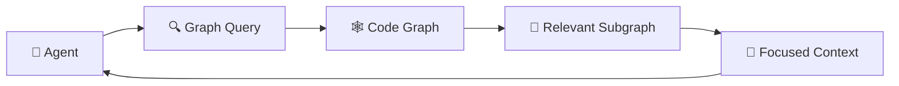

The objective is not merely fewer tokens.

It is **better context selection**.

---

# 💥 17. Blast Radius Analysis

Suppose:

```python
def authenticate(...):
    ...
```

changes.

Ananke can traverse structural relationships.

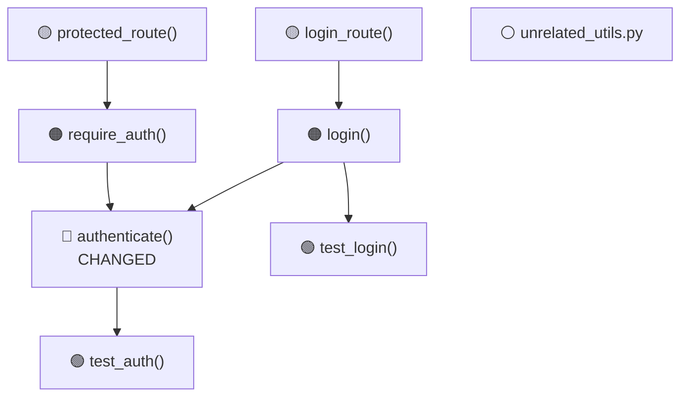

This provides direct answers to questions such as:

- What may break?
    
- Which tests matter?
    
- What architecture components are involved?
    
- Which routes rely on the changed symbol?
    
- Which reviewers should inspect the change?
    

---

> [!figure] Code graph intelligence  
> ![[code_graph_intelligence_infographic.png]]

---

# 🧠 18. Context Assembly

Code context is only one type of context.

Ananke assembles several context layers before agent execution.

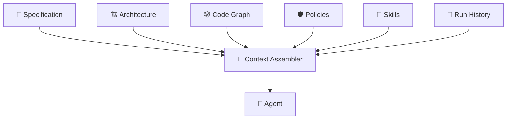

This means an agent receives not merely:

> "Here are some files."

It receives:

> "Here is the requirement, the architecture, the relevant code neighborhood, applicable policy, available tools, and the evidence from previous steps."

That is a fundamentally richer engineering environment.

---

# 🤖 19. Governed Agentic Execution

Agentic execution follows a controlled lifecycle.

```mermaid
flowchart LR

    START["🎯 Story / Prompt / Spec"]
    ISO["🌿 Isolated Branch / Worktree"]
    CTX["🧠 Context Assembly"]
    PLAN["🧭 Agent Plan"]
    CODE["💻 Code / Refactor"]
    HOOK["🪝 Hook Checks"]
    VERIFY["🧪 Verification"]
    PR["📬 Pull Request"]
    HUMAN["👤 Review / Approval"]
    MERGE["🚀 Merge / Release"]

    START --> ISO
    ISO --> CTX
    CTX --> PLAN
    PLAN --> CODE
    CODE --> HOOK
    HOOK --> VERIFY
    VERIFY --> PR
    PR --> HUMAN
    HUMAN --> MERGE

    VERIFY -. failure .-> PLAN
```

---

> [!figure] Governed agentic execution  
> ![[governed_agentic_execution_pipeline.png]]

---

# 👥 20. Multi-Agent Coordination

Ananke supports specialized roles without requiring every workflow to be multi-agent.

```mermaid
flowchart TB

    DIRECTOR["🎛️ Execution Director"]

    PLAN["🎯 Planner"]
    ARCH["🏗️ Architect"]
    CODER["💻 Coder"]
    REVIEW["🔍 Reviewer"]
    VERIFY["🧪 Verifier"]
    DOC["📚 Documentation Agent"]

    POLICY["🛡️ Shared Policy"]
    CONTEXT["🧠 Shared Context"]
    ARTIFACTS["🧾 Shared Artifacts"]

    DIRECTOR --> PLAN
    DIRECTOR --> ARCH
    DIRECTOR --> CODER
    DIRECTOR --> REVIEW
    DIRECTOR --> VERIFY
    DIRECTOR --> DOC

    POLICY --> DIRECTOR
    CONTEXT --> DIRECTOR
    ARTIFACTS --> DIRECTOR
```

All agents operate inside the same:

- policies,
    
- graph context,
    
- specification,
    
- architecture,
    
- evidence model.
    

---

# 🔁 21. Resilient Execution

Long-running agent workflows must assume failure.

Ananke therefore uses a stateful execution model.

```mermaid
stateDiagram-v2

    [*] --> Created
    Created --> ContextReady
    ContextReady --> Planning
    Planning --> Executing

    Executing --> Verifying

    Verifying --> Completed: all gates pass
    Verifying --> Recovering: recoverable failure
    Verifying --> AwaitingApproval: approval required
    Verifying --> Failed: hard failure

    Recovering --> Planning
    AwaitingApproval --> Executing: approved
    AwaitingApproval --> Cancelled: rejected

    Executing --> Cancelled: cancelled
    Failed --> [*]
    Completed --> [*]
    Cancelled --> [*]
```

Execution controls include:

- 🔐 permission scopes,
    
- 🛠️ tool allowlists,
    
- 👤 approval gates,
    
- 🔁 retries,
    
- ↩️ rollback,
    
- 🛑 cancellation,
    
- 🔑 idempotency keys,
    
- 🧾 structured run logs.
    

---

# 🌿 22. Isolated Git Worktrees

An autonomous agent should not need to operate directly in the developer's active workspace.

Runs can execute in isolated Git worktrees.

```mermaid
flowchart TB

    REPO["Git Repository"]

    MAIN["🌿 Main Working Tree"]
    USER["👨‍💻 Developer Tree"]

    RUN1["🤖 Agent Worktree<br/>RUN-001"]
    RUN2["🤖 Agent Worktree<br/>RUN-002"]
    RUN3["🤖 Agent Worktree<br/>RUN-003"]

    REPO --> MAIN
    REPO --> USER
    REPO --> RUN1
    REPO --> RUN2
    REPO --> RUN3
```

Benefits include:

- parallel execution,
    
- cleaner attribution,
    
- easier cancellation,
    
- safer experimentation,
    
- reproducible execution environments.
    

---

# 🪝 23. Tensile Git Hooks

Git hooks form one of the closest governance surfaces to actual development.

```mermaid
flowchart LR

    EDIT["✍️ Edit"]
    PRECOMMIT["🪝 Pre-Commit"]
    COMMIT["🔀 Commit"]
    POST["🔄 Post-Commit"]
    PREPUSH["🛡️ Pre-Push"]
    PUSH["⬆️ Push"]
    CI["⚙️ CI"]

    EDIT --> PRECOMMIT
    PRECOMMIT --> COMMIT
    COMMIT --> POST
    POST --> PREPUSH
    PREPUSH --> PUSH
    PUSH --> CI
```

---

## ⚡ Pre-Commit

Fast checks can include:

- formatting validation,
    
- linting,
    
- type validation,
    
- staged secret detection,
    
- schema validation,
    
- lightweight policy checks.
    

---

## 🔍 Post-Commit

Post-commit activity focuses on non-destructive refresh tasks such as:

- graph cache updates,
    
- local derived-state refresh,
    
- execution metadata.
    

---

## 🛡️ Pre-Push

Deeper local checks can include:

- unit tests,
    
- integration tests,
    
- graph review,
    
- architecture validation,
    
- SAST,
    
- dependency auditing,
    
- license checks.
    

---

# 🧪 24. Progressive Verification

Not every check belongs at the same point in the lifecycle.

```mermaid
flowchart LR

    CODE["💻 Change"]

    FAST["⚡ Pre-Commit<br/>Fast Feedback"]
    DEEP["🔍 Pre-Push<br/>Deep Local Verification"]
    CI["🏭 CI / Release<br/>Full Assurance"]
    RELEASE["🚀 Release"]

    CODE --> FAST
    FAST --> DEEP
    DEEP --> CI
    CI --> RELEASE
```

---

## Verification Matrix

|Stage|Typical checks|
|---|---|
|⚡ Pre-commit|format, lint, types, secrets, schemas|
|🔍 Pre-push|tests, graph review, SAST, dependency audit, licenses|
|🏭 CI|full test matrix, container scans, SBOM, provenance, signing|
|🚀 Release|artifact integrity, attestation, deployment policy|

---

# 🛡️ 25. Security as a Layered System

Ananke does not reduce "security" to one scanner.

```mermaid
flowchart TB

    CHANGE["💻 Code Change"]

    SECRET["🔑 Secrets Detection"]
    SAST["🛡️ Static Analysis"]
    DEPS["📦 Dependency Audit"]
    LICENSE["⚖️ License Check"]
    CONTAINER["📦 Container Scan"]
    POLICY["📜 Policy"]
    SBOM["📑 SBOM"]
    PROV["🔏 Provenance"]

    CHANGE --> SECRET
    CHANGE --> SAST
    CHANGE --> DEPS
    CHANGE --> LICENSE
    CHANGE --> CONTAINER

    SECRET --> POLICY
    SAST --> POLICY
    DEPS --> POLICY
    LICENSE --> POLICY
    CONTAINER --> POLICY

    POLICY --> SBOM
    SBOM --> PROV
```

---

## Example Tooling

|Concern|Typical integration|
|---|---|
|Python quality|Ruff|
|Typing|mypy / Pyright|
|Secrets|Gitleaks|
|SAST|Semgrep|
|Dependency CVEs|pip-audit / Trivy|
|Container scanning|Trivy|
|Workflow validation|actionlint / zizmor|
|Code scanning|CodeQL|
|Licensing|license auditing|
|SBOM|CycloneDX / equivalent tooling|
|Provenance|build attestations|

The key difference is that Ananke **coordinates and interprets** these tools rather than attempting to replace them.

---

# 🧾 26. Evidence as a First-Class Artifact

This is one of the most important Ananke concepts.

Every meaningful engineering run produces evidence.

---

## Evidence Bundle Contents

|Evidence|Meaning|
|---|---|
|📜 Spec hash|exact requirement version|
|🧭 Plan hash|exact execution plan|
|📋 Task list|canonical executed work|
|🏗️ CALM delta|architecture change|
|🕸️ Graph delta|structural code change|
|🧪 Test results|behavioral proof|
|🛡️ Scanner reports|security evidence|
|📦 Dependency report|supply-chain state|
|🔀 Git metadata|commit / branch / PR identity|
|⏱️ Timestamps|execution chronology|
|🔐 Checksums|artifact integrity|
|👤 Approvals|human governance|
|🔧 Tool versions|reproducibility|

---

# 🔗 27. Evidence Lineage

```mermaid
graph TD

    INTENT["🎯 Intent"]
    SPEC["📜 Spec Hash"]
    PLAN["🧭 Plan Hash"]
    TASKS["📋 Tasks"]
    COMMIT["🔀 Commit"]

    TEST["🧪 Test Results"]
    GRAPH["🕸️ Graph Delta"]
    ARCH["🏗️ Architecture Delta"]
    SECURITY["🛡️ Security Results"]

    PR["📬 Pull Request"]
    RELEASE["📦 Release"]
    EVIDENCE["🧾 Evidence Bundle"]

    INTENT --> SPEC
    SPEC --> PLAN
    PLAN --> TASKS
    TASKS --> COMMIT

    COMMIT --> TEST
    COMMIT --> GRAPH
    COMMIT --> ARCH
    COMMIT --> SECURITY

    TEST --> EVIDENCE
    GRAPH --> EVIDENCE
    ARCH --> EVIDENCE
    SECURITY --> EVIDENCE

    EVIDENCE --> PR
    PR --> RELEASE
```

The result is traceability from:

> **Why did we build this?**

all the way to:

> **Which artifact was released, and what proved it was safe?**

---

> [!figure] Security, verification, and evidence  
> ![[verifiable_pipeline_for_autonomous_engineering.png]]

---

# 🔌 28. Model Context Protocol

MCP allows external development agents to use Ananke as a common engineering intelligence surface.

```mermaid
flowchart LR

    COPILOT["GitHub Copilot"]
    Q["Amazon Q"]
    KIRO["Kiro"]
    LOCAL["Local Agent"]
    FUTURE["Future Agent"]

    MCP["🔌 MCP"]

    ANANKE["⚖️ Ananke Plexus"]

    COPILOT --> MCP
    Q --> MCP
    KIRO --> MCP
    LOCAL --> MCP
    FUTURE --> MCP

    MCP --> ANANKE
```

---

## Example MCP Tools

```text
get_code_graph_context(symbol)

get_change_blast_radius(path)

get_active_spec(feature)

validate_calm_architecture()

run_verification(profile)

get_policy_decision(action)

build_evidence_summary()
```

---

## Example MCP Resources

```text
ananke://specs/PROJ-101

ananke://architecture/system

ananke://graph/symbol/PaymentService

ananke://runs/latest

ananke://policies/effective
```

The critical architectural advantage is:

> Each agent does not need to independently reinvent repository intelligence.

Ananke becomes the common governed interface.

---

# 📦 29. APM — Agent Package Manager

Agent capabilities themselves become packages.

```mermaid
flowchart LR

    DISCOVER["🔍 Discover"]
    INSTALL["📦 Install"]
    VERIFY["🛡️ Verify"]
    ACTIVATE["✅ Activate"]
    EXECUTE["🤖 Execute"]
    AUDIT["🧾 Audit"]

    DISCOVER --> INSTALL
    INSTALL --> VERIFY
    VERIFY --> ACTIVATE
    ACTIVATE --> EXECUTE
    EXECUTE --> AUDIT
```

---

## APM Responsibilities

APM manages:

- 🧠 prompts,
    
- 🛠️ tools,
    
- 🧩 skills,
    
- 🛡️ policies,
    
- 📜 schemas,
    
- 🧪 tests,
    
- 🔐 capabilities,
    
- 📦 bundles.
    

---

## Example Skill Manifest

```yaml
name: graph-reviewer
version: 1.2.0

description: >
  Performs graph-aware impact review for repository changes.

inputs:
  schema: schemas/input.json

outputs:
  schema: schemas/output.json

capabilities:
  filesystem:
    read:
      - "src/**"
      - "tests/**"
  network: []

tools:
  - graph.query
  - graph.blast_radius

policies:
  - no-write-access

tests:
  - tests/contract.yaml
```

---

# 🔐 30. Capability-Based Skill Security

Two skills need not receive equal permissions.

```mermaid
flowchart TB

    SKILL["📦 Skill"]

    FS["📁 Filesystem Permissions"]
    NET["🌐 Network Permissions"]
    GIT["🔀 Git Permissions"]
    TOOLS["🛠️ Tool Permissions"]
    APPROVAL["👤 Approval Requirements"]

    SKILL --> FS
    SKILL --> NET
    SKILL --> GIT
    SKILL --> TOOLS
    SKILL --> APPROVAL
```

A documentation skill may be allowed to write only `docs/**`.

A release skill may require Git tagging and release-network access.

The skill itself declares its requested capabilities.

Ananke decides whether they are allowed.

---

# 🧰 31. Pluggable Agent Backends

Ananke remains backend-independent.

```mermaid
flowchart TB

    ANANKE["⚖️ Ananke Execution Director"]

    PORT["🔌 Agent Backend Port"]

    COPILOT["GitHub Copilot"]
    AMAZONQ["Amazon Q"]
    KIRO["Kiro"]
    HERMES["Hermes"]
    LOCAL["Local Models"]

    ANANKE --> PORT

    PORT --> COPILOT
    PORT --> AMAZONQ
    PORT --> KIRO
    PORT --> HERMES
    PORT --> LOCAL
```

A backend advertises capabilities such as:

- code generation,
    
- chat,
    
- tool calling,
    
- autonomous loop support,
    
- streaming,
    
- structured output,
    
- context limits.
    

The Ananke core does not need to change when a backend changes.

---

# 🏢 32. Enterprise Lifecycle Integration

Engineering work does not exist only inside Git.

Ananke connects requirements, implementation, review, and release.

```mermaid
flowchart LR

    JIRA["📋 Jira Story"]
    SPEC["📜 Ananke Spec"]
    RUN["🤖 Governed Agent Run"]
    GIT["🔀 Git Change"]
    PR["📬 Pull Request"]
    EVIDENCE["🧾 Evidence"]
    JIRAUPDATE["📋 Jira Verification Update"]

    JIRA --> SPEC
    SPEC --> RUN
    RUN --> GIT
    GIT --> PR
    PR --> EVIDENCE
    EVIDENCE --> JIRAUPDATE
```

---

## Jira Integration

Ananke can use Jira to:

- load stories,
    
- read acceptance criteria,
    
- associate specs,
    
- create subtasks,
    
- transition workflow states,
    
- post verification summaries,
    
- attach evidence.
    

---

## Git / Bitbucket / GitHub Integration

Source-control integration covers:

- branch creation,
    
- worktrees,
    
- commits,
    
- PR creation,
    
- PR descriptions,
    
- review metadata,
    
- merge state.
    

---

# 📬 33. Rich Pull Requests

An Ananke-generated PR is designed to explain the change structurally.

Typical sections include:

```markdown
## Requirement

## Specification

## Behavioral Contract

## Architecture Delta

## Code Graph Impact

## Tests

## Security

## Policy Decisions

## Residual Risk

## Evidence
```

This converts the PR from:

> "Here is code."

into:

> "Here is the requirement, implementation impact, verification, and proof."

---

# 📊 34. Observability

Autonomous software development is itself a distributed system.

It should therefore be observable.

```mermaid
sequenceDiagram

    participant U as 👤 User
    participant A as ⚖️ Ananke
    participant G as 🕸️ Graph
    participant M as 🤖 Model
    participant V as 🧪 Verification
    participant E as 🧾 Evidence

    U->>A: Start run
    A->>G: Retrieve relevant context
    G-->>A: Subgraph
    A->>M: Execute task
    M-->>A: Proposed change
    A->>V: Verify
    V-->>A: Results
    A->>E: Persist run evidence
    E-->>A: Evidence bundle
    A-->>U: Result + proof
```

---

## Useful Metrics

|Metric|Meaning|
|---|---|
|🎯 Run success rate|overall reliability|
|🔁 Recovery rate|execution resilience|
|⏱️ Execution latency|productivity|
|🧪 Verification failure rate|change quality|
|🏗️ Architecture drift|architectural health|
|🛡️ Policy violations|governance pressure|
|👤 Approval frequency|autonomy maturity|
|🧠 Context size|reasoning efficiency|
|📁 Files changed|scope discipline|
|♻️ Rework loops|planning quality|

---

# 🎯 35. Evaluation Beyond Traditional Testing

Not every property of agent behavior is a unit test.

Ananke separates **deterministic verification** from **semantic evaluation**.

```mermaid
flowchart TB

    RESULT["🤖 Agent Result"]

    DET["🧪 Deterministic Verification"]
    SEM["🧠 Semantic Evaluation"]

    TEST["Tests"]
    SCHEMA["Schemas"]
    POLICY["Policies"]
    ARCH["Architecture"]

    RUBRIC["Rubrics"]
    QUALITY["Explanation Quality"]
    COVERAGE["Requirement Coverage"]

    RESULT --> DET
    RESULT --> SEM

    DET --> TEST
    DET --> SCHEMA
    DET --> POLICY
    DET --> ARCH

    SEM --> RUBRIC
    SEM --> QUALITY
    SEM --> COVERAGE
```

The governing principle is:

> **Use deterministic checks wherever truth is computable. Use semantic judgment only where judgment is actually required.**

---

# 🛡️ 36. Agent-Specific Threat Model

Autonomous engineering introduces unique risks.

---

## 🧨 Prompt Injection in Repository Content

Repository content is treated as **untrusted input**.

A README, issue, comment, or source file should not be capable of overriding Ananke's runtime controls.

---

## 🛠️ Tool Escalation

Agents cannot assume permission to run arbitrary commands.

```mermaid
flowchart LR

    AGENT["🤖 Agent Requests Tool"]
    POLICY["🛡️ Policy Evaluation"]

    ALLOW["✅ Allow"]
    APPROVE["👤 Require Approval"]
    DENY["🛑 Deny"]

    AGENT --> POLICY

    POLICY --> ALLOW
    POLICY --> APPROVE
    POLICY --> DENY
```

---

## 🔑 Secret Exposure

Filesystem permission controls determine whether agents may read:

- `.env`,
    
- cloud credentials,
    
- SSH keys,
    
- CI tokens,
    
- signing keys.
    

---

## 🌐 Network Exfiltration

Network permissions are evaluated independently.

```mermaid
flowchart TB

    DATA["📁 Local Data"]
    AGENT["🤖 Agent"]
    NETWORK["🌐 Network"]

    DATA --> AGENT

    AGENT --> GUARD["🛡️ Network Guard"]

    GUARD -->|"Approved"| NETWORK
    GUARD -->|"Denied"| BLOCK["🛑 Block"]
```

---

## 📦 Dependency Hallucination

New packages can be checked for:

- existence,
    
- approved registries,
    
- vulnerabilities,
    
- licenses,
    
- organizational allowlists.
    

---

# 🗂️ 37. Workspace Model

Ananke uses `.ananke/` as the local control-plane workspace.

|Path|Purpose|Version controlled?|
|---|---|--:|
|`.ananke/config.yaml`|project configuration|✅|
|`.ananke/constitution.md`|engineering principles|✅|
|`.ananke/specs/`|specifications|✅|
|`.ananke/architecture/`|CALM architecture|✅|
|`.ananke/policies/`|governance policies|✅|
|`.ananke/skills/`|local skills|✅|
|`.ananke/graph/`|derived graph cache|Usually ❌|
|`.ananke/runs/`|local execution state|Usually ❌|
|`.ananke/evidence/`|evidence records|Policy-dependent|
|`.ananke/worktrees/`|autonomous run worktrees|❌|

---

# 🐍 38. Python Package Organization

The package is modular rather than monolithic.

```mermaid
flowchart TB

    ROOT["ananke.plexus"]

    CLI["cli"]
    CORE["core"]
    CONTRACT["contracts"]
    POLICY["policy"]
    VERIFY["verification"]
    EVIDENCE["evidence"]
    EXEC["execution"]
    GRAPH["graph"]
    ARCH["architecture"]
    HOOKS["hooks"]
    MCP["mcp"]
    APM["apm"]
    PORTS["ports"]
    INTEGRATIONS["integrations"]

    ROOT --> CLI
    ROOT --> CORE
    ROOT --> CONTRACT
    ROOT --> POLICY
    ROOT --> VERIFY
    ROOT --> EVIDENCE
    ROOT --> EXEC
    ROOT --> GRAPH
    ROOT --> ARCH
    ROOT --> HOOKS
    ROOT --> MCP
    ROOT --> APM
    ROOT --> PORTS
    ROOT --> INTEGRATIONS
```

---

## Package Responsibilities

|Package|Responsibility|
|---|---|
|`ananke.plexus.core`|configuration, state, events, artifacts|
|`ananke.plexus.contracts`|specification, BMAD, schemas|
|`ananke.plexus.policy`|governance decisions|
|`ananke.plexus.execution`|run lifecycle and orchestration|
|`ananke.plexus.graph`|graph abstraction and intelligence|
|`ananke.plexus.architecture`|CALM and architecture reconciliation|
|`ananke.plexus.verification`|tests and quality gates|
|`ananke.plexus.evidence`|provenance and evidence bundles|
|`ananke.plexus.hooks`|Git lifecycle automation|
|`ananke.plexus.mcp`|MCP server interface|
|`ananke.plexus.apm`|agent package management|
|`ananke.plexus.ports`|adapter interfaces|
|`ananke.plexus.integrations`|external providers|

---

# 📦 39. Installation

Install the CLI with `uv`:

```bash
uv tool install ananke-plexus
```

or:

```bash
pip install ananke-plexus
```

Initialize a project:

```bash
ananke init
```

Inspect environment health:

```bash
ananke doctor
```

---

# ⌨️ 40. Main CLI

The `ananke` command operates the engineering lifecycle.

|Command|Purpose|
|---|---|
|`ananke init`|initialize Ananke in a repository|
|`ananke doctor`|inspect environment and integrations|
|`ananke spec create`|create a specification|
|`ananke spec validate`|validate specification contracts|
|`ananke arch render`|render architecture diagrams|
|`ananke arch validate`|reconcile architecture|
|`ananke graph update`|update code graph|
|`ananke graph query`|query repository relationships|
|`ananke graph review`|perform structural impact review|
|`ananke policy check`|evaluate governance policy|
|`ananke verify`|run verification|
|`ananke evidence show`|inspect evidence|
|`ananke hooks install`|install lifecycle hooks|
|`ananke run`|execute a governed engineering run|
|`ananke serve-mcp`|expose Ananke over MCP|

---

# 📦 41. APM CLI

`apm` manages reusable agent capabilities.

```bash
apm search graph-review

apm install graph-review

apm verify graph-review

apm activate graph-review

apm list
```

---

# 🚀 42. Quickstart

```bash
uv tool install ananke-plexus

cd my-project

ananke init --backend copilot

ananke doctor

ananke spec create PROJ-101

ananke graph update

ananke verify --security --bmad

ananke run .ananke/specs/PROJ-101/spec.md

ananke serve-mcp
```

---

> [!figure] Open ecosystem and getting started  
> ![[open_ecosystem_getting_started.png]]

---

# 🧭 43. Common Usage Patterns

Ananke does not require full autonomy.

Teams can choose how much autonomy they want.

---

## 👨‍💻 Pattern 1 — Human-Led, Agent-Assisted

```mermaid
flowchart LR

    HUMAN["👤 Human Specifies"]
    AGENT["🤖 Agent Implements"]
    ANANKE["⚖️ Ananke Verifies"]
    REVIEW["👤 Human Reviews"]

    HUMAN --> AGENT
    AGENT --> ANANKE
    ANANKE --> REVIEW
```

Good for teams beginning adoption.

---

## 🤖 Pattern 2 — Jira-to-PR Automation

```mermaid
flowchart LR

    JIRA["📋 Jira Story"]
    SPEC["📜 Spec"]
    GRAPH["🕸️ Graph Context"]
    AGENT["🤖 Agent"]
    VERIFY["🧪 Verify"]
    PR["📬 PR"]
    JIRA2["📋 Update Jira"]

    JIRA --> SPEC
    SPEC --> GRAPH
    GRAPH --> AGENT
    AGENT --> VERIFY
    VERIFY --> PR
    PR --> JIRA2
```

Useful for well-defined work.

---

## 🛠️ Pattern 3 — Brownfield Modification

```mermaid
flowchart LR

    EXISTING["📚 Existing Code"]
    GRAPH["🕸️ Blast Radius"]
    DELTA["📜 Delta Spec"]
    ARCH["🏗️ Architecture Check"]
    CODE["💻 Targeted Change"]
    TEST["🧪 Targeted Tests"]

    EXISTING --> GRAPH
    GRAPH --> DELTA
    DELTA --> ARCH
    ARCH --> CODE
    CODE --> TEST
```

Especially valuable in large existing repositories.

---

## 🏗️ Pattern 4 — Architecture Refactoring

```mermaid
flowchart LR

    CALM["🏗️ Desired CALM Architecture"]
    GRAPH["🕸️ Observed Graph"]
    DIFF["⚖️ Architecture Delta"]
    MIGRATION["🧭 Migration Tasks"]
    REFACTOR["💻 Refactor"]
    RECONCILE["✅ Reconcile"]

    CALM --> DIFF
    GRAPH --> DIFF

    DIFF --> MIGRATION
    MIGRATION --> REFACTOR
    REFACTOR --> RECONCILE
```

---

## 🔐 Pattern 5 — Regulated Engineering

```mermaid
flowchart LR

    SPEC["📜 Specification"]
    AGENT["🤖 Agent"]
    POLICY["🛡️ Strong Policy"]
    SECURITY["🔐 Security Gates"]
    APPROVAL["👤 Human Approval"]
    EVIDENCE["🧾 Evidence"]
    RELEASE["🚀 Release"]

    SPEC --> AGENT
    AGENT --> POLICY
    POLICY --> SECURITY
    SECURITY --> APPROVAL
    APPROVAL --> EVIDENCE
    EVIDENCE --> RELEASE
```

---

## 🏠 Pattern 6 — Fully Local Development

```mermaid
flowchart LR

    CODE["💻 Local Code"]
    GRAPH["🕸️ Local Graph"]
    SPEC["📜 Local Specs"]
    MODEL["🤖 Local Model"]
    VERIFY["🧪 Local Verification"]
    EVIDENCE["🧾 Local Evidence"]

    CODE --> GRAPH
    SPEC --> MODEL
    GRAPH --> MODEL
    MODEL --> VERIFY
    VERIFY --> EVIDENCE
```

Local-first remains a first-class architecture.

---

# 👥 44. Who Ananke Plexus Is For

---

## 👨‍💻 Individual Developers

For an individual developer, Ananke provides:

- targeted repository context,
    
- better coding-agent discipline,
    
- automatic verification,
    
- safer autonomous edits.
    

For them:

> **Ananke is a powerful engineering harness around a coding agent.**

---

## 🧑‍🔧 Staff and Principal Engineers

They gain:

- architecture enforcement,
    
- dependency visibility,
    
- blast-radius analysis,
    
- maintainability controls.
    

For them:

> **Ananke turns architecture from documentation into executable constraints.**

---

## 🤖 AI Platform Engineers

They gain:

- common agent interfaces,
    
- MCP,
    
- model abstraction,
    
- skill packaging,
    
- policy enforcement,
    
- observability.
    

For them:

> **Ananke is an agent engineering control plane.**

---

## 🔐 Security Teams

They gain:

- tool permissioning,
    
- secret protection,
    
- network governance,
    
- evidence,
    
- dependency policy,
    
- provenance.
    

For them:

> **Ananke is a security boundary around software agents.**

---

## 🏢 Engineering Leadership

They gain:

- governed autonomy,
    
- measurable execution,
    
- standardization,
    
- traceability,
    
- greater confidence in AI adoption.
    

For them:

> **Ananke creates the conditions under which more autonomy can safely be granted.**

---

## 🧾 Audit and Compliance Teams

They gain lineage:

```mermaid
flowchart LR

    REQ["Requirement"]
    SPEC["Specification"]
    CODE["Change"]
    TEST["Verification"]
    APPROVAL["Approval"]
    RELEASE["Release"]

    REQ --> SPEC --> CODE --> TEST --> APPROVAL --> RELEASE
```

For them:

> **Ananke is a traceability and evidence system.**

---

# 🧠 45. The Distinction Between a Coding Agent and an Engineering Agent

A coding agent primarily manipulates code.

An engineering agent must understand and respect the entire environment around the code.

```mermaid
flowchart TB

    CODING["💻 Coding Agent"]

    ENGINEERING["🧠 Engineering Agent"]

    SPEC["📜 Requirements"]
    ARCH["🏗️ Architecture"]
    GRAPH["🕸️ Dependencies"]
    POLICY["🛡️ Policy"]
    TESTS["🧪 Tests"]
    SECURITY["🔐 Security"]
    EVIDENCE["🧾 Evidence"]

    CODING --> ENGINEERING

    SPEC --> ENGINEERING
    ARCH --> ENGINEERING
    GRAPH --> ENGINEERING
    POLICY --> ENGINEERING
    TESTS --> ENGINEERING
    SECURITY --> ENGINEERING
    EVIDENCE --> ENGINEERING
```

Ananke Plexus exists primarily to enable this transition.

---

# 🎯 46. End-to-End Example

Consider:

> **PROJ-101 — Add idempotent processing to the payment webhook.**

The complete Ananke flow looks like this:

```mermaid
sequenceDiagram

    participant J as 📋 Jira
    participant A as ⚖️ Ananke
    participant S as 📜 Specification
    participant G as 🕸️ Code Graph
    participant M as 🤖 Agent
    participant V as 🧪 Verification
    participant E as 🧾 Evidence
    participant P as 📬 Pull Request

    J->>A: PROJ-101
    A->>S: Create / load spec
    S-->>A: Behavior + Model + Architecture contracts

    A->>G: Find affected code
    G-->>A: Webhook, services, repository, tests

    A->>M: Execute task with context + policies
    M-->>A: Proposed implementation

    A->>V: Run verification
    V-->>A: Tests + architecture + security results

    A->>E: Build evidence bundle
    E-->>A: Verified evidence

    A->>P: Create PR with context + proof
    P-->>J: Verification summary
```

The review conversation changes from:

> "The AI generated this. Does it look okay?"

to:

> "This implementation satisfies specification X, affects these graph nodes, preserves these architecture constraints, passes these tests and security checks, and produced this evidence."

That is the difference Ananke is trying to create.

---

# 🌐 47. Open Ecosystem Philosophy

Ananke deliberately does not require one vendor.

```mermaid
flowchart TB

    ANANKE["⚖️ Ananke Plexus"]

    AGENTPORT["🤖 Agent Port"]
    GRAPHPORT["🕸️ Graph Port"]
    TRACKERPORT["📋 Tracker Port"]
    SCMPORT["🔀 SCM Port"]
    SCANNERPORT["🛡️ Scanner Port"]

    COPILOT["Copilot"]
    Q["Amazon Q"]
    KIRO["Kiro"]
    HERMES["Hermes"]
    LOCAL["Local Models"]

    GRAPHIFYY["Graphifyy"]
    CRG["Code Review Graph"]

    JIRA["Jira"]

    GH["GitHub"]
    BB["Bitbucket"]

    SEMGREP["Semgrep"]
    TRIVY["Trivy"]

    ANANKE --> AGENTPORT
    ANANKE --> GRAPHPORT
    ANANKE --> TRACKERPORT
    ANANKE --> SCMPORT
    ANANKE --> SCANNERPORT

    AGENTPORT --> COPILOT
    AGENTPORT --> Q
    AGENTPORT --> KIRO
    AGENTPORT --> HERMES
    AGENTPORT --> LOCAL

    GRAPHPORT --> GRAPHIFYY
    GRAPHPORT --> CRG

    TRACKERPORT --> JIRA

    SCMPORT --> GH
    SCMPORT --> BB

    SCANNERPORT --> SEMGREP
    SCANNERPORT --> TRIVY
```

Tools will change.

Models will change.

IDEs will change.

The governance model should survive those changes.

---

# ⚙️ 48. Design Principles

Ananke Plexus is built around a small number of architectural principles.

---

## 🏠 Local-First

Code, specs, graph state, verification, and evidence can remain local.

---

## 🔌 Adapter-Driven

External tools integrate through stable capability contracts.

---

## 🛡️ Policy-Governed

Agents operate within explicit permissions.

---

## 🧾 Auditable

Important actions produce durable evidence.

---

## 🧩 Pluggable

Models, graph engines, trackers, and scanners are replaceable.

---

## 🕸️ Graph-Aware

Repository intelligence is structural rather than purely textual.

---

## 📜 Spec-Governed

Intent is stored in durable artifacts rather than transient prompts.

---

## 🧪 Deterministically Verified

Where truth can be computed, models do not decide it.

---

## 👤 Human-Aligned

Human review remains available exactly where judgment is required.

---

# ⚖️ 49. Why Apache-2.0 Fits the Ecosystem

Ananke Plexus uses the **Apache License 2.0**.

That matches the architecture well.

The project is intended to support:

- open-source extension,
    
- enterprise adoption,
    
- commercial integration,
    
- proprietary adapters,
    
- community skills,
    
- private deployments.
    

A permissive license encourages the ecosystem to expand without forcing downstream organizations to adopt Ananke's licensing model for unrelated proprietary systems.

---

# 🧠 50. The Core Engineering Equation

The Ananke philosophy can be summarized as:

Safe Autonomy∝Agent Capability×Context Quality×Verification Strength×Governance Quality\text{Safe Autonomy} \propto \text{Agent Capability} \times \text{Context Quality} \times \text{Verification Strength} \times \text{Governance Quality}

This is why simply improving the model is not enough.

A more capable model with:

- poor context,
    
- weak policies,
    
- no testing,
    
- no architecture understanding,
    

may simply create mistakes **faster**.

---

# 🚀 51. From AI Coding to Autonomous Engineering

The industry transition can be viewed as:

```mermaid
flowchart LR

    AUTO["⌨️ Autocomplete"]
    GEN["💻 Code Generation"]
    CODER["🤖 Coding Agent"]
    REPO["🧠 Repository Agent"]
    ENG["🏗️ Engineering Agent"]
    AUTOENG["🚀 Autonomous Engineering System"]

    AUTO --> GEN
    GEN --> CODER
    CODER --> REPO
    REPO --> ENG
    ENG --> AUTOENG
```

Each stage increases capability.

Each stage also increases required governance.

Ananke Plexus is designed for the right half of this evolution.

---

# 🌌 52. The Full Ananke Plexus Model

```mermaid
flowchart TB

    HUMAN["👤 Human Intent"]

    subgraph SDD["📜 Specification-Driven Development"]
        CONST["Constitution"]
        SPEC["Specification"]
        PLAN["Plan"]
        TASK["Tasks"]
    end

    subgraph BMAD["🧬 BMAD Contracts"]
        B["Behavior"]
        M["Model"]
        A["Architecture"]
    end

    subgraph PLEXUS["🕸️ Plexus Intelligence"]
        CALM["CALM"]
        GRAPH["Code Graph"]
        CONTEXT["Context Assembly"]
        SKILLS["APM Skills"]
    end

    subgraph GOVERN["🛡️ Governance"]
        POLICY["Policy Engine"]
        PERMISSION["Permission Boundary"]
        APPROVAL["Approval Gates"]
    end

    subgraph EXEC["🤖 Agent Execution"]
        DIRECTOR["Execution Director"]
        AGENT["Agent Backend"]
        TOOLS["Tools"]
        RECOVERY["Recovery"]
    end

    subgraph VERIFY["🧪 Verification"]
        TEST["Tests"]
        TYPE["Type Contracts"]
        ARCHCHECK["Architecture"]
        SECURITY["Security"]
        LICENSE["Licenses"]
    end

    subgraph PROOF["🧾 Evidence"]
        RUNLOG["Run Logs"]
        HASHES["Artifact Hashes"]
        REPORTS["Reports"]
        PROVENANCE["Provenance"]
    end

    subgraph DELIVERY["🚀 Delivery"]
        GIT["Git"]
        PR["Pull Request"]
        TICKET["Jira"]
        RELEASE["Release"]
    end

    HUMAN --> CONST
    CONST --> SPEC
    SPEC --> PLAN
    PLAN --> TASK

    SPEC --> B
    SPEC --> M
    SPEC --> A

    A --> CALM

    B --> CONTEXT
    M --> CONTEXT
    CALM --> CONTEXT
    GRAPH --> CONTEXT
    SKILLS --> CONTEXT

    CONTEXT --> DIRECTOR

    POLICY --> DIRECTOR
    PERMISSION --> DIRECTOR
    APPROVAL --> DIRECTOR

    DIRECTOR --> AGENT
    AGENT --> TOOLS
    TOOLS --> RECOVERY
    RECOVERY -. retry .-> DIRECTOR

    AGENT --> TEST
    AGENT --> TYPE
    AGENT --> ARCHCHECK
    AGENT --> SECURITY
    AGENT --> LICENSE

    TEST --> RUNLOG
    TYPE --> REPORTS
    ARCHCHECK --> REPORTS
    SECURITY --> REPORTS
    LICENSE --> REPORTS

    RUNLOG --> PROVENANCE
    HASHES --> PROVENANCE
    REPORTS --> PROVENANCE

    PROVENANCE --> GIT
    GIT --> PR
    PR --> TICKET
    PR --> RELEASE
```

---

# ✨ 53. What Ananke Plexus Ultimately Changes

The most important transformation is conceptual.

Without a governed ADLC:

```mermaid
flowchart LR

    PROMPT["💬 Prompt"]
    AI["🤖 AI"]
    CODE["💻 Code"]
    HUMAN["👤 Hope + Review"]

    PROMPT --> AI
    AI --> CODE
    CODE --> HUMAN
```

With Ananke Plexus:

```mermaid
flowchart LR

    INTENT["🎯 Intent"]
    SPEC["📜 Specification"]
    ARCH["🏗️ Architecture"]
    GRAPH["🕸️ Context"]
    POLICY["🛡️ Policy"]
    AGENT["🤖 Agent"]
    VERIFY["🧪 Verification"]
    EVIDENCE["🧾 Evidence"]
    DELIVERY["🚀 Delivery"]

    INTENT --> SPEC
    SPEC --> ARCH
    ARCH --> GRAPH
    GRAPH --> POLICY
    POLICY --> AGENT
    AGENT --> VERIFY
    VERIFY --> EVIDENCE
    EVIDENCE --> DELIVERY
```

The agent is no longer the sole center of the system.

It becomes one powerful participant in a larger engineering structure.

---

# 🪐 54. The Philosophy in One Sentence

> **Ananke Plexus transforms autonomous coding from a sequence of probabilistic model actions into a specification-driven, architecture-aware, graph-grounded, policy-governed, deterministically verified, and auditable software engineering lifecycle.**

And its philosophy can be reduced even further:

> # **Freedom at the edge. Necessity at the core.**

The objective is not to make autonomous agents less capable.

It is to build a strong enough **Plexus** around them that we can safely allow them to become **more capable**.