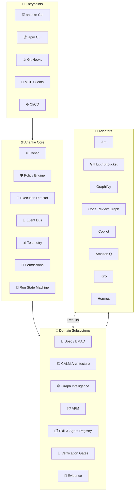

# System Architecture

## Overview

Ananke Plexus follows a **core + ports + adapters** hexagonal architecture. The stable center contains Ananke's governance semantics. External tooling remains fully replaceable.



---

## Package layout

```
ananke-plexus/
└── src/ananke/plexus/
    ├── cli/            — Typer CLI entrypoints (ananke + apm)
    ├── core/           — IDs, result types, path helpers, workflow audit
    ├── config/         — Config models, loader, migration, secrets resolver
    ├── contracts/      — BMAD compiler: behavior, model, architecture
    ├── specs/          — Spec models, service, providers, lock, drift
    ├── architecture/   — CALM loader, validation, delta, Mermaid rendering
    ├── graph/          — Canonical graph models, providers (native/Graphifyy/CRG)
    ├── policy/         — Policy engine, rule schema, builtin packs
    ├── gates/          — Gate runner, adapters (ruff, mypy, pytest, semgrep...)
    ├── execution/      — Plan DAG, scheduler, checkpoint, approvals, compensation
    ├── backends/       — AgentBackend protocol, Copilot/Q/Kiro/Hermes/fake adapters
    ├── lifecycle/      — Git service, worktrees, Jira, Bitbucket, PR evidence
    ├── hooks/          — Git hook manager, stages, runner
    ├── mcp/            — MCP server, tools, resources, prompts, auth
    ├── apm/            — Skill manifests, registry, installer, sandbox, lockfile
    ├── evidence/       — Evidence bundle, SARIF 2.1.0, hash, retention (+ registry capability snapshot)
    ├── registry/       — Skill & Agent Registry: SQLite + content-addressed store, importers,
    │                     resolver, ananke.lock, activation, docs generator, HTTP server
    ├── evals/          — Enterprise evaluation harness: traces, evaluators, judges, regression
    ├── testing/        — Unified test & quality harness: adapters, profiles, quality gate
    ├── events/         — In-process event bus with JSONL audit log
    ├── telemetry/      — OpenTelemetry adapter, noop
    └── plugins/        — Entry-point discovery, plugin metadata
```

---

## Design principles

### Local-first

Code, specs, graph state, verification, and evidence can remain entirely local. No hosted service is required.

### Ports and adapters

Every external integration is isolated behind a protocol/interface:

```python
GraphProvider  →  NativeGraphProvider | GraphifyyAdapter | CodeReviewGraphAdapter
AgentBackend   →  CopilotBackend | AmazonQBackend | KiroBackend | HermesBackend | FakeBackend
SCMPort        →  BitbucketAdapter | GitHubAdapter
IssuePort      →  JiraAdapter
ScannerPort    →  RuffAdapter | SemgrepAdapter | GitleaksAdapter | TrivyAdapter
```

### Immutable, content-addressed capabilities

Skills and agents live in the [registry](registry.md): every version is an immutable, hash-verified payload; mutable state (trust, channel, lifecycle) is separate and audited. Resolution is deterministic, policy-aware and explainable, and produces a reproducible `ananke.lock`.

### Fail closed for hard gates

When a configured hard gate cannot execute, the default result is **BLOCKED**, not "pass."

Soft gates return: `PASS | WARN | SKIPPED | UNAVAILABLE`  
Hard gates return: `PASS | BLOCKED | ERROR`

### Evidence before mutation

Every mutating step records:

1. Requested intent
2. Policy decision
3. Preconditions
4. Execution result
5. Verification result
6. Artifact hashes
7. Audit record

### Capability discovery

Every backend declares a `BackendCapabilities` model. The orchestrator asks the registry for capabilities and constructs a compatible execution plan.

---

## Configuration precedence

Highest wins:

1. CLI flags (`--project`, `--offline`, `--json`)
2. Process environment variables
3. `.ananke/config.local.toml`
4. `.ananke/config.toml`
5. User config
6. Built-in defaults

---

## Event system

Every subsystem emits typed domain events to an in-process event bus. Events are appended to `.ananke/evidence/*.jsonl` for audit trails.

Registry events (`artifact.registered`, `artifact.promoted`, `artifact.yanked`, `artifact.quarantined`, …) are also written to an append-only `registry_events` table.

Key events: `RequirementCaptured`, `SpecCreated`, `SpecLocked`, `GateCompleted`, `BackendInvoked`, `PullRequestCreated`, `EvidenceFinalized`, `ApprovalRequested`, `ApprovalGranted`

---

## Exit codes

| Code | Meaning |
|---|---|
| 0 | success |
| 1 | generic failure |
| 2 | invalid usage/config |
| 3 | policy blocked |
| 4 | verification failed |
| 5 | dependency/tool unavailable |
| 6 | integration failure |
| 7 | authentication/authorization |
| 8 | spec drift |
| 9 | architecture violation |
| 10 | cancelled |
