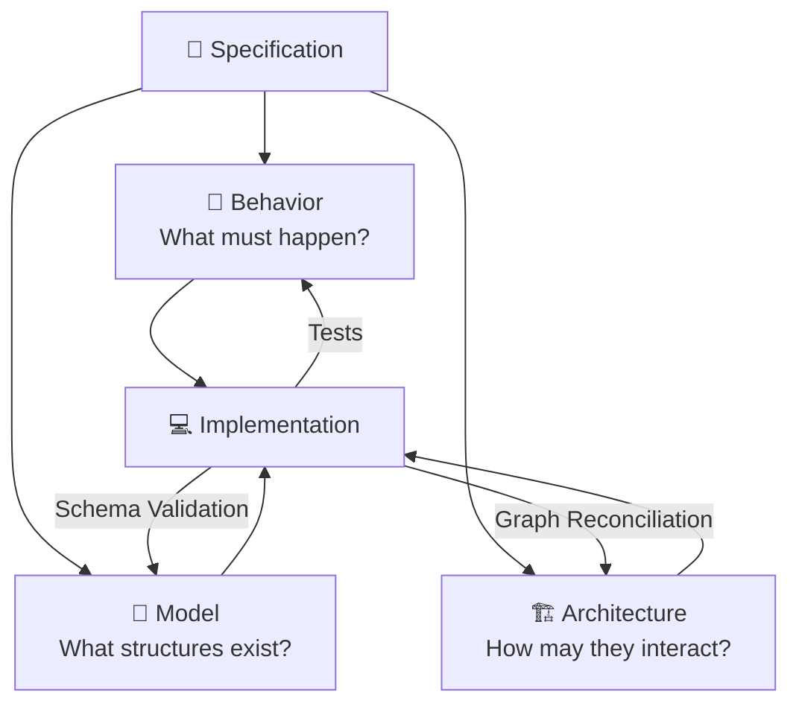

# Ananke BMAD — Behavior, Model, Architecture

Within Ananke Plexus, **BMAD** means:

> **Behavior — Model — Architecture Driven Development**

These represent three distinct forms of engineering truth that must all align for a change to be considered proven.



---

## Compiling BMAD from a requirement

```bash
# Create a requirement with acceptance criteria
ananke spec create \
  --id PROJ-101 \
  --title "Add idempotent payment webhook" \
  --acceptance "Duplicate events are deduplicated" \
  --acceptance "Idempotency key is stored per transaction"

# Compile all BMAD artifacts
ananke bmad compile --feature-dir .ananke/specs/PROJ-101
```

This produces:

```
.ananke/specs/PROJ-101/
├── bmad.yaml                    — BMAD index
├── model-contract.yaml          — API schema skeleton
├── architecture-contract.yaml   — CALM + allow/deny rules
└── tests/
    ├── test_proj_101_behavior.py    — Failing pytest skeleton
    └── proj_101.feature             — Gherkin scenarios
```

---

## Behavior contract

Behavior is expressed through failing tests and Gherkin scenarios. Every generated test records its full traceability chain:

```
Requirement → Acceptance Criterion → Scenario → Test ID
```

Generated pytest skeleton (`tests/test_proj_101_behavior.py`):

```python
import pytest

# Traceability: PROJ-101 -> AC-1 -> test_ac_1_duplicate_events_are_deduplicated
@pytest.mark.requirement('PROJ-101')
@pytest.mark.ac('1')
def test_ac_1_duplicate_events_are_deduplicated() -> None:
    """AC-1: Duplicate events are deduplicated"""
    # TODO: implement acceptance criterion assertion
    pytest.fail('not implemented')
```

Generated Gherkin feature:

```gherkin
Feature: Add idempotent payment webhook
  # Requirement: PROJ-101

  Scenario: AC-1 — Duplicate events are deduplicated
    Given the system is in a known state
    When the condition for AC-1 is met
    Then the system satisfies the acceptance criterion
```

### Behavior principle

Never claim that an automatically generated test proves the requirement unless traceability exists. Every test records `Requirement → AC → Scenario → Test ID`.

---

## Model contract

Model contracts define API schemas, event payloads, domain value objects, and compatibility rules.

Generated `model-contract.yaml`:

```yaml
contract_id: model-proj-101
requirement_id: PROJ-101
title: Add idempotent payment webhook
schemas:
  - name: proj-101_request
    type: object
    description: API request boundary for this requirement
  - name: proj-101_response
    type: object
    description: API response boundary for this requirement
compatibility_policy: backward_compatible
boundary_types:
  - api_request
  - api_response
```

Example domain model:

```python
from pydantic import BaseModel
from datetime import datetime
from decimal import Decimal
from uuid import UUID

class PaymentWebhookPayload(BaseModel):
    transaction_id: UUID
    customer_id: UUID
    amount: Decimal
    currency: str
    occurred_at: datetime
    idempotency_key: str
```

---

## Architecture contract

Architecture contracts are checked against the CALM system document, graph provider facts, and component allow/deny rules.

Generated `architecture-contract.yaml`:

```yaml
contract_id: arch-proj-101
requirement_id: PROJ-101
calm_ref: .ananke/architecture/system.calm.json
allowed_dependencies: []
denied_dependencies: []
invariant_ids: []
import_rules:
  deny_cross_domain_imports: true
  deny_circular_imports: true
```

---

## Verifying BMAD artifacts

```bash
ananke bmad verify --feature-dir .ananke/specs/PROJ-101
# exits 0 if all artifacts present, 4 if missing

ananke bmad show --feature-dir .ananke/specs/PROJ-101
# prints the bmad.yaml index

ananke bmad trace --feature-dir .ananke/specs/PROJ-101
# shows requirement → AC → test traceability
```

---

## BMAD vs BMAD-METHOD

Ananke uses **Ananke BMAD** (Behavior, Model, Architecture) as its internal contract triad.

The external **BMAD-METHOD** ecosystem is separate. If supported, it lives under `ananke.plexus.integrations.bmad_method` to avoid semantic collision.

---

## Drift detection

After locking the spec, Ananke detects when artifacts have changed:

```bash
ananke spec lock --feature-dir .ananke/specs/PROJ-101
ananke spec diff --feature-dir .ananke/specs/PROJ-101
# → [] if no drift
# → ["HASH_MISMATCH:spec.md"] if spec changed after lock
```

Drift types: `REQUIREMENT_DRIFT`, `SPEC_DRIFT`, `ARCHITECTURE_DRIFT`, `MODEL_DRIFT`, `POLICY_DRIFT`, `TOOLCHAIN_DRIFT`, `GRAPH_DRIFT`
