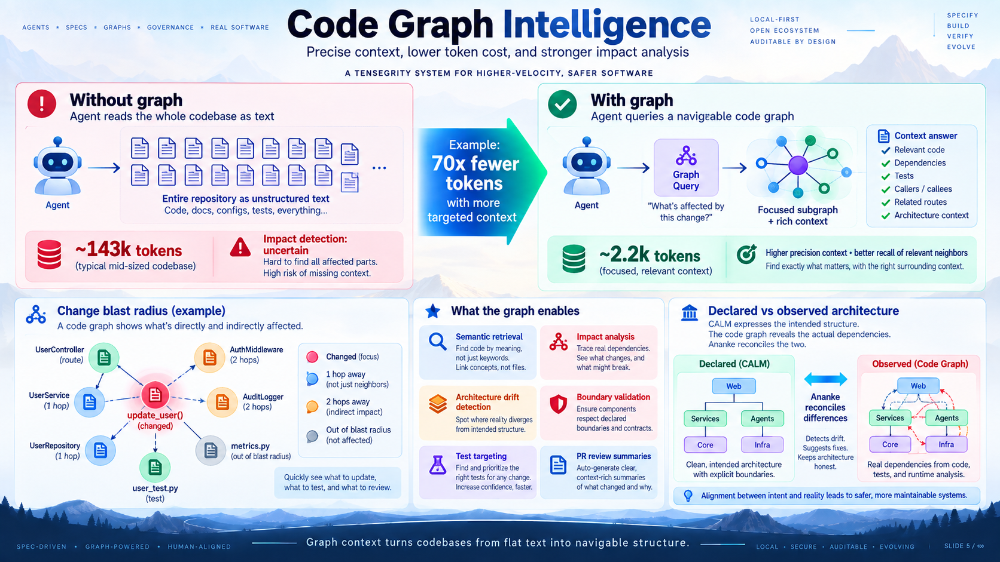
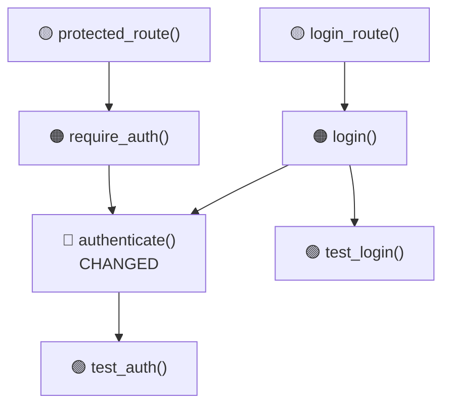

# Code Graph Intelligence

Ananke treats your repository as a **graph of semantic relationships**, not a flat directory tree.



---

## Why graph context changes everything

Without graph intelligence:

```
Agent → Entire Repository → Huge Text Context
```

With graph intelligence:

```
Agent → Graph Query → Relevant Subgraph → Focused Context → Agent
```

The objective is not merely fewer tokens. It is **better context selection** — giving the agent exactly the code it needs to understand the impact of a change.

---

## Canonical graph model

All providers normalize to the same types.

### Node kinds

| Kind | Represents |
|---|---|
| `file` | Source file |
| `function` | Function definition |
| `class` | Class definition |
| `method` | Class method |
| `module` | Python module |
| `route` | HTTP API endpoint |
| `table` | Database table |
| `queue` | Message queue |
| `service` | Service component |
| `requirement` | Requirement artifact |
| `test` | Test function |
| `skill` | APM skill |
| `tool` | MCP tool |
| `architecture_component` | CALM component |

### Edge kinds

| Kind | Meaning |
|---|---|
| `imports` | Module/file imports another |
| `calls` | Function calls another |
| `inherits` | Class inherits from another |
| `implements` | Class implements interface |
| `reads` | Component reads from store |
| `writes` | Component writes to store |
| `publishes` | Component publishes event |
| `subscribes` | Component subscribes to event |
| `tests` | Test covers function/class |
| `realizes` | Implementation realizes spec |
| `depends_on` | Component depends on another |
| `owns` | File owns function/class |
| `violates` | Component violates constraint |
| `constrained_by` | Component constrained by policy |

### Edge provenance

Each edge carries:
- `origin`: `extracted | inferred | ambiguous | declared`
- `provider`: which adapter produced the edge
- `confidence`: float 0.0–1.0
- `source_location`: file:line where the relationship was found

---

## Blast radius analysis

When `authenticate()` changes, Ananke traverses the graph:



This answers:
- What may break?
- Which tests matter?
- What architecture components are involved?
- Which routes rely on the changed symbol?

---

## Building and querying the graph

```bash
# Build/update the code graph
ananke graph build --project .

# Query the graph for a symbol
ananke graph query --text "authenticate"

# Calculate impact of changed files
ananke graph impact --files src/auth.py src/middleware.py

# Export the graph as JSON
ananke graph export --format json

# Check graph status
ananke graph status
```

---

## Graph providers

### Native (built-in)

AST-based Python analysis. Always available, no dependencies.

- Extracts: files, functions, classes, imports
- Populates: `owns`, `imports` edges
- Best for: quick local analysis, CI without external tools

### Graphifyy adapter

When `graphifyy` is installed, provides broad knowledge-graph enrichment and multi-source relationships. Falls back to native when unavailable.

```bash
pip install graphifyy  # optional
```

### code-review-graph adapter

When `code-review-graph` is installed, provides structural code review and incremental blast-radius analysis. Falls back to native when unavailable.

```bash
pip install code-review-graph  # optional
```

### Multi-provider reconciliation

When multiple providers run, edges are reconciled:

| Status | Meaning |
|---|---|
| `CONSENSUS` | Multiple providers agree |
| `SINGLE_SOURCE` | Only one provider found this edge |
| `CONFLICT` | Providers disagree |
| `UNKNOWN` | No provider has data |

---

## Impact report

The impact report includes:

```json
{
  "changed_files": ["src/auth.py"],
  "impacted_symbols": ["function:src/auth.py:authenticate", "class:src/auth.py:AuthService"],
  "impacted_files": ["src/middleware.py"],
  "forbidden_edges": [],
  "blast_radius": 15,
  "summary": "1 changed, 14 impacted symbols, 1 impacted files"
}
```

---

## Architecture reconciliation

Ananke compares declared architecture (CALM) with observed architecture (graph):

```
DECLARED  = architecture intended by CALM
OBSERVED  = architecture found in source/graph
DELTA     = observed − declared / declared − observed
```

Findings include:
- Undeclared dependency
- Declared relationship not found in code
- Protocol mismatch
- Forbidden cross-domain edge
- Interface changed without model version bump
