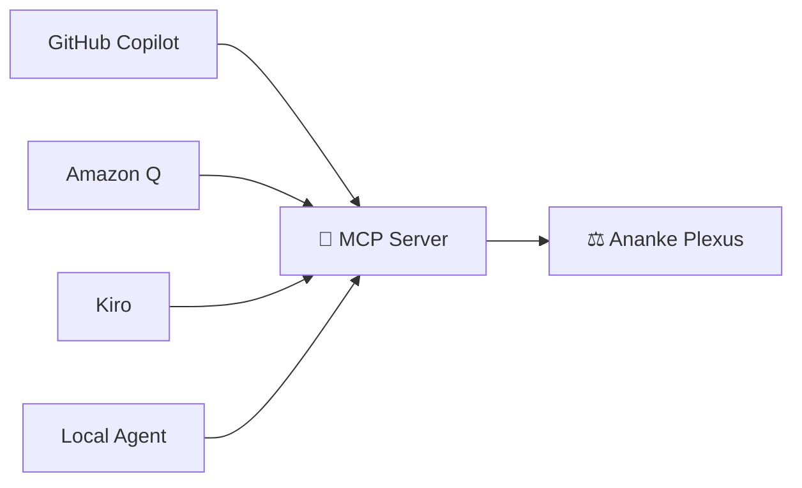
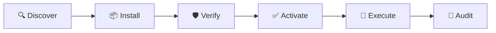

# MCP Server & APM

## Model Context Protocol Server

Ananke exposes a governed engineering intelligence surface via MCP, allowing any compatible IDE or agent to query specifications, architecture, code graph, policy, and evidence.



---

## Starting the MCP server

```bash
# Read-only surface (safe for any agent)
ananke serve-mcp

# HTTP transport
ananke serve-mcp --transport http --port 8765 --token my-secret

# With mutation tools enabled (requires explicit opt-in)
ananke serve-mcp --allow-mutations
```

Default transport is **stdio** (for IDE integration). HTTP transport binds to loopback only by default.

---

## Read-only tools

| Tool | Description |
|---|---|
| `ananke.project.status` | Project health / doctor summary |
| `ananke.spec.get` | Retrieve spec artifacts for a feature |
| `ananke.spec.validate` | Validate spec contract completeness |
| `ananke.spec.create` | Create a spec from requirement |
| `ananke.bmad.get_contract` | Get BMAD contract for a feature |
| `ananke.arch.get` | Get the CALM system document |
| `ananke.arch.validate` | Validate architecture against CALM |
| `ananke.arch.render` | Render architecture as Mermaid |
| `ananke.graph.query` | Query code graph by symbol |
| `ananke.graph.impact` | Calculate blast radius for changed files |
| `ananke.graph.update` | Rebuild the code graph |
| `ananke.policy.explain` | Explain policy decisions for a stage |
| `ananke.verify.run` | Run full local verification |
| `ananke.run.status` | Get run state |
| `ananke.evidence.get` | Retrieve evidence bundle manifest |

## Mutation tools (requires `--allow-mutations`)

| Tool | Description |
|---|---|
| `ananke.run.execute` | Start a governed run for a spec |
| `ananke.git.create_branch` | Generate branch name from ticket |
| `ananke.git.commit` | Create a git commit |
| `ananke.lifecycle.transition_issue` | Transition a Jira issue |
| `ananke.lifecycle.create_pr` | Create a pull request |

---

## MCP resources

Dynamic resource URIs expose live data from the workspace:

```
ananke://project/status        — effective config
ananke://architecture/system   — CALM document
ananke://spec/index            — list of specs
ananke://spec/PROJ-101         — spec artifact files
ananke://graph/snapshot        — latest code graph
ananke://policy/index          — active policy packs
ananke://policy/baseline       — specific pack content
ananke://evidence/index        — list of evidence runs
ananke://run/<id>/evidence     — specific run manifest
ananke://run/index             — list of all runs
```

## MCP prompts

| Prompt | Use case |
|---|---|
| `architecture-aware-implementation` | Implement while respecting architecture |
| `blast-radius-review` | Summarize impact of changed files |
| `spec-clarification` | Find ambiguities in requirement |
| `bmad-contract-generation` | Generate BMAD contract skeletons |
| `pr-evidence-summary` | Summarize evidence for PR body |

---

## APM — Agent Package Manager

APM treats agent capabilities as supply-chain artifacts with provenance, permissions, and lockfiles.



### Package types

- `skill` — reusable agent capability
- `prompt-pack` — curated prompts
- `policy-pack` — governance rules
- `evaluator` — evaluation rubrics
- `workflow` — execution templates
- `tool-adapter` — external tool integration
- `bundle` — collection of the above

### Installing skills

```bash
# Install from local directory
apm install --source ./my-skill/

# List installed skills
apm list

# Inspect a skill
apm info my-skill

# Audit a skill's permissions
apm audit my-skill

# Check sandbox permissions
apm sandbox-check my-skill

# Activate for use
apm activate my-skill

# Verify integrity
apm verify my-skill
```

### Skill manifest

```toml
[skill]
name = "graph-reviewer"
version = "1.2.0"
description = "Graph-aware impact review."
license = "MIT"

[compatibility]
ananke = ">=0.5,<1"
skill_api = "1"

[permissions]
filesystem_read = ["src/**", "tests/**", ".ananke/**"]
filesystem_write = [".ananke/evidence/**"]
network = []
shell = ["ananke graph *"]

[entrypoints]
instructions = "SKILL.md"

[provenance]
source = "github"
repository = "org/awesome-skills"
revision = "<sha>"
```

### APM lockfile

`apm.lock` records exact resolved state:
- Resolved version and digest
- Source and source revision
- Transitive bundle members
- Permission hash
- License
- Install timestamp

### Sandbox enforcement

Untrusted skills cannot:
- Access `.ananke/secrets/**` or `config.local.toml`
- Run blocked shell patterns (`git *`, `curl *`, `rm -rf*`, etc.)
- Write outside declared `filesystem_write` globs
- Access hosts not in `network` allowlist

### Importing from GitHub Awesome Copilot

```bash
apm import-copilot --path ./path/to/copilot-skills/
```

Preserves `SKILL.md`, records upstream commit SHA, infers permissions conservatively, requires explicit activation for executable assets.

### Bundle management

```bash
# Export a bundle of installed skills
apm bundle export --name skill-a --name skill-b --output ./release.tar.gz

# List bundle members
apm bundle list --bundle ./release.tar.gz

# Install from a bundle
apm bundle install --bundle ./release.tar.gz
```
