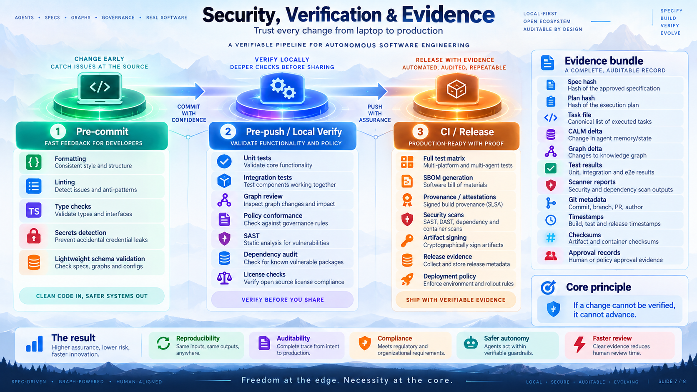
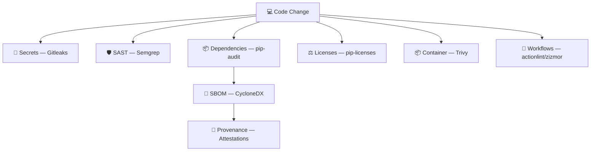

# Policy Engine & Security

Ananke's policy engine is the "Ananke" layer — the hard constraints that govern every agent action.



---

## Policy categories

| Category | Example policies |
|---|---|
| Architecture | No domain cycles; no forbidden imports |
| Security | No secrets committed; SAST must pass |
| Quality | Ruff clean; mypy strict; coverage ≥ 85% |
| Testing | Tests must pass before push |
| Model compatibility | Schema changes must be backward-compatible |
| Dependency | No CVEs without documented exception |
| License | No GPL in production dependencies |
| Git | No force-push to main |
| Lifecycle | Jira must be In Progress before implementation |
| Agent permissions | Skills cannot access secrets directory |
| Network | Default deny; allow-list per skill |
| Filesystem | Skills restricted to declared read/write globs |
| Release | SBOM required; provenance attestation required |
| Evidence | Evidence bundle must exist before PR creation |

---

## Gate severity

| Severity | Effect |
|---|---|
| `info` | Logged only |
| `low` | Warning |
| `medium` | Warning in CI; may block in strict mode |
| `high` | Blocks unless policy says `warn` |
| `critical` | Always blocks |

Hard gates: `PASS | BLOCKED | ERROR`  
Soft gates: `PASS | WARN | SKIPPED | UNAVAILABLE`

Tools not installed return `UNAVAILABLE`. Policy decides whether that blocks or warns.

---

## Builtin policy packs

Install a pack into your project:

```bash
ananke policy install-pack baseline
ananke policy install-pack python-library
ananke policy install-pack agentic-security
ananke policy install-pack enterprise-strict
```

### `baseline`

Minimal rules for any Ananke project:
- `policy.core.fail-closed` — ensures `fail_closed = true` in config
- `security.no-secret` — gitleaks must find no secrets (pre-commit)

### `python-library`

For Python library and service projects:
- Ruff check (pre-commit)
- mypy strict (verify)
- Test coverage ≥ 85% (verify)
- pip-audit clean (verify)
- License scan (verify, warn)

### `agentic-security`

For projects with autonomous agents:
- No secrets in prompts (gitleaks)
- SAST clean (semgrep)
- Dependency audit (pip-audit)
- Trivy filesystem scan
- Architecture: no domain cycles (pre-push)

### `enterprise-strict`

All of the above, at critical severity, blocking.

---

## Writing custom policies

Create `.ananke/policy/my-rules.toml`:

```toml
[[rule]]
id = "arch.no-domain-cycle"
stage = "pre_push"
severity = "high"
gate = "architecture"
assert = "graph.domain_cycles == 0"
on_failure = "block"

[[rule]]
id = "security.no-secret"
stage = "pre_commit"
severity = "critical"
gate = "gitleaks"
assert = "findings.count == 0"
on_failure = "block"

[[rule]]
id = "tests.minimum-coverage"
stage = "verify"
severity = "medium"
gate = "pytest"
assert = "coverage.line >= 85"
on_failure = "block"
```

---

## Policy commands

```bash
# List active rules
ananke policy list --project .
ananke policy list --json

# Evaluate a stage
ananke policy check --stage verify
# exits 0 if pass, 3 if blocked

# Explain gate decisions
ananke policy explain --stage pre_commit
```

---

## Security — a layered system

Ananke does not reduce "security" to one scanner. Security is layered:



### Scanner surface

| Concern | Tool |
|---|---|
| Python quality | Ruff |
| Type safety | mypy |
| Secrets | Gitleaks |
| SAST | Semgrep |
| Python CVEs | pip-audit |
| Container/filesystem CVEs | Trivy |
| Workflow security | actionlint, zizmor |
| Code scanning | CodeQL |
| SBOM | CycloneDX |
| Provenance | GitHub artifact attestations |

Tools are detected at runtime — if not installed, they produce `UNAVAILABLE` rather than silently passing.

---

## Agentic security threat model

Ananke addresses agent-specific risks:

| Risk | Mitigation |
|---|---|
| Prompt injection from repo content | Repository content treated as untrusted input |
| Tool escalation | Tool allowlists + policy evaluation before every call |
| Secret exposure | APM sandbox blocks reads of `.ananke/secrets/**` |
| Network exfiltration | Default deny; per-skill allow-list |
| Dependency hallucination | APM verifies packages before install |
| Approval bypass | Required approval classes enforced in run engine |
| Evidence tampering | SHA-256 checksums and manifest hashes |

---

## Evidence bundle

Every verification run produces an immutable evidence bundle:

```
.ananke/evidence/<run-id>/
├── manifest.json          — file hashes
├── run.json               — run metadata
├── policy-decisions.jsonl — every gate decision
├── checksums.sha256       — integrity file
└── gates/
    ├── ruff.json
    ├── mypy.json
    ├── pytest.json
    ├── gitleaks.json
    ├── semgrep.json
    ├── pip-audit.json
    ├── trivy.json
    ├── license.json
    └── sast.sarif         — SARIF 2.1.0 for security findings
```

The SARIF file can be uploaded directly to GitHub Security tab.
