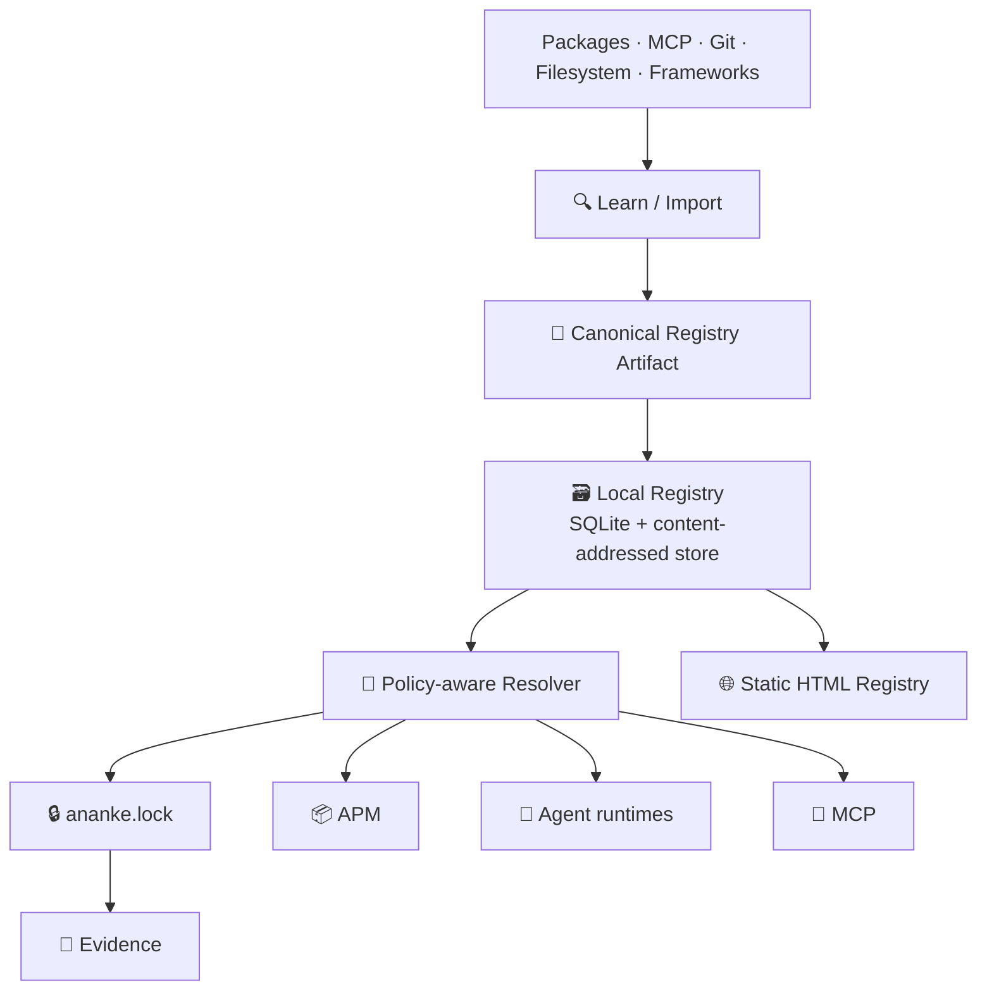
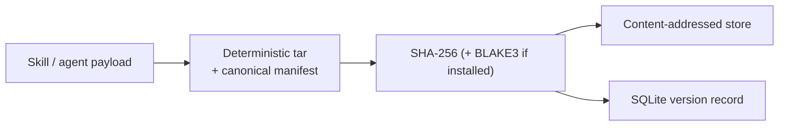
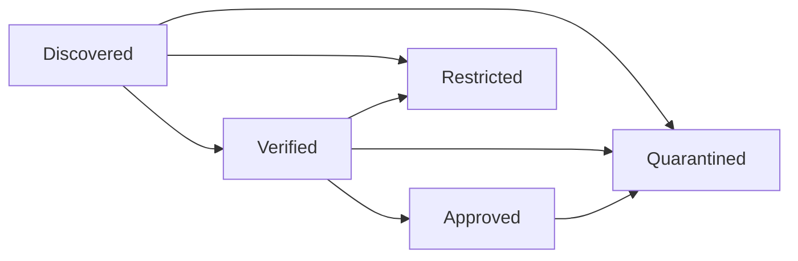

# Skill & Agent Registry

> **Discover capabilities once. Normalize them into registry truth. Version them immutably. Resolve them reproducibly. Explain them visibly. Use them safely everywhere.**

The registry is the **capability memory and package-resolution layer** of Ananke Plexus. It answers questions that "what skills are installed?" never could:

- What capabilities do we know about, and where did each come from?
- What exactly does each version do, and what changed between versions?
- What permissions does it need, and which runtimes can use it?
- Which version is allowed *here*, and *why* did the resolver choose it?
- Which agents depend on it? Can we reproduce the same capability graph tomorrow?
- Can a human understand all of this from one offline HTML page?



## One core, many artifact kinds

Skills and agents are two *views* over one shared registry core. A single `ArtifactManifest` model covers every kind:

| Kind | Meaning |
|---|---|
| `skill` | Reusable capability an agent can activate or invoke |
| `agent` | Configured actor: instructions, runtime, composed skills, policies, eval suite |
| `tool`, `workflow`, `evaluator`, `prompt`, `policy` | Other versioned capabilities |
| `bundle` | Versioned collection of artifacts |
| `runtime-profile` | Runtime configuration profile |

Identity is a stable URI: `ananke://<kind>/<namespace>/<name>@<version>`, e.g. `ananke://skill/core/graph-review@2.1.0`. Short forms (`core/graph-review@^2`) and aliases (`graph-review`) are accepted everywhere; a bare name that matches several artifacts is rejected as ambiguous rather than guessed.

An agent is simply a **versioned dependency graph**: its `skills`, slash-qualified `policies` and evaluator are dependencies the resolver solves before activation.

## Immutable, content-addressed versions



- The payload is a **reproducible tar** (sorted entries, zeroed owners/mtimes) that embeds the canonical manifest as `ananke.registry.json`. The same source always yields the same digest.
- Registering the same content twice is a no-op. Registering *different* content under an existing version fails with `VERSION_CONTENT_CONFLICT` and tells you the diff-based version bump to use.
- Database triggers make `payload_sha256`, `manifest_json`, `version` and `created_at` physically immutable, and the event log append-only.
- **Registry revisions** correct *metadata* (a description typo, a licence fix) without touching payload identity. Trust, channel and lifecycle changes are revisions too, each with actor and reason.
- Blobs are stored read-only under `blobs/sha256/<aa>/<digest>` and verified on every read, so tampering is detected.

## Versions, channels, lifecycle, trust

Versions follow **SemVer 2.0**. Foreign version strings are normalised best-effort (`1.2` → `1.2.0`, `1.0a2` → `1.0.0-alpha.2`) and the original is kept in provenance; `strict_semver = true` rejects them instead.

| Dimension | Values | Notes |
|---|---|---|
| Lifecycle | `active`, `deprecated`, `yanked`, `quarantined`, `archived` | *Yanked* stays resolvable from lockfiles; *quarantined* is never selected and materialization is refused |
| Channel | `stable`, `candidate`, `beta`, `canary`, `deprecated`, `quarantined` + custom | Independent of SemVer |
| Trust | `unknown`, `discovered`, `verified`, `approved`, `restricted`, `quarantined` | Follows the promotion workflow below |



Newly registered versions are `discovered` in the `candidate` channel. **Approval is never granted at registration**: `promote` runs the [quality gate](#quality-gate) first, and moving `discovered → approved` records both intermediate steps in the audit trail.

## Importers — learn from anywhere, execute nothing by default

`ananke registry learn <source>` runs `probe → inspect → normalize → compare with existing → validate → register`.

| Source | Example | Static? |
|---|---|---|
| Ananke manifest (`ananke.toml/.yaml/.registry.json`, legacy `ananke-skill.toml`) | `./skills/graph-review` | ✅ |
| Generic skill layout (`SKILL.md`, `skill.yaml`, `AGENT.md`, `tools/*.json`) | `./external-skills` | ✅ |
| Python package metadata + entry points | `python:pkg`, `python:./dist` | ✅ never imports the package |
| Rust crate (`Cargo.toml`, `ananke.registry.json`) | `rust:./crate` | ✅ |
| MCP snapshot | `mcp:tools-list.json` | ✅ |
| Archive (`.tar.gz`, `.tgz`, `.zip`) | `./skills.tar.gz` | ✅ safe extraction |
| Framework source (AST scan) | `framework:pydantic-ai:./src` | ✅ parses, never executes |
| Git | `git:https://…` / local repo | ⚠️ remote clone needs network approval |
| MCP server | `mcp-stdio:<cmd>`, `mcp-http:<url>` | ⚠️ needs dynamic / network approval |
| Dynamic introspection plugin | `dynamic:<framework>:<path>` | ⚠️ sandboxed subprocess, explicit opt-in |

Discovery produces a **candidate**, not a manifest. Anything that cannot be inferred (namespace, licence, version, permissions) is reported as a diagnostic — never silently guessed. Identity matching uses an explicit `ananke_id`, then `(source package, native id)`, then aliases; a same-name match in another namespace is only a low-confidence *suggestion*, and ambiguous matches need review.

Re-learning an unchanged source is skipped via a source fingerprint (`--force` overrides). When content changed, `learn` shows the **diff and suggests the version bump**; `--version auto` applies it.

Custom importers plug in via the `ananke.registry.importers` entry-point group and must implement the `RegistryImporter` protocol (`probe`, `inspect`, declared `static`/`permissions`).

## Resolution — explainable, deterministic, policy-governed

"Best version" is never an undocumented heuristic. Each candidate passes a rule pipeline:

`requirement → lifecycle → pre-release → channel → trust → licence → security → quality → compatibility → enterprise approval`

Accepted candidates are ranked by **policy adjustments → trust → channel → SemVer** (so an approved `2.4.1` beats a merely discovered `2.5.0`). Dependencies are solved together with backtracking, so a graph never contains two versions of one artifact and every dependency constraint holds.

```text
$ ananke registry resolve core/graph-review@^2 --runtime pydantic --explain
Selected 2.4.1 of ananke://skill/core/graph-review because:
  ✓ matches ^2
  ✓ stable
  ✓ approved
  ✓ license Apache-2.0 approved
  ✓ no active security quarantine
  ✓ supports runtime pydantic
Rejected 2.5.0-beta.2:
  ✗ pre-release not allowed
  ✗ beta channel not allowed
Rejected 2.4.2:
  ✗ trust status = discovered (minimum: approved)
```

**Resolution modes:** `highest-compatible` (default), `highest-approved` (recommended for enterprises), `lowest-compatible`, `stable-only`, `exact`, `locked`.

Guaranteed properties (checked by tests): same inputs → same resolution; a locked version never silently changes; quarantined versions are never selected; an exact pin selects only that version; all dependency constraints are satisfied; the payload digest matches the lock.

Resolver rules are an extension point (`ResolverRule`: accept / reject / penalty / preference) discoverable through the `ananke.registry.rules` entry-point group.

### Lockfile

`ananke.lock` is deterministic TOML — no timestamps — recording each artifact's exact version, payload digest, dependency edges, `source` (`local-registry`, `project-registry`, `path`), the registry snapshot id and the root requirements:

```toml
# ananke.lock — generated by `ananke registry lock`. Do not edit.
version = 1
registry_snapshot = "sha256:…"
mode = "highest-compatible"

[[requirement]]
id = "ananke://agent/engineering/coding-agent"
req = "^3"

[[artifact]]
id = "ananke://agent/engineering/coding-agent"
version = "3.2.0"
digest = "sha256:…"
source = "local-registry"
kind = "agent"
dependencies = ["ananke://skill/core/graph-review@1.0.0"]

[[artifact]]
id = "ananke://skill/core/graph-review"
version = "1.0.0"
digest = "sha256:…"
source = "local-registry"
kind = "skill"
requested_by = ["ananke://agent/engineering/coding-agent@3.2.0"]
```

`ananke sync` prefers versions already pinned in the lock while they still satisfy the requirements (`--update` re-resolves). A moved registry snapshot alone never rewrites the lock. **Path overrides and dev links** appear as `source = "path"`, `dirty = true`, and `--release` can forbid them.

## Compatibility and runtime translation

Compatibility covers the Ananke version, Python, runtime (and runtime version), OS, architecture, MCP protocol and model capabilities. `ananke registry translate` produces a framework-neutral descriptor for `pydantic`, `microsoft`, `generic-mcp`, `langgraph` or `crewai` — no framework is imported, and the descriptor always carries the original `uri`, `version` and `digest`, so translation never changes registry identity.

## Quality gate

`ananke registry promote --trust approved` runs, in order: checksum & embedded-manifest integrity → provenance → JSON-Schema validity → secret scan → dependency registration → runtime translation → licence → network-permission review → tests → vulnerability scan → signature. Policy (`approval.require`) decides which checks are *required*; failures block promotion.

!!! warning "Tests execute artifact code"
    Running an artifact's own tests executes untrusted code, so it only happens with an explicit `--run-tests` (or `approval.run_tests = true`).

## Security model

| Threat | Control |
|---|---|
| Malicious package on import | No dynamic execution by default; static metadata/AST only |
| Dynamic introspection | Separate `python -I` process: no network, scrubbed environment and throw-away `HOME`, CPU/memory/file limits, timeout, JSON-only output. *Defence in depth, not a container boundary* — use an OS sandbox for hostile code |
| Path traversal / symlink escape | Canonical paths everywhere; symlinks are never followed; archive members are validated one by one |
| Archive & git attacks | Only regular files; size caps; `ext::`/argument-injection URLs rejected; remote clones need network approval |
| Secrets in payloads | Scanned before hashing; policy `reject` (default) / `redact` / `warn`; findings never echo the secret |
| Poisoned docs (HTML/JS injection) | Everything escaped; sanitized Markdown (no raw HTML, no `javascript:`, images not auto-loaded); strict CSP, no inline scripts |
| Tampered blobs | SHA-256 verified on every read; lock digests; `registry verify` |
| Version substitution | Immutability triggers + conflict rejection |
| Dependency confusion | Namespaces, publisher policy, explicit identity matching |
| Egress | MCP HTTP / git remotes / remote registries denied unless policy or an explicit flag allows |
| Forged trust | `verified` is never read from a manifest or archive: signatures are checked against the policy's trusted keys every time |
| Remote registry compromise | Pulled versions are digest-checked, re-validated by local policy and arrive as `discovered` — trust is never inherited |

## Signatures

Versions can be signed with **Ed25519**. The signed message binds the version URI *and* the payload SHA-256 (`ananke-registry-signature-v1 \n <uri>@<version> \n sha256:<digest>`), so a signature cannot be replayed onto another version or different content.

- A signature is **verified** only if it is valid *and* its key is listed in policy (`[signing.trusted_keys.<id>]`) and not revoked. Signatures from unknown keys are stored but reported *untrusted*.
- `verified` is always **computed**, never stored or read from a manifest, database column or archive. Importing content cannot assert its own trust, and revoking a key takes effect immediately.
- `require_signature = true` (or `approval.require = ["signature"]`) makes promotion and resolution demand a verified signature.
- Private keys live only in a key file you control (created `0600`; group/world-readable keys are refused) — never in the registry, policy, events or evidence. Signing needs `pip install ananke-plexus[registry-signing]`; **verification needs nothing** (pure-Python RFC 8032 fallback, cross-checked against OpenSSL in the test suite).

```bash
ananke registry key generate --trust            # key file under .ananke/secrets/, public key into policy
ananke registry sign core/graph-review@1.0.0 --key .ananke/secrets/registry-signing.key
ananke registry signatures core/graph-review@1.0.0
ananke registry key revoke ed25519-1a2b3c4d5e6f7a8b
```

## Static documentation

`ananke registry docs build` writes a complete offline site to `.ananke/registry/docs/`: home dashboard, per-kind indexes, artifact pages with a **Latest approved / Latest stable / All versions** selector, immutable per-version pages, version history with **BREAKING** flags, comparison pages (manifest, capability, permission, dependency, schema, prompt and docs diffs, trust changes), a capability matrix, frameworks, publishers, and search. Diagrams are pre-rendered **SVG** — no JavaScript needed. Builds are deterministic and **incremental** (unchanged pages are not rewritten).

`ananke registry docs dump -o registry.html` produces **one self-contained file**: inline CSS/JS, embedded search data, dark/light themes, printable, no CDN, works offline and under a hash-pinned CSP.

## Activation, APM and evidence

`registered ≠ materialized ≠ activated`. Discovery never makes a capability executable:

1. **Materialize** — extract the verified payload to `materialized/<digest>/`.
2. **Activate** — expose it in the project (`.ananke/skills/installed/…` + `active/` marker for skills, `.ananke/agents/…` for agents), record it in `.ananke/activation.toml`, and keep the legacy `apm.lock` in sync.

APM becomes the package-manager UX over these services: `apm search`, `apm info REF`, `apm install REF`, `apm activate REF`, `apm lock`, `apm upgrade`, `apm link/unlink`, `apm publish`.

Every governed run can record **exactly which capability versions ran**: when `ananke.lock` exists, `create_evidence_bundle` writes `registry-capabilities.json` (agent, skill URIs, versions, digests, snapshot, lock hash) into the evidence bundle and its checksums.

## MCP

Agents discover capabilities through the same source of truth: the read-only tools `registry_search`, `registry_get_skill`, `registry_get_agent`, `registry_resolve`, `registry_compare_versions`, `registry_list_capabilities`, and resources `ananke://registry/skills`, `ananke://registry/agents`, `ananke://registry/skill/<ns>/<name>/<version>`.

## Operating the registry

| Concern | Feature |
|---|---|
| Integrity | `registry verify` (SQLite, foreign keys, blob hashes, embedded manifests, semver, cycles, aliases, index, lockfiles) · `registry doctor` |
| Portability | `registry export`/`import` — database-independent archive, checksummed, collision-safe, policy-checked; `import(export(r)) == r` |
| Backup | `registry backup`/`restore` — consistent SQLite snapshot + reachable blobs + lockfiles |
| Housekeeping | `registry gc` (dry-run by default; retains versions, locked and evidence-referenced blobs; grace period) · `registry rebuild-index` |
| Insight | `registry report inventory|licenses|trust|stale|deprecated|unused|security|compatibility` · `registry analytics build` |
| Governance | `registry policy init --preset enterprise` · namespace publishers · licence allow/deny · forbidden permissions · signature requirement |
| Serving | `registry serve` — read-only JSON API + static docs; loopback by default, `--token-env` (bearer token) required to listen elsewhere |
| Dev workflow | `registry watch` (native OS events with `registry-watch`, polling otherwise; detect automatically, publish manually) · `apm link` · path overrides |
| Search | Lexical (FTS5) always; optional similarity search (`--semantic`, policy-gated) |
| Performance | `registry benchmark` against the spec's goals, with baseline/regression tracking |
| Federation | Source priority `project → user → enterprise → public`; local sources resolve, remote ones are **pull-only** (`registry remote pull`) |
| Analytics | `registry analytics query` answers the spec's six questions with the same SQL on DuckDB or SQLite |

## Federation (pull-only)

A remote registry is another registry exposed with `ananke registry serve --token-env NAME`. Resolution **never** touches the network; you *pull* what you need, then resolve locally, offline and reproducibly.

```toml
# .ananke/registry/policy.toml
[remote_sources]
enterprise = true                     # network access is policy-gated (or pass --allow-network)

[sources.enterprise]
type = "remote"
url = "https://registry.example.internal"
token_env = "ANANKE_REGISTRY_TOKEN"   # NAME of an env var — the token is never stored
```

```bash
ananke registry remote list
ananke registry remote search "graph review"
ananke registry remote pull core/coding-agent@^2      # the agent and its dependency closure
```

- **Transport:** `https` only (loopback `http` for development), no redirects, timeouts and size caps, no credentials in URLs; the token is sent only over a permitted transport.
- **Verified content:** every version is checked against the digest the remote advertised, then re-validated by the normal import path (checksums, allow-listed archive members, secrets, licences, permissions). A bundle that differs from what was requested is rejected before anything is written.
- **No inherited trust:** pulled versions arrive `discovered` in `candidate`; promotion is a local decision. Signatures travel with them and are verified against *your* trusted keys. Existing local versions are never overwritten.
- The server refuses to serve quarantined versions and refuses non-loopback binds without a token.

## Similarity search (optional)

Lexical search is complete on its own. With `[semantic] enabled = true`, `ananke registry search --semantic` ranks by similarity. The built-in `local-hash` provider is a deterministic feature-hashing embedder (words + character n-grams): it tolerates typos, word forms and shared vocabulary, but it is **not a neural model** and does not know that "lint" means "static analysis". Plug a real embedder in through the `ananke.registry.embedders` entry-point group; providers that send text off-machine must declare `remote = True` and are refused unless `[semantic] allow_remote = true`. Vectors are derived cache entries keyed by embedded text, never authoritative and never exported.

## Analytics questions

`ananke registry analytics query` answers the questions in the spec (approved skills per runtime, agents on deprecated versions, network-permission skills, versions not verified recently, versions pinned by lockfiles, licences in active bundles). The SQL is portable and fixed; it runs on DuckDB when installed and SQLite otherwise, with identical results (enforced by tests).

## Quality assurance of the registry itself

- **Fuzzing** — seeded fuzz targets for the version/requirement parsers, query DSL, manifest parsers, portable-archive import, archive extraction, path handling and the Markdown sanitizer. Scale with `ANANKE_FUZZ_ITERATIONS` / `ANANKE_FUZZ_SEED`. (Fuzzing found and fixed unwrapped decompression and malformed-archive errors in import.)
- **Benchmarks** — `ananke registry benchmark [--size 10000] [--save-baseline F] [--baseline F]` times lookup, version list, small and 100-dependency resolves, FTS search, docs builds, CAS insert, export/import and integrity checks, reports the spec's goals, and fails on regressions against a saved baseline.

## What is and is not in this release

Implemented: everything above as a **Python-native** implementation with a stable service boundary (`Registry`, `Resolver`, importers, docs generator).

Not implemented (needs a Rust toolchain and a separate build/CI story — tracked in the master spec): the **Rust core** (`ananke-registry-core`, PyO3/maturin) and Rust-side APIs, and the `redb` and `tantivy` accelerators (SQLite FTS5 and a SQLite-backed cache are used instead). Optional accelerators that *are* available: `blake3`, `zstandard`, `jsonschema`, `cryptography` (signing), `watchfiles` (Rust `notify` file events) and `duckdb` (analytics).
