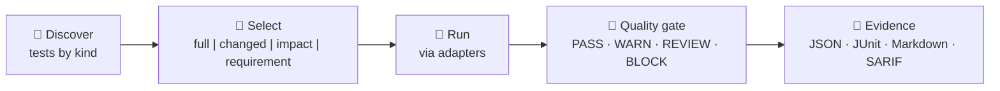

# Unified Testing & Quality Harness

The testing harness is the **verification plane** of the ADLC. One command discovers, selects, runs and reports every kind of test, and turns the outcome into a quality-gate decision — with evidence.



## Design principles

- **Adapters, not lock-in.** Every engine (pytest, Hypothesis, Schemathesis, mutmut, cargo-nextest, cargo-fuzz, Kani) sits behind the `TestAdapter` protocol. Missing tools produce `unavailable` results — never a crash.
- **Profiles instead of ad-hoc lists.** A profile is a named, transitive set of test *kinds*.
- **Deterministic, spec-traced selection.** Choose all tests, tests for changed files, tests impacted per the code graph, or tests tied to a requirement.
- **Evidence by default.** Every run can be persisted under `.ananke/evidence/<run-id>/quality/`.

## Test kinds

`unit`, `integration`, `acceptance`, `bdd`, `property`, `stateful`, `contract`, `mutation`, `fuzz`, `snapshot`, `formal`, `concurrency`, `performance`, `security`, `api_schema`, `coverage`, `compile_fail`, `agent_eval`.

## Profiles

| Profile | Adds (on top of its parent) | Use |
|---|---|---|
| `fast` | `unit`, `property`, `snapshot` (30 s budget) | Every save / pre-commit |
| `standard` | `integration`, `bdd`, `acceptance`, `contract`, `coverage`, `api_schema` | Default; CI on every PR |
| `strict` | `mutation`, `fuzz`, `security`, `stateful` | Merge to main |
| `verification` | `concurrency`, `formal` | Safety-critical modules |
| `release` | `performance`, `agent_eval` | Release gates |

## Adapters

| Adapter id | Engine | Kinds |
|---|---|---|
| `pytest` | pytest (+ pytest-cov / json-report / xdist when present) | unit, integration, acceptance, bdd, snapshot, coverage |
| `hypothesis` | Hypothesis | property, stateful |
| `schemathesis` | Schemathesis | api_schema |
| `mutmut` | mutmut | mutation |
| `nextest` | cargo-nextest | unit, integration (Rust) |
| `cargo-fuzz` | cargo-fuzz | fuzz (Rust) |
| `kani` | Kani | formal (Rust) |

Each adapter reports `available()`, `version()`, `capabilities()` (kinds, selection/parallelism/seed/timeout/JUnit/JSON/coverage support, network need, languages), `discover()`, `run()` and `doctor()`. Install the Python engines with the `test-*` extras (`test-python`, `test-property`, `test-api`, `test-snapshot`, `test-bdd`, `test-mutation`, `test-contract`, `test-automation`, or `test-all`).

## Quality gate

`ananke test run` applies the quality gate to every run and exits `1` when it blocks (or when any result failed/errored), `2` when `.ananke/quality.yaml` is invalid. The same decision is available from Python via `apply_quality_gate` as a `QualityGateDecision`:

| Verdict | When |
|---|---|
| `BLOCK` | Failures (with `block_on_required_failure`) or errors (with `block_on_error`); coverage or mutation score below threshold; run slower than `max_duration_seconds` |
| `WARN` | Warnings, skipped tests when `warn_on_skipped` is enabled, or a configured threshold that **nothing measured** |
| `PASS` | Everything passed |

Configure in `.ananke/quality.yaml`:

```yaml
quality_gate:
  block_on_required_failure: true
  block_on_error: true
  warn_on_skipped: false
  coverage_threshold: 80          # percent, 0-100
  mutation_score_threshold: 60    # percent of mutants killed, 0-100
  max_duration_seconds: 900
```

- **Coverage** is measured by the pytest adapter (`pytest-cov`, install `test-python`) — only when `coverage_threshold` is set, because it slows the run. The reported figure is total line coverage.
- **Mutation score** comes from `mutmut` (v3 `export-cicd-stats` or v2 `results`): `(killed + timeout) / (killed + timeout + survived + suspicious)`.
- A threshold that nothing measured produces a **warning** rather than a silent pass.
- The file is validated: out-of-range values or malformed YAML are an error, never silently ignored.

## Evidence

`.ananke/evidence/<run-id>/quality/` contains `results.json` (full run), `manifest.json` (SHA-256 checksums) and `reports/` (`summary.md`, `junit.xml`). Additional formats (`console`, `markdown`, `json`, `junit`, `sarif`) can be rendered with `ananke test report`.

## Where it fits

- The **registry** can execute a skill's own tests through this harness as part of the promotion quality gate (`--run-tests`, explicit opt-in).
- The **evaluation harness** covers *agent* quality (traces, judges); this harness covers *code* quality. `agent_eval` in the `release` profile bridges the two.
- Test evidence uses the same layout as every other Ananke evidence bundle, so PR evidence and audits can reference it.

See the [CLI reference](../reference/commands.md#ananke-test) and the [Test Harness reference](../reference/test-harness.md).
