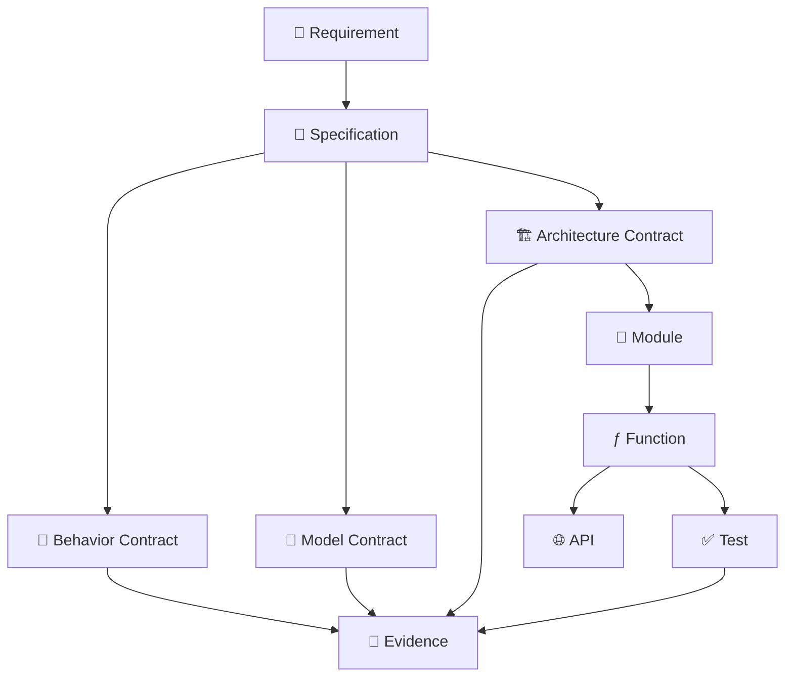
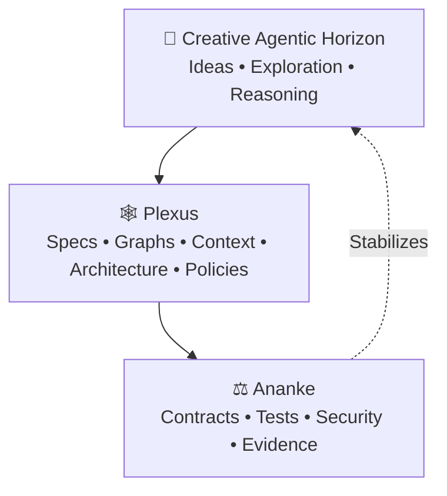
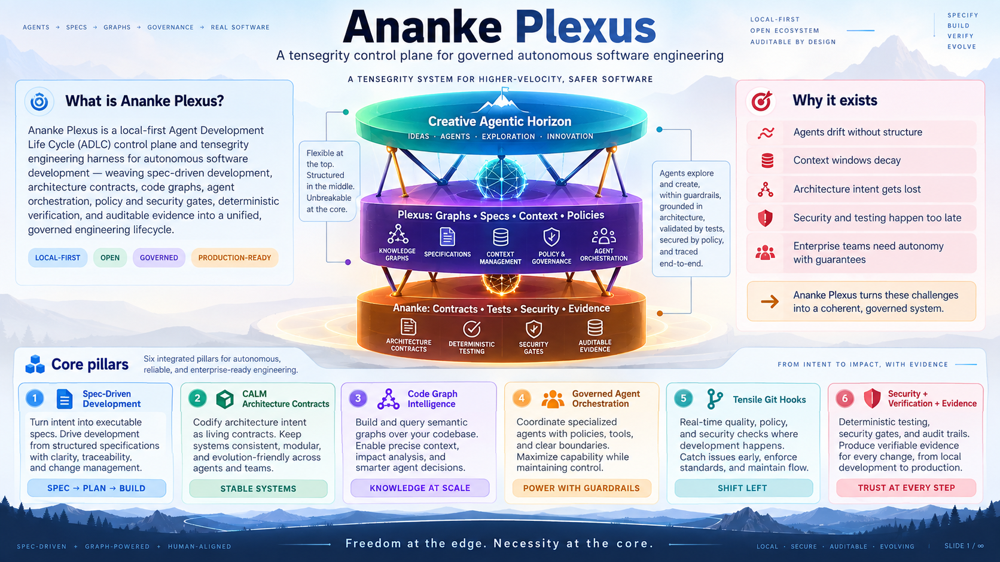
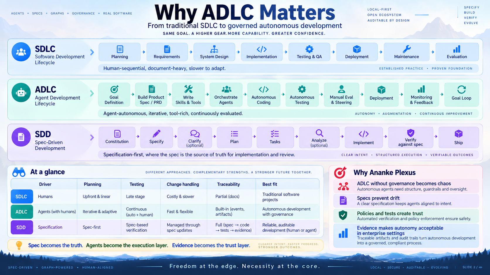

# Why Ananke Plexus

## The problem with autonomous agents

Modern coding agents can already do far more than autocomplete. They can understand requirements, explore repositories, modify dozens of files, write tests, run commands, create commits, and open pull requests.

That creates an entirely different engineering problem.

The question is no longer:

> **Can an AI write code?**

It is increasingly:

> **How do we safely allow autonomous systems to participate in software engineering without losing architectural integrity, security, traceability, or control?**

Ananke Plexus is designed around that question.

---

## The core problems

| Problem | Without structure | Ananke provides |
|---|---|---|
| **Agent drift** | Implementation diverges from requirement | Specs, acceptance criteria, policies, evidence |
| **Context overload** | Agents read huge repos as undifferentiated text | Code graphs for targeted structural context |
| **Architecture drift** | Agents imitate accidental dependencies | CALM expresses intended; graphs reveal actual |
| **Excessive autonomy** | Broad filesystem/shell/Git/network access | Capability boundaries and policy gates |
| **Late testing** | Problems discovered only in CI | Progressive local verification |
| **Security as afterthought** | Secrets or unsafe changes reach PRs | Security integrated into every lifecycle stage |
| **Poor traceability** | Nobody knows why a change exists | Evidence bundles: intent → change → verification |
| **Fragile automation** | Failed runs leave partial side effects | Recovery, retry, idempotency, state machines |
| **Enterprise distrust** | Teams restrict autonomy, can't prove safety | Auditable execution with deterministic gates |

---

## Why the name matters

### Ananke — Necessity

In Greek cosmology, **Ananke** represents necessity, inevitability, and the fundamental laws that even divine forces cannot escape.

Within the framework, **Ananke represents software truths that cannot be negotiated away by an agent**:

- A type contract must validate
- A test assertion must pass
- An architecture boundary must hold
- Credentials must not leak
- Prohibited dependencies cannot be introduced
- Sensitive operations may require approval
- Release artifacts must have provenance

Ananke is not primarily a restriction mechanism — it is the system's **gravitational center of truth**.

### Plexus — The interwoven engineering network

Software is not a directory tree. It is a network of relationships. A single function may be connected to API routes, services, tests, domain models, database tables, architecture components, requirements, policies, PRs, and releases.

That interconnected structure is the **Plexus**.



---

## Tensegrity — The architectural philosophy

Traditional governance often behaves like a wall:

```
Agent → Restriction → ❌ Blocked
```

Ananke Plexus uses a **tensegrity model** instead:



The agent remains creative at the edge. The middle provides context and structural awareness. The core protects invariants.

This allows the system to support **more autonomy precisely because stronger constraints exist where they matter**.



---

## SDLC → SDD → ADLC

### SDLC — Traditional software development lifecycle

The human engineering team drives the process from planning through deployment.

### SDD — Spec-Driven Development

Instead of `Prompt → Code`, the lifecycle becomes:

```
Requirement → Specify → Clarify → Plan → Tasks → Implement → Verify against Spec → Ship
```

The specification becomes the durable source of truth.

### ADLC — Agent Development Lifecycle

Agentic systems introduce new concerns: agent identity, context construction, tool availability, permissions, recovery, execution traces, human steering, and agent evaluation.



| Dimension | SDLC | SDD | ADLC |
|---|---|---|---|
| Primary driver | Human process | Specification | Agent + human execution |
| Source of truth | Documents / code | Specification | Specs + policies + execution artifacts |
| Traceability | Tickets + Git | Spec → Code | Intent → Agent → Code → Evidence |
| Governance | Organizational | Contract-oriented | Machine-enforced |

---

## The core engineering equation

$$\text{Safe Autonomy} \propto \text{Agent Capability} \times \text{Context Quality} \times \text{Verification Strength} \times \text{Governance Quality}$$

A more capable model with poor context, weak policies, no testing, and no architecture understanding may simply create mistakes **faster**.

> **Ananke Plexus transforms autonomous coding from a sequence of probabilistic model actions into a specification-driven, architecture-aware, graph-grounded, policy-governed, deterministically verified, and auditable software engineering lifecycle.**
