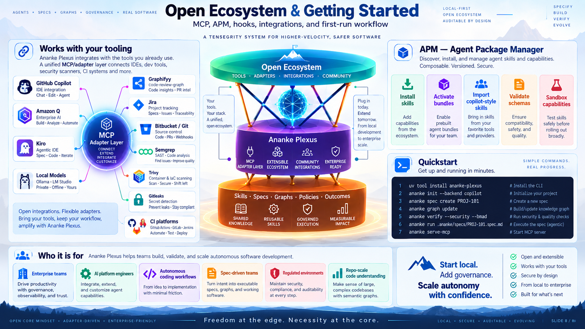

# Getting Started

This guide walks you through installing Ananke Plexus, initializing a project, and running your first governed development lifecycle.



---

## Installation

### With uv (recommended)

```bash
uv tool install ananke-plexus
```

### With pip

```bash
pip install ananke-plexus
```

### With extras

```bash
# MCP server support
pip install "ananke-plexus[mcp]"

# Jira integration
pip install "ananke-plexus[jira]"

# OpenTelemetry
pip install "ananke-plexus[telemetry]"

# All extras
pip install "ananke-plexus[all]"
```

### From source (development)

```bash
git clone https://github.com/neo-pragnya/ananke-plexus
cd ananke-plexus
pip install -e ".[dev]"
```

---

## Verify installation

```bash
ananke version
ananke --help
apm --help
```

---

## Initialize a project

```bash
cd my-project
ananke init
```

This creates:

```
my-project/
└── .ananke/
    ├── config.toml             — project configuration
    ├── config.local.toml.example
    ├── policy/
    │   └── default.toml        — baseline policy
    ├── architecture/
    │   └── system.calm.json    — CALM architecture skeleton
    ├── secrets/
    │   └── adapters.env        — credential store (gitignored)
    ├── specs/
    ├── graph/
    ├── skills/
    ├── runs/
    └── evidence/
```

Run diagnostics:

```bash
ananke doctor
ananke doctor --json  # machine-readable
```

---

## Install a policy pack

```bash
ananke policy install-pack python-library
```

---

## Create your first requirement

```bash
ananke spec create \
  --id PROJ-101 \
  --title "Add idempotent payment webhook" \
  --acceptance "Duplicate events are deduplicated" \
  --acceptance "Idempotency key stored per transaction" \
  --acceptance "Returns 200 on replay"
```

This creates `.ananke/specs/PROJ-101/requirement.md`.

### Complete the spec workflow

```bash
# Generate spec, plan, tasks
ananke spec plan --feature-dir .ananke/specs/PROJ-101
ananke spec tasks --feature-dir .ananke/specs/PROJ-101

# Compile BMAD contracts (behavior tests, model schema, architecture contract)
ananke bmad compile --feature-dir .ananke/specs/PROJ-101

# Lock the spec (records hashes for drift detection)
ananke spec lock --feature-dir .ananke/specs/PROJ-101

# View traceability
ananke bmad trace --feature-dir .ananke/specs/PROJ-101
```

---

## Build the code graph

```bash
ananke graph build
ananke graph status
ananke graph query --text "webhook"
```

---

## Run verification

```bash
ananke verify
```

This runs all configured gates and produces an evidence bundle in `.ananke/evidence/`.

---

## Install git hooks

```bash
ananke hooks install
ananke hooks status
```

Pre-commit will run Ruff and secrets scan. Pre-push will run the full verification suite.

---

## Start the MCP server

Add to your IDE's MCP configuration:

```json
{
  "mcpServers": {
    "ananke": {
      "command": "ananke",
      "args": ["serve-mcp"]
    }
  }
}
```

Your agent can now query `ananke://spec/PROJ-101`, `ananke://graph/snapshot`, and use tools like `ananke.graph.impact`.

---

## Run the demo golden journey

```bash
ananke run start DEMO-101 --backend fake
```

Expected output:

```
✓ Requirement captured
✓ Spec locked                 sha256:...
✓ Behavior contract compiled  2 scenarios
✓ Model contract compiled     2 schemas
✓ Architecture validated
✓ Isolated worktree created
✓ Backend completed implementation
✓ Ruff passed
✓ Type checking passed
✓ Tests passed
✓ Secret scan passed
✓ Evidence bundle finalized
```

---

## Common patterns

### Pattern 1 — Human-led, agent-assisted

```bash
# Human specifies
ananke spec create --id T-1 --title "Feature"
# Agent implements via IDE with MCP
# Ananke verifies
ananke verify
# Human reviews PR
```

### Pattern 2 — Jira to PR automation

```bash
ananke lifecycle issue-transition --ticket PROJ-101 --state "In Progress"
ananke run start PROJ-101
```

### Pattern 3 — Architecture refactoring

```bash
ananke arch validate        # find drift
ananke arch diff            # show declared vs observed
ananke graph impact --files src/old_module.py
```

---

## Configuration

Edit `.ananke/config.toml`:

```toml
[project]
name = "my-service"
default_branch = "main"

[ananke]
mode = "developer"
fail_closed = true
offline = false

[spec]
provider = "native"
contract_mode = "ananke-bmad"

[graph]
providers = ["native"]
primary = "native"

[security]
secret_scan = true
sast = true
sca = true
license_scan = true
```

For credentials, use `.ananke/secrets/adapters.env`:

```bash
ANANKE_JIRA_TOKEN=your-token-here
ANANKE_BITBUCKET_APP_PASSWORD=your-password
```

See [Configuration Reference](../reference/configuration.md) for full details.
