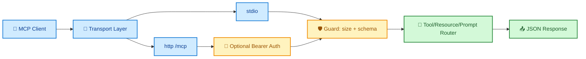
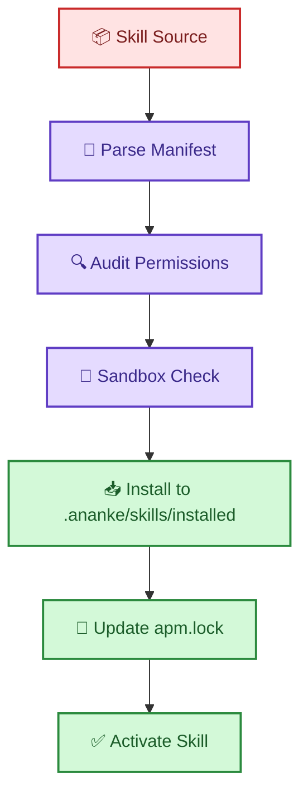

# 🚀 Ananke Plexus Implementation Log

Status date: 2026-09-15

This log tracks what has been implemented, what is partially implemented, and what comes next.

## 🎯 Delivery Snapshot

| Area | Status | Notes |
|---|---|---|
| Spec lifecycle (Spec Kit + native fallback) | ✅ Implemented | Create, plan, tasks, lock, validate, diff, converge, superpowers |
| Graph baseline | ✅ Implemented | Build, query, impact, export with canonical nodes/edges |
| APM baseline | ✅ Implemented | Install, list, activate, deactivate, resolve, audit, sandbox-check, import-copilot |
| MCP baseline | ✅ Implemented | Read-only tools/resources/prompts over stdio + HTTP action transport |
| Lifecycle baseline | ✅ Implemented | Branch naming, issue transition, PR creation, worktree listing with idempotency store |
| Run engine baseline | ✅ Implemented | Start, status, cancel, replay with persisted state |
| Enterprise adapters | 🟡 Partial | Jira/Bitbucket provider simulation only (real remote adapters pending) |
| Security/release hardening | 🟡 Partial | Workflows exist; full attestations/SBOM/strict policy gates pending |

## 🌈 Architecture Flow (Current)

## 🧩 MCP Read-Only Surface

| Action | Result | Security guard |
|---|---|---|
| `ping` | `pong` | request size limit |
| `tools.list` | available read-only tool names | permission map |
| `resources.list` | available resource URIs | static allow list |
| `resources.read` | resource text | canonical local path reads |
| `prompts.list` | available prompt names | fixed registry |
| `prompts.get` | prompt content | fixed registry |
| `tools.call` | routed API result | mutation tools blocked |
| `shutdown` | terminate loop | explicit action |

## 🌐 MCP Transport Modes

| Transport | Endpoint | Auth | Status |
|---|---|---|---|
| stdio | process stdin/stdout | n/a | ✅ implemented |
| http | `POST /mcp` | optional Bearer token | ✅ implemented baseline |

## ⚙️ APM Governance Baseline

## 📊 Module Progress Matrix

| Epic | Capability | Progress |
|---|---|---|
| A | Core + plugin discovery baseline | 🟡 Partial |
| B | Policy engine advanced semantics | 🟡 Partial |
| C | Full verification adapter contracts | 🟡 Partial |
| D | Spec lifecycle + drift + convergence | ✅ Strong baseline |
| E | CALM reconciliation and rendering | 🟡 Partial |
| F | Graph model/query/impact + provider baseline | 🟡 Partial |
| G | Hook orchestration | ⏳ Pending |
| H | MCP v2 full protocol and auth hardening | 🟡 Partial |
| I | APM resolver/sandbox/audit/lock/import | 🟡 Partial |
| J | Lifecycle real Jira/Bitbucket adapters | 🟡 Partial |
| K | Backend adapters (Copilot/Q/Kiro/Hermes) | ⏳ Pending |
| L | Full DAG run engine and compensation | 🟡 Partial |
| M | Supply-chain hardening and attestations | 🟡 Partial |

## 🛣️ Next Implementation Wave

1. Implement true Jira/Bitbucket remote adapters with idempotency keys and retries.
2. Add MCP v2 Streamable HTTP and stronger auth policy mapping.
3. Add provider adapters (`graphifyy`, `code-review-graph`) and reconciliation levels.
4. Add APM bundles and untrusted skill runtime execution guards.
5. Add run-engine approvals, concurrency controls, and compensation strategy.
## 2026-09-16

- Completed docs creation and hosting baseline with MkDocs (`mkdocs.yml`, `docs/index.md`) and GitHub Pages deployment workflow (`.github/workflows/docs.yml`).
- Added config precedence layering (`defaults -> config.toml -> config.local.toml -> env`) with test coverage.
- Added `ananke config migrate` and `ananke evidence prune` command families with API/CLI/tests.
- Added release hardening: CycloneDX SBOM generation and provenance attestations in TestPyPI/PyPI workflows.
- Added security policy workflows: CodeQL, dependency-review, Scorecard, and workflow linting via actionlint + zizmor.

## 🧪 Quality Snapshot

- ✅ Ruff: passing
- ✅ mypy: passing
- ✅ pytest: passing
- ✅ End-to-end command smoke tests: passing
