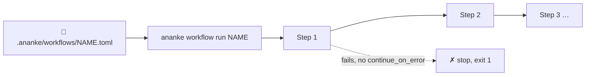

# Workflows

A **workflow** is a named, ordered sequence of `ananke`/`apm` commands, saved once and run
together with a single command. It's the same commands you'd type by hand — bundled so a
newcomer, a CI job, or a future you doesn't have to remember (or re-type) the sequence.



## Quick start

```bash
ananke workflow install-pack setup     # a built-in preset
ananke workflow show setup             # see what it does before running it
ananke workflow run setup              # init → doctor → baseline policy → git hooks
```

## Built-in presets

| Preset | What it runs |
|---|---|
| `setup` | `init` → `doctor` (soft) → `policy install-pack baseline` → `hooks install all` |
| `verify-all` | `doctor` (soft) → `verify` → `policy check` → `registry verify` (soft) |
| `registry-bootstrap` | `registry init` → `registry learn ${source}` → `sync` — needs `--set source=PATH --set namespace=NAME --set license=SPDX` |

"soft" steps have `continue_on_error = true`: diagnostics and optional subsystems don't abort the rest of the workflow.

```bash
ananke workflow install-pack verify-all
ananke workflow run verify-all                              # same gates CI runs, one command

ananke workflow install-pack registry-bootstrap
ananke workflow run registry-bootstrap \
  --set source=./skills/graph-review --set namespace=core --set license=Apache-2.0
```

## Writing your own

```bash
ananke workflow create release-check \
  --step "ananke verify" \
  --step "ananke policy check" \
  --step "ananke registry verify" \
  --description "What I run before tagging a release"

ananke workflow run release-check
```

This writes `.ananke/workflows/release-check.toml` — plain, deterministic TOML, meant to be committed and reviewed like any other project file:

```toml
name = "release-check"
description = "What I run before tagging a release"

[[steps]]
description = ""
command = ["ananke", "verify"]
continue_on_error = false

[[steps]]
description = ""
command = ["ananke", "policy", "check"]
continue_on_error = false

[[steps]]
description = ""
command = ["ananke", "registry", "verify"]
continue_on_error = false
```

You can also write the file directly — `command` is always an argv list, one element per
word, never a shell string (no `&&`, `|`, or quoting rules to fight with).

## Variables

A step's command can reference `${name}` placeholders. `${project}` is always available (the
`--project` a workflow was run with); anything else comes from `--set name=value`:

```bash
ananke workflow run registry-bootstrap --set source=./skills/x --set namespace=core --set license=MIT
```

A placeholder with nothing supplied for it is a **hard error for that step** — it is never
passed through literally as the string `${source}`. The step that referenced it fails, later
steps are skipped (unless the workflow continues past failures — see below), and the run exits
`1`.

## Failure handling

By default, `workflow run` stops at the first failing step and every step after it is reported
as `skipped`. Mark a specific step `continue_on_error = true` (in the TOML, there's no CLI flag
for it — it's a property of the step, not the run) to let the workflow keep going past it; the
overall run still reports `ok=false` and exits `1` if *any* step failed, soft or not.

```bash
ananke workflow run setup --dry-run     # show exactly what would run, run nothing
ananke workflow run setup --json        # machine-readable step-by-step result
```

## Reference

| Command | What it does |
|---|---|
| `ananke workflow list [--json]` | List workflows saved under `.ananke/workflows/` |
| `ananke workflow show NAME [--json]` | Print a workflow's steps |
| `ananke workflow create NAME --step "..." [--step "..."]… [--description] [--force]` | Build a workflow from one or more `--step` commands |
| `ananke workflow install-pack NAME [--force]` | Install a built-in preset (`setup`, `verify-all`, `registry-bootstrap`) |
| `ananke workflow run NAME [--set K=V]… [--dry-run] [--json]` | Run all steps in order |
| `ananke workflow delete NAME` | Remove a saved workflow |

## How it runs

Each step is executed exactly as if you'd typed it: `subprocess.run(argv, shell=False, cwd=project)` — no shell is ever invoked, so there is no shell-metacharacter or injection surface, and no PATH-dependent `&&`/`|` chaining between steps (a workflow *is* the chain). A step's stdout/stderr are captured and shown only on failure (or in full under `--json`), so a passing run stays quiet.

## What this isn't (yet)

Workflows don't call each other (no composition), don't branch or loop, and have no
per-step timeout override (a fixed 900s applies to every step). If you need real branching
logic, write a script and add it as a single step — a workflow is a *sequence*, not a
scripting language.
