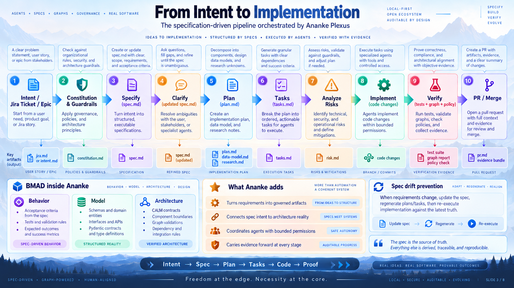
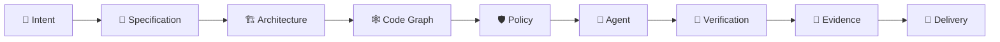

# Ananke Plexus

> **Freedom at the edge. Necessity at the core.**

**Ananke Plexus** is a local-first **Agent Development Life Cycle (ADLC) control plane** — a tensegrity engineering harness that gives AI coding agents architectural context, deterministic guardrails, security gates, and verifiable delivery evidence.



---

## What it does

Ananke Plexus connects **specifications, CALM architecture, code graphs, tests, security scanners, MCP tools, agent skills, Git, Jira, and pull requests** into one governed development lattice.

| Layer | What Ananke provides |
|---|---|
| **Specification** | Requirement capture → spec → plan → tasks → BMAD contracts |
| **Architecture** | FINOS CALM declarations, declared vs observed reconciliation |
| **Graph intelligence** | AST code graph, blast-radius impact, Graphifyy & CRG adapters |
| **Policy engine** | Lint, tests, secrets, SAST, SCA, licenses, architecture gates |
| **Agent backends** | GitHub Copilot, Amazon Q, Kiro, Hermes, generic CLI, fake/demo |
| **MCP server** | Read-only + mutation tools, dynamic resource registry |
| **APM** | Agent skill package manager with lockfile, sandbox, provenance |
| **Lifecycle** | Jira, Bitbucket, Git worktrees, PR evidence storytelling |
| **Evidence** | SARIF 2.1.0, SHA-256 manifests, policy decisions, checksums |

---

## Quick start

```bash
pip install ananke-plexus
# or:
uv tool install ananke-plexus

cd my-project
ananke init
ananke doctor
```

Create a requirement and compile BMAD contracts:

```bash
ananke spec create --id PROJ-101 \
  --title "Add idempotent webhook" \
  --acceptance "duplicate events deduplicated" \
  --acceptance "idempotency key stored"

ananke bmad compile --feature-dir .ananke/specs/PROJ-101
```

Run full verification and generate evidence:

```bash
ananke verify
```

Serve the MCP server:

```bash
ananke serve-mcp
# with mutation tools enabled:
ananke serve-mcp --allow-mutations
```

---

## Documentation

| Section | Description |
|---|---|
| [Why Ananke](concepts/why-ananke.md) | Problems solved, tensegrity philosophy |
| [Architecture](concepts/architecture.md) | System design, ports & adapters |
| [BMAD Contracts](concepts/bmad.md) | Behavior, Model, Architecture compilation |
| [Graph Intelligence](concepts/graph.md) | Code graph, blast radius, providers |
| [Policy & Security](concepts/policy-security.md) | Policy engine, packs, security gates |
| [MCP & APM](concepts/mcp-apm.md) | MCP server and Agent Package Manager |
| [Getting Started](guides/getting-started.md) | Install, init, first spec, first verify |
| [CLI Reference](reference/commands.md) | Full command taxonomy |
| [Configuration](reference/configuration.md) | Config files, secrets, precedence |
| [Policy Reference](reference/policy.md) | Rule syntax, builtin packs |
| [Release Guide](guides/release.md) | PyPI Trusted Publishing workflow |

---

## The core thesis

> **Agents receive freedom of action only through a stronger surrounding structure of truth.**



---

## Docs workflow

```bash
make docs-serve   # local preview at http://127.0.0.1:8000
make docs-build   # static build → site/
```

A GitHub Pages workflow publishes this site from `main` to `gh-pages` automatically.
